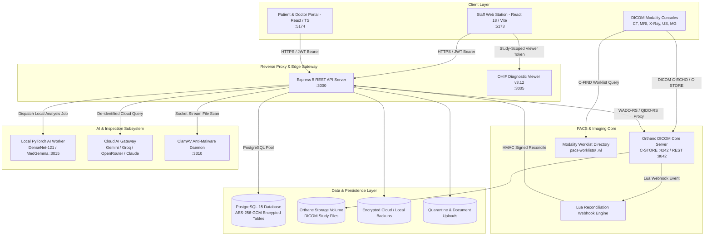
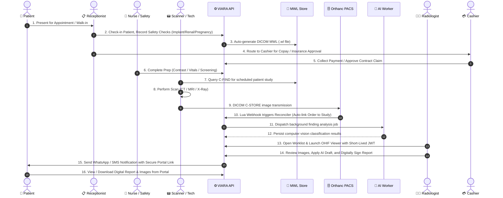
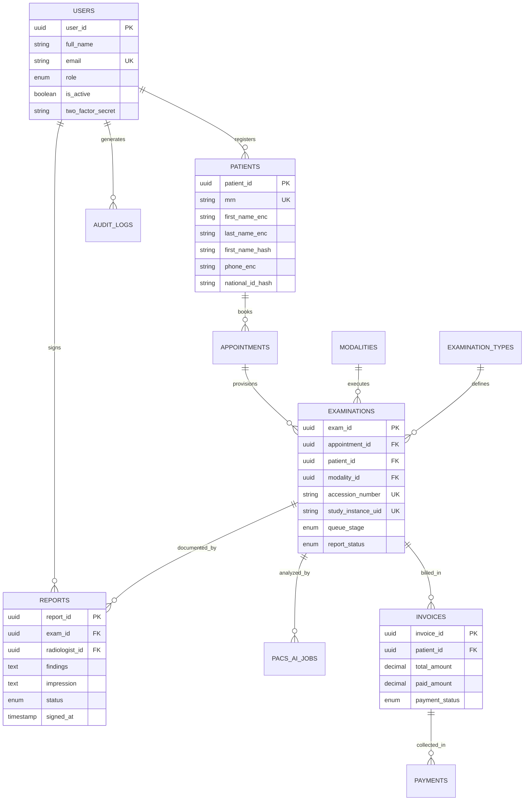

# VIARA - Radiology Information System (RIS) & PACS Management Platform

<div align="center">


-00b894.svg?style=for-the-badge)


<p align="center">
  <b>Enterprise-Grade Radiology Information System (RIS), Picture Archiving and Communication System (PACS), AI Diagnostic Worker, and Patient-Doctor Collaboration Hub.</b>
</p>

</div>

---

## 📑 Table of Contents

1. [Executive Overview](#-executive-overview)
2. [High-Level System Architecture](#-high-level-system-architecture)
3. [Network Topology & Port Allocations](#-network-topology--port-allocations)
4. [End-to-End Clinical & Imaging Workflow](#-end-to-end-clinical--imaging-workflow)
5. [Core Functional Modules](#-core-functional-modules)
   - [Clinical RIS & Patient Operations](#1-clinical-ris--patient-operations)
   - [PACS & DICOM Web Viewing Engine](#2-pacs--dicom-web-viewing-engine)
   - [AI Finding Analysis & Auto-Drafting](#3-ai-finding-analysis--auto-drafting)
   - [Billing, Cashier & Insurance Claims](#4-billing-cashier--insurance-claims)
   - [Human Resources, Attendance & Payroll](#5-human-resources-attendance--payroll)
   - [Patient & Referring Physician Portal](#6-patient--referring-physician-portal)
   - [CRM, Automated Messaging & Loyalty](#7-crm-automated-messaging--loyalty)
6. [Security, Governance & Compliance](#-security-governance--compliance)
7. [Database Architecture & Migration Engine](#-database-architecture--migration-engine)
8. [Multi-Lingual Support & RTL Internationalization](#-multi-lingual-support--rtl-internationalization)
9. [Technology Stack & Monorepo Structure](#-technology-stack--monorepo-structure)
10. [Developer Setup & Quick Start](#-developer-setup--quick-start)
11. [Core REST API Specification Directory](#-core-rest-api-specification-directory)
12. [DICOM 3.0 Conformance Statement](#-dicom-30-conformance-statement-summary)
13. [Production Nginx Reverse Proxy Configuration](#-production-nginx-reverse-proxy-configuration)
14. [Production Deployment Across Environments & Platforms](#-production-deployment-across-environments--platforms)
    - [Linux Enterprise Production (Ubuntu/Debian/RHEL)](#1--linux-enterprise-production-deployment-ubuntu-22042404-debian-12-rhelrocky-9)
    - [Windows Server 2019 / 2022 Deployment](#2--windows-server-2019--2022-production-deployment)
    - [Docker Compose & Docker Swarm Clustering](#3--docker-compose--docker-swarm-clustering)
    - [Kubernetes (K8s) Cloud-Native Architecture](#4-️-kubernetes-k8s-high-availability-cloud-native-deployment)
    - [Cloud Reference Architectures (AWS / Azure / GCP)](#5-️-cloud-infrastructure-reference-architectures-aws--azure--gcp)
    - [Hospital On-Premise Hypervisors (VMware / Proxmox & TrueNAS)](#6--hospital-on-premise-hypervisors-vmware-esxi-proxmox-ve--truenas-san)
15. [Troubleshooting & FAQ](#-troubleshooting--faq)
16. [Licensing, System Protection & IP Safeguards](#-licensing-system-protection--ip-safeguards)
    - [Commercial License & Deployment Models](#1-commercial-license--deployment-models)
    - [Defensive Architecture & Anti-Tamper Protection](#2-defensive-architecture--anti-tamper-protection)
    - [Regulatory, Clinical & Data Liability Disclaimers](#3-regulatory-clinical--data-liability-disclaimers)
    - [Vulnerability Disclosure & Security Inquiries](#4-vulnerability-disclosure--security-inquiries)


---

## 📘 دليل تشغيل العميل

لخطوات تجهيز الخادم وتفعيل الترخيص والتشغيل على Linux أو عبر Linux VM على Windows Server، وتأمين الشبكة والنسخ الاحتياطي وتحديث الإصدارات، راجع [دليل إعداد وتشغيل VIARA للعميل](docs/CLIENT_DEPLOYMENT_OPERATIONS_AR.md). هذا الدليل موجّه لبيئات العملاء؛ أما هذا المستودع وملفات التطوير فلا تُعد وحدها حزمة إنتاج معتمدة.

## 🧪 تجربة تقييمية معزولة

لإنشاء تجربة قصيرة المدة ببيانات اصطناعية، استخدم أداة العروض المعزولة لكل عميل؛ لا تستخدم حزمة الإنتاج لهذا الغرض. تتطلب الأداة إعداد مفاتيح إصدار الترخيص وملف `.env` تطويريّاً على المضيف، وتبدأ خدمات Docker فعلية. راجع [دليل التجربة التقييمية](docs/TRIAL_EVALUATION_AR.md) قبل الإنشاء. لا تستخدم بيانات مرضى حقيقية أو تكشف منافذ التجربة للإنترنت.

---

## 🌟 Executive Overview

**VIARA** is an all-in-one healthcare software solution engineered specifically for modern diagnostic imaging centers, hospital radiology departments, and outpatient imaging networks. It bridges the gap between administrative operations, high-throughput DICOM modalities (MRI, CT, X-Ray, Ultrasound, Mammography, PET-CT), diagnostic image review, artificial intelligence analysis, cashier workflows, and referring doctor engagement.

### Key Business & Clinical Capabilities:
- **Zero-Latency Modality Worklists (MWL):** Eliminates manual typographical errors on scanner consoles by broadcasting standards-compliant DICOM `.wl` worklists in real time.
- **Embedded Zero-Footprint Diagnostic Viewer:** Powered by **OHIF Viewer v3.12**, offering MPR, 3D volume rendering, cine loops, measurements, and annotations directly inside the browser.
- **Hybrid AI Radiology Assistance:** Combines local PyTorch inference for immediate pathology detection with multi-provider Cloud LLMs (Gemini, Groq, OpenRouter, Claude) for intelligent reporting assistance.
- **Enterprise Security Compliance:** AES-256-GCM field encryption for all Protected Health Information (PHI), blind indexing for encrypted searches, cryptographic audit trail chaining, and ClamAV malware scanning.
- **Financial Integrity & Multi-Branch Support:** Real-time billing, partial payment governance, split insurance claims, shift reconciliation, and double-entry general ledger posting.

---

## 📐 High-Level System Architecture



---

## 🌐 Network Topology & Port Allocations

VIARA maps services to dedicated network boundaries with granular resource limits and network isolation:

| Service | Container / Process | Internal Port | Host Binding | Access Level | Protocol / Purpose |
| :--- | :--- | :---: | :---: | :--- | :--- |
| **Frontend RIS** | `VIARA_frontend` | `80` | `127.0.0.1:5173` | Staff LAN / VPN | HTTP / React Staff Application |
| **Public Portal** | `VIARA_portal` | `80` | `127.0.0.1:5174` | Public / Internet | HTTP / Patient & Doctor Portal |
| **Backend API** | `VIARA_backend` | `3000` | `127.0.0.1:3000` | Internal App | HTTP / REST API, Auth & Business Logic |
| **OHIF Viewer** | `VIARA_ohif` | `80` | `127.0.0.1:3005` | Staff LAN / VPN | HTTP / Zero-Footprint DICOMweb Viewer |
| **PACS DICOM** | `VIARA_orthanc` | `4242` | `${PACS_DICOM_BIND:-127.0.0.1}:4242` | Modality Subnet (set `PACS_DICOM_BIND` to the LAN/VPN IP for scanners) | DICOM C-STORE, C-ECHO, C-FIND (MWL) |
| **PACS REST** | `VIARA_orthanc` | `8042` | `127.0.0.1:8042` | Backend Loopback | HTTP REST API (Orthanc Admin & WADO) |
| **AI Worker** | `VIARA_pacs_ai_worker` | `8000` | `127.0.0.1:3015` | Backend Loopback | HTTP / PyTorch Image Inference Engine |
| **PostgreSQL** | `VIARA_db` | `5432` | `127.0.0.1:5432` | Database Net | PostgreSQL 15 Core Database |
| **ClamAV** | `VIARA_clamav` | `3310` | *not published* | Internal `data`/`scanner-egress` networks only | TCP Socket / Antivirus Upload Scanning |

---

## 🔄 End-to-End Clinical & Imaging Workflow



---

## 🧩 Core Functional Modules

### 1. Clinical RIS & Patient Operations
- **Comprehensive Patient Registry:** Automated Medical Record Number (MRN) generation, duplicate record detection, family lineage linking, and record merging with full audit lineage.
- **Smart Scheduling & Resource Governance:** Multi-modality calendar, room scheduling, technician shifts, overbooking guards, idempotency keys, and automated slot duration calculation.
- **Clinical Queue Management:** Real-time visual tracking of patient flow through 11 distinct stages: `Registered` $\rightarrow$ `Scheduled` $\rightarrow$ `Arrived` $\rightarrow$ `Payment Pending` $\rightarrow$ `Prep Pending` $\rightarrow$ `Ready for Exam` $\rightarrow$ `In Exam` $\rightarrow$ `Reporting` $\rightarrow$ `Finalized` $\rightarrow$ `Delivered`.
- **Pre-Exam Safety Checklists:** Mandatory clinical safety evaluations for Renal Function (eGFR / Creatinine), MRI Implant & Metal screening, and Pregnancy validation.

### 2. PACS & DICOM Web Viewing Engine
- **Full Modality Worklist (MWL) Integration:** Real-time generation of standard DICOM `.wl` worklists using `dcmjs` with Explicit VR Little Endian (`1.2.840.10008.1.2.1`).
- **Zero-Footprint OHIF Diagnostic Viewer:** Seamlessly embedded diagnostic viewer supporting WADO-RS, QIDO-RS, windowing presets (Bone, Soft Tissue, Lung, Brain), multi-planar reconstruction (MPR), and DICOM SR annotations.
- **Automated Study Reconciliation:** Real-time Lua webhook listener immediately resolves discrepancies between accession numbers, patient identifiers, and modality DICOM tags.
- **DICOM Storage Tiering:** Automated lifecycle archiving rules migrate historical imaging datasets between hot online storage and compressed cold archives.

### 3. AI Finding Analysis & Auto-Drafting
- **Local Computer Vision Inference (`pacs/ai-worker`):** Containerized Python PyTorch worker utilizing TorchXRayVision (DenseNet-121, MedGemma) to detect 14 radiographic pathologies (Cardiomegaly, Pneumonia, Effusion, Infiltration, Nodule, etc.).
- **Multi-Provider Cloud Reporting LLM:** Built-in dynamic fallback supporting Google Gemini Flash, Groq, OpenRouter, Anthropic Claude, and OpenAI.
- **Automated Report Structuring:** Transforms raw voice transcriptions and radiologist bullet notes into standardized radiological report formats (Technique, Comparison, Findings, Impression) with clinical sanity guards.

### 4. Billing, Cashier & Insurance Claims
- **Multi-Price Catalog & Governance:** Dynamic pricing rules based on modality, branch, contrast injection, emergency surcharges, and discount policies.
- **Shift Reconciliation & Cashier Handoff:** Blind opening/closing drawer cash reconciliations, audit logs, and supervisor sign-offs.
- **Comprehensive Insurance Engine:** Manages insurance companies, corporate contracts, co-pay percentages, deductible caps, pre-authorization document attachments, and claims generation.
- **Automated Financial Journaling:** Transactional double-entry accounting posting (`financial_journal_entries`) reconciling receivables, revenue, discounts, and cashier shifts.

### 5. Human Resources, Attendance & Payroll
- **Shift Scheduling & Time Attendance:** Biometric / Web check-in with IP verification, stale session guards, and leave management.
- **Dynamic Compensation Engine:** Supports monthly base salaries, overtime rates, per-case radiologist reading commissions, and technician scan bonuses.
- **Statutory Deductions & Penalties:** Configurable tiered penalty rules, tax deductions, and approval workflows.
- **One-Click Payroll Run & Direct Journal Posting:** Automatically calculates net pay across all active staff and posts journal entries to general ledger accounts.

### 6. Patient & Referring Physician Portal
- **Zero-Password OTP & Direct Login:** Secure patient authentication via MRN, national ID, or one-time mobile verification codes.
- **Interactive Report & Image Preview:** Mobile-responsive diagnostic report viewer with PDF export, laboratory attachments, and DICOM web preview.
- **Referring Doctor Requisition Hub:** Specialized workspace for external clinics to submit examination orders, track patient progress, and download approved diagnostic reports.

### 7. CRM, Automated Messaging & Loyalty
- **Multi-Channel Notifications:** Automated SMS, Email, and WhatsApp appointment reminders, ready-for-pickup alerts, and critical finding notifications via Twilio and SMTP.
- **Marketing Campaigns & Patient Segmentation:** Targeted outreach based on visit history, modality type, and patient loyalty points.
- **Referring Doctor Relationship Analytics:** Tracking referral volumes, doctor commission payables, and branch distribution trends.

---

## 🔒 Security, Governance & Compliance

VIARA is architected from the ground up to exceed international healthcare regulatory standards, including **HIPAA Security Rule**, **GDPR**, and **HITECH**:

| Security Domain | Implemented Control | Technical Implementation |
| :--- | :--- | :--- |
| **Data at Rest** | AES-256-GCM Field Encryption | Sensitive patient PII fields (`first_name_enc`, `phone_enc`, `national_id_enc`) encrypted with unique 12-byte IVs and 16-byte authentication tags. |
| **Exact Lookups** | HMAC Blind Indexing | One-way SHA-256 salted hashes (`*_hash`) allow exact database queries without decrypting entire tables. |
| **Data in Transit** | Enforced TLS 1.3 / HTTPS | All internal and external HTTP traffic encrypted; strict HTTP Strict Transport Security (HSTS) headers. |
| **Authentication** | Passkeys & TOTP 2FA | FIDO2 / WebAuthn passwordless biometric login alongside RFC 6238 TOTP two-factor authentication. |
| **Audit Trails** | Cryptographic Hash Chaining | Tamper-evident ledger linking every record update to its prior state: `curr_hash = SHA-256(prev_hash + payload)`. |
| **Malware Defense** | ClamAV Socket Scanning | In-memory socket inspection of all uploaded patient requisitions, PDFs, and DICOM files before writing to disk. |
| **Environment Defense** | Fail-Closed Config Validator | Startup validation script (`validateEnv.js`) strictly verifies entropy of secret keys, CORS origins, and backup parameters. |
| **Right to be Forgotten** | Automated GDPR Anonymization | Cryptographic erasure mechanisms and data portability exports via `/api/v1/privacy/gdpr-export`. |

---

## 🗄️ Database Architecture & Migration Engine

The PostgreSQL database contains **194 modular transactional migrations** managed by the zero-downtime runner [`database/migrate.js`](file:///d:/VIARA/database/migrate.js).

### Database Architectural Highlights:
1. **Advisory Locking:** Executes under `pg_advisory_lock(847291)` to prevent race conditions during rolling container deployments.
2. **Atomic Transactions:** Each migration `.sql` file executes inside an isolated transaction (`BEGIN` $\rightarrow$ `COMMIT`), automatically rolling back on syntax or constraint errors.
3. **Checksum Verification:** Every migration's SHA-256 digest is verified against `schema_migrations` to prevent undetected schema drift.
4. **Clean Monolithic Startup:** Zero DDL queries execute during web server boot (`server.js`), guaranteeing rapid, resilient API startups.

### Core Database ERD Schema:



---

## 🌐 Multi-Lingual Support & RTL Internationalization

VIARA features first-class, contract-tested internationalization across all user interfaces:
- **Languages Supported:** Arabic (`ar`), English (`en`), French (`fr`), Spanish (`es`).
- **Dynamic RTL / LTR Switching:** Automatic bidirectional layout flipping for Arabic typography using Tailwind RTL utilities and custom CSS logical properties.
- **Automated i18n Contract Verification:** Built-in script (`npm run check:locales`) validates 100% key parity, pluralization rules, and variable placeholder alignment across all locale files.

---

## 🏗️ Technology Stack & Monorepo Structure

```
d:\VIARA/
├── .env.example                     # Comprehensive master environment template
├── .gitignore                       # Multi-tier exclusion rules (locks, caches, logs, media)
├── docker-compose.yml               # Multi-container service topology
├── package.json                     # Monorepo command orchestrator
├── start-services.js                # Master interactive cross-platform service launcher
├── start-services.bat / .ps1 / .sh  # OS-specific bootstrap scripts
│
├── backend/                         # Core API & Business Logic Server (Express 5)
│   ├── src/
│   │   ├── config/                  # Logger, validateEnv, WebAuthn settings
│   │   ├── controllers/             # 48 Specialized Domain Controllers
│   │   ├── jobs/                    # MWL Sync, AI Analysis, Retention, Audit Workers
│   │   ├── middleware/              # Auth, RBAC, Rate Limiting, Audit, CSRF, Tracing
│   │   ├── routes/                  # Modular Route Tables & Sub-routers
│   │   ├── schemas/                 # 31 Zod Input Validation Schemas
│   │   ├── services/                # Encryption, PACS Proxy, AI LLM, Reporting, PDF
│   │   ├── utils/                   # Crypto, Errors, Pagination, Password Helpers
│   │   └── server.js                # API Entry Point & Graceful Connection Draining
│   ├── scripts/                     # Backend Utilities (createDeveloper, decryptBackup)
│   ├── tests/                       # 280+ Jest Test Suites (1,976+ Unit & Integration Tests)
│   ├── Dockerfile
│   └── package.json
│
├── frontend/                        # Staff Clinical & Administrative Client (React 18 + Vite)
│   ├── public/                      # Static Brand Assets & Approved Visual Media
│   ├── src/
│   │   ├── assets/                  # Optimized SVG Illustrations & Brand Graphics
│   │   ├── components/              # Modular Domain Components (CRM, Reception, PACS, HR)
│   │   ├── config/                  # Routes, Permissions, Brand Palette Configuration
│   │   ├── hooks/                   # Custom Hooks (useReception, usePayment, useAuth)
│   │   ├── i18n/                    # Locale Dictionaries (en, ar) & Language Switchers
│   │   ├── pages/                   # Workstation Pages (50+ Clinical & Admin Views)
│   │   ├── store/                   # Redux Toolkit State Slices & RTK Query API
│   │   └── utils/                   # Formatter, Export, Date, and Color Utilities
│   ├── Dockerfile
│   └── package.json
│
├── portal/                          # Public Patient & Referring Doctor Portal (React 18 + TS + Vite)
│   ├── public/                      # Public Static Media & Favicons
│   ├── src/
│   │   ├── components/              # Portal UI Components, Chat Bubbles, Case Views
│   │   ├── lib/                     # MCP Tool Catalog, Portal Tokens, Formatting
│   │   ├── pages/                   # Patient Login, Doctor Portal, Landing Views
│   │   └── store/                   # Redux Toolkit Session & Data Stores
│   ├── Dockerfile
│   └── package.json
│
├── pacs/                            # PACS Diagnostic & Imaging Services
│   ├── orthanc/                     # Orthanc Config (`orthanc.json`) & Lua Reconciler
│   ├── ohif/                        # OHIF Viewer Docker Context & Nginx Configuration
│   └── ai-worker/                   # Local PyTorch Chest Radiography Worker
│
├── pacs-worklists/                  # Shared Volume for DICOM MWL Files (.wl) (.gitkeep)
│
├── database/                        # Database Schemas & Migrations
│   ├── migrations/                  # 194 Transactional SQL Migrations
│   ├── migrate.js                   # Advisory-Locked Schema Migration Engine
│   ├── schema.sql                   # Master Table Structure Reference
│   └── seed.js                      # Rich Multi-Entity Database Seeder
│
├── scripts/                         # Monorepo Operations & Tooling
│   ├── check-locales.mjs            # i18n Contract Parity Validator
│   ├── logs.js                      # Colored Multi-Container Log Streaming Tool
│   └── seed.js                      # Centralized Database Seeding Script
│
└── docs/                            # Technical Architecture & Verification Documentation
    └── reports/                     # 18 QA, Security, UX, and Deployment Reports
```

---

## 🚀 Developer Setup & Quick Start

### 1. Prerequisites
- **Node.js**: `v18.0.0` or higher (`v22.x LTS` recommended)
- **Docker & Docker Compose**: Docker Desktop or Engine v24+
- **PostgreSQL Client** (optional for local debugging)

### 2. Clone & Bootstrap
```bash
# Clone the repository
git clone https://github.com/abdo-elshaikh/VIARA.git
cd VIARA

# Install root orchestrator dependencies
npm install

# Copy environment configuration
cp .env.example .env
```

### 3. Configure Secrets (`.env`)
Open `.env` and configure high-entropy secret keys:
```ini
JWT_SECRET=your_super_secret_jwt_key_at_least_32_chars_long
ENCRYPTION_KEY=0123456789abcdef0123456789abcdef0123456789abcdef0123456789abcdef
BACKUP_ENCRYPTION_KEY=fedcba9876543210fedcba9876543210fedcba9876543210fedcba9876543210
BLIND_INDEX_KEY=abcdef0123456789abcdef0123456789abcdef0123456789abcdef0123456789
PACS_WEBHOOK_SECRET=your_pacs_hmac_webhook_secret_key
POSTGRES_PASSWORD=your_secure_postgres_password
ORTHANC_PASSWORD=your_secure_orthanc_password
```

### 4. Launch Services
```bash
# Start Interactive Hybrid Launcher (Docker for DB/PACS/ClamAV, Node local for UI/API)
npm start

# Or launch all services fully containerized in Docker
npm run dev:docker-all
```

---

## 🔌 Core REST API Specification Directory

The backend API follows RESTful architectural patterns, versioned under `/api/v1/` with mandatory JSON content negotiation, structured errors (`AppError`), and correlation tracing (`X-Request-ID`).

### 1. Authentication & Security Endpoints

| Method | Endpoint | Access Level | Description | Request Payload / Params |
| :--- | :--- | :---: | :--- | :--- |
| `POST` | `/api/v1/auth/login` | Public | Staff email & password login with progressive rate lockout. | `{"email": "rad@center.com", "password": "..."}` |
| `POST` | `/api/v1/auth/2fa/verify` | Public | Verify RFC 6238 TOTP passcode to issue session JWT. | `{"tempToken": "...", "code": "123456"}` |
| `POST` | `/api/v1/auth/refresh` | Authenticated | Rotate refresh token and mint fresh 15-minute access token. | `{"refreshToken": "..."}` |
| `POST` | `/api/v1/auth/passkey/auth-options` | Public | Generate WebAuthn FIDO2 authentication challenge. | `{"email": "doctor@center.com"}` |
| `POST` | `/api/v1/auth/passkey/auth-verify` | Public | Verify signed WebAuthn cryptographic passkey assertion. | `{"email": "...", "credential": {...}}` |

### 2. Clinical Patient Registry & Blind Index Search

| Method | Endpoint | Access Level | Description | Request Payload / Params |
| :--- | :--- | :---: | :--- | :--- |
| `GET` | `/api/v1/patients` | Staff | Search patients via exact blind hashes or fetch paginated list. | `?search=Ahmed&page=1&limit=25` |
| `POST` | `/api/v1/patients` | Reception / Admin | Register new patient (encrypts PII and generates HMAC blind hashes). | `{"firstName": "John", "lastName": "Doe", "phone": "+1234567890", "gender": "male", "dob": "1985-04-12"}` |
| `GET` | `/api/v1/patients/:id` | Staff | Retrieve decrypted patient demographics, order history, and invoices. | `params: { id: "patient-uuid" }` |
| `POST` | `/api/v1/patients/merge` | Admin / Developer | Merge duplicate patient records and transfer study/billing history. | `{"sourcePatientId": "...", "targetPatientId": "..."}` |

### 3. Modality Scheduling & Queue Management

| Method | Endpoint | Access Level | Description | Request Payload / Params |
| :--- | :--- | :---: | :--- | :--- |
| `POST` | `/api/v1/appointments` | Reception / Staff | Schedule patient examination and reserve modality slot. | `{"patientId": "...", "modalityId": "...", "scheduledAt": "2026-08-25T10:00:00Z", "examTypeId": "..."}` |
| `PATCH` | `/api/v1/queue/:examId/stage` | Clinical Staff | Transition examination across the 11 clinical queue stages. | `{"stage": "IN_EXAM", "modalityId": "..."}` |
| `GET` | `/api/v1/queue/live` | Clinical Staff | Fetch live real-time workstation queue state by modality room. | `?branchId=...&modalityId=...` |

### 4. PACS, DICOM Streaming & Image Viewer

| Method | Endpoint | Access Level | Description | Request Payload / Params |
| :--- | :--- | :---: | :--- | :--- |
| `GET` | `/api/v1/pacs/studies` | Radiologist / Tech | Search DICOM studies stored in Orthanc with caching. | `?patientId=...&modality=CT&from=2026-08-01` |
| `GET` | `/api/v1/pacs/ohif-token/:studyUid` | Radiologist / Doctor | Mint short-lived, study-scoped JWT token for OHIF viewer embedding. | `params: { studyUid: "1.2.840.113619.2..." }` |
| `POST` | `/api/v1/pacs/webhook` | System | Orthanc Lua webhook listener verifying `X-Pacs-Signature`. | `{"event": "NewStudyArrived", "studyUid": "...", "instances": 140}` |
| `POST` | `/api/v1/pacs/mwl/refresh` | System / Tech | Force generation of all pending DICOM `.wl` worklists. | `{}` |

### 5. Structured Reporting & AI Findings

| Method | Endpoint | Access Level | Description | Request Payload / Params |
| :--- | :--- | :---: | :--- | :--- |
| `POST` | `/api/v1/reports` | Radiologist | Create new radiology report draft from modality study. | `{"examId": "...", "findings": "...", "impression": "..."}` |
| `POST` | `/api/v1/reports/:id/ai-draft`| Radiologist | Request automated structured draft from Cloud AI LLM. | `{"examId": "...", "notes": "patient has right lower lobe opacity"}` |
| `POST` | `/api/v1/reports/:id/sign` | Radiologist | Digitally sign and seal finalized report, generating signed PDF. | `{"signaturePassword": "..."}` |
| `GET` | `/api/v1/reports/:id/pdf` | Staff / Doctor | Stream high-resolution, letterheaded diagnostic PDF report. | `params: { id: "report-uuid" }` |

### 6. Billing, Cashier Shifts & Insurance

| Method | Endpoint | Access Level | Description | Request Payload / Params |
| :--- | :--- | :---: | :--- | :--- |
| `POST` | `/api/v1/billing/invoices` | Cashier / Reception | Generate itemized billing invoice for order examinations. | `{"appointmentId": "...", "items": [{"examTypeId": "...", "price": 120.00}]}` |
| `POST` | `/api/v1/billing/payments` | Cashier | Collect cash, card, or bank transfer payment against invoice. | `{"invoiceId": "...", "amount": 120.00, "method": "CARD", "shiftId": "..."}` |
| `POST` | `/api/v1/cashier/shifts/close`| Cashier | Perform blind drawer closure and submit for reconciliation. | `{"shiftId": "...", "declaredCash": 1450.00, "declaredCard": 3200.00}` |
| `POST` | `/api/v1/insurance/claims` | Insurance Staff | Submit batch insurance claims with pre-authorization attachments. | `{"invoiceId": "...", "policyNumber": "POL-9821", "approvalCode": "APP-01"}` |

---

## 📡 DICOM 3.0 Conformance Statement (Summary)

VIARA integrates natively with any standard DICOM 3.0 compliant imaging equipment.

### Supported SOP Classes

| SOP Class Name | SOP Class UID | Service Role |
| :--- | :--- | :---: |
| **Verification SOP Class (C-ECHO)** | `1.2.840.10008.1.1` | SCP / SCU |
| **Modality Worklist Information Model - FIND** | `1.2.840.10008.5.1.4.31` | SCP |
| **CT Image Storage** | `1.2.840.10008.5.1.4.1.1.2` | SCP |
| **Enhanced CT Image Storage** | `1.2.840.10008.5.1.4.1.1.2.1` | SCP |
| **MR Image Storage** | `1.2.840.10008.5.1.4.1.1.4` | SCP |
| **Enhanced MR Image Storage** | `1.2.840.10008.5.1.4.1.1.4.1` | SCP |
| **Digital X-Ray Image Storage (For Presentation)** | `1.2.840.10008.5.1.4.1.1.1.1` | SCP |
| **Computed Radiography Image Storage** | `1.2.840.10008.5.1.4.1.1.1` | SCP |
| **Ultrasound Multi-frame Image Storage** | `1.2.840.10008.5.1.4.1.1.3.1` | SCP |
| **Digital Mammography X-Ray Image Storage** | `1.2.840.10008.5.1.4.1.1.1.2` | SCP |
| **Secondary Capture Image Storage** | `1.2.840.10008.5.1.4.1.1.7` | SCP |
| **Key Object Selection Document Storage** | `1.2.840.10008.5.1.4.1.1.88.59` | SCP |
| **Comprehensive SR Storage** | `1.2.840.10008.5.1.4.1.1.88.33` | SCP |

### Supported Transfer Syntaxes

- **Implicit VR Little Endian:** `1.2.840.10008.1.2`
- **Explicit VR Little Endian:** `1.2.840.10008.1.2.1`
- **Explicit VR Big Endian:** `1.2.840.10008.1.2.2`
- **JPEG Lossless, Non-Hierarchical, First-Order Prediction:** `1.2.840.10008.1.2.4.70`
- **JPEG-LS Lossless Image Compression:** `1.2.840.10008.1.2.4.80`
- **RLE Lossless:** `1.2.840.10008.1.2.5`

---

## 🌐 Production Nginx Reverse Proxy Configuration

Below is the production-ready Nginx configuration template for hosting VIARA with SSL/TLS termination, rate limiting, and sub-path routing:

```nginx
# /etc/nginx/sites-available/VIARA.conf

upstream backend_api {
    server 127.0.0.1:3000;
    keepalive 32;
}

upstream ohif_viewer {
    server 127.0.0.1:3005;
}

upstream staff_frontend {
    server 127.0.0.1:5173;
}

upstream public_portal {
    server 127.0.0.1:5174;
}

# Rate Limiting Zone
limit_req_zone $binary_remote_addr zone=api_limit:10m rate=30r/s;

server {
    listen 80;
    server_name ris.yourcenter.com portal.yourcenter.com;
    return 301 https://$host$request_uri;
}

server {
    listen 443 ssl http2;
    server_name ris.yourcenter.com;

    ssl_certificate /etc/letsencrypt/live/ris.yourcenter.com/fullchain.pem;
    ssl_certificate_key /etc/letsencrypt/live/ris.yourcenter.com/privkey.pem;
    ssl_protocols TLSv1.2 TLSv1.3;
    ssl_ciphers HIGH:!aNULL:!MD5;

    # Security Headers
    add_header X-Frame-Options "SAMEORIGIN" always;
    add_header X-Content-Type-Options "nosniff" always;
    add_header X-XSS-Protection "1; mode=block" always;
    add_header Strict-Transport-Security "max-age=31536000; includeSubDomains" always;

    client_max_body_size 250M;

    # Staff Web Application
    location / {
        proxy_pass http://staff_frontend;
        proxy_set_header Host $host;
        proxy_set_header X-Real-IP $remote_addr;
        proxy_set_header X-Forwarded-For $proxy_add_x_forwarded_for;
        proxy_set_header X-Forwarded-Proto $scheme;
    }

    # REST API & WebSockets
    location /api/ {
        limit_req zone=api_limit burst=50 nodelay;
        proxy_pass http://backend_api;
        proxy_http_version 1.1;
        proxy_set_header Upgrade $http_upgrade;
        proxy_set_header Connection "upgrade";
        proxy_set_header Host $host;
        proxy_set_header X-Real-IP $remote_addr;
        proxy_set_header X-Forwarded-For $proxy_add_x_forwarded_for;
        proxy_set_header X-Forwarded-Proto $scheme;
        proxy_read_timeout 180s;
    }

    # Embedded OHIF Diagnostic Viewer
    location /pacs-viewer/ {
        proxy_pass http://ohif_viewer/;
        proxy_set_header Host $host;
        proxy_set_header X-Real-IP $remote_addr;
        proxy_set_header X-Forwarded-For $proxy_add_x_forwarded_for;
        proxy_set_header X-Forwarded-Proto $scheme;
    }
}
```

---

## 🚀 Production Deployment Across Environments & Platforms

VIARA is engineered to deploy seamlessly across diverse operating systems, enterprise virtualization hypervisors, and cloud providers.

```
┌──────────────────────────────────────────────────────────────────────────────────────────────────┐
│                               Production Deployment Matrix                                       │
├───────────────────┬───────────────────────────────┬──────────────────────────────────────────────┤
│ Target Platform   │ Recommended Orchestrator      │ Storage & Imaging Tier                       │
├───────────────────┼───────────────────────────────┼──────────────────────────────────────────────┤
│ Linux Enterprise  │ Systemd / PM2 + Nginx TLS     │ Local NVMe + ZFS / NFS NAS Pool              │
│ Windows Server    │ PM2 / Windows Services + IIS  │ NTFS / ReFS Dedicated Storage Volume         │
│ Docker / Swarm    │ Docker Compose v2 / Swarm     │ Named Docker Volumes / CIFS / NFS Shares     │
│ Kubernetes (K8s)  │ Helm / Kubelet Deployments    │ PersistentVolumeClaims (Ceph, EBS, AzureDisk)│
│ Cloud (AWS/Azure) │ ECS Fargate / AKS Cluster     │ Managed PostgreSQL (RDS) + EFS / Azure Files │
│ Hospital On-Prem  │ VMware ESXi / Proxmox VE      │ TrueNAS / Synology iSCSI SAN LUN Target      │
└───────────────────┴───────────────────────────────┴──────────────────────────────────────────────┘
```

---

### 1. 🐧 Linux Enterprise Production Deployment (Ubuntu 22.04/24.04, Debian 12, RHEL/Rocky 9)

#### A. System Prerequisites & Dependencies
```bash
# Update repositories and install Node.js 22 LTS, PostgreSQL 15, and Nginx
curl -fsSL https://deb.nodesource.com/setup_22.x | sudo -E bash -
sudo apt-get update && sudo apt-get install -y nodejs postgresql-15 postgresql-contrib nginx certbot python3-certbot-nginx git ufw

# Install PM2 process manager globally
sudo npm install -g pm2
```

#### B. Firewall Configuration (UFW)
```bash
# Allow standard web traffic
sudo ufw allow 80/tcp comment "HTTP Web"
sudo ufw allow 443/tcp comment "HTTPS Secure Web"

# Allow DICOM C-STORE from Modalitiy Subnet (e.g. 192.168.10.0/24)
sudo ufw allow from 192.168.10.0/24 to any port 4242 proto tcp comment "DICOM Modality C-STORE"

# Enable Firewall
sudo ufw enable
```

#### C. Systemd Service Unit Configuration
Create a dedicated background daemon for the backend API:

```ini
# /etc/systemd/system/VIARA-api.service
[Unit]
Description=VIARA Radiology Information System API Server
After=network.target postgresql.service
Wants=postgresql.service

[Service]
Type=simple
User=VIARA
WorkingDirectory=/opt/VIARA
ExecStart=/usr/bin/node backend/src/server.js
Restart=always
RestartSec=5
Environment=NODE_ENV=production
EnvironmentFile=/opt/VIARA/.env
LimitNOFILE=65536

[Install]
WantedBy=multi-user.target
```

Enable and start the service:
```bash
sudo systemctl daemon-reload
sudo systemctl enable --now VIARA-api.service
sudo systemctl status VIARA-api.service
```

---

### 2. 🪟 Windows Server 2019 / 2022 Production Deployment

For hospital bare-metal servers or Hyper-V virtual machines running Windows Server:

#### A. Prerequisites Installation
- Install **Node.js LTS (v22+)** via official Windows `.msi` package.
- Install **PostgreSQL 15 for Windows** with `UTF-8` database collation.
- Install **Git for Windows**.
- Install **PM2** process supervisor:
  ```powershell
  npm install -g pm2
  ```

#### B. Configure Windows Defender Firewall
Open administrative PowerShell:
```powershell
# Allow DICOM C-STORE Port (4242) for Imaging Subnet
New-NetFirewallRule -DisplayName "VIARA DICOM C-STORE" -Direction Inbound -LocalPort 4242 -Protocol TCP -Action Allow

# Allow HTTPS and HTTP Web Ports
New-NetFirewallRule -DisplayName "VIARA Web Services" -Direction Inbound -LocalPort 80,443 -Protocol TCP -Action Allow
```

#### C. Run Production Services with PM2
```powershell
cd C:\VIARA

# Run Zero-Downtime Database Migrations
node database/migrate.js

# Build Production Frontend and Portal Assets
npm run build

# Start Backend Cluster with Automatic Core Scaling
pm2 start backend/src/server.js --name "VIARA-api" -i max --env NODE_ENV=production

# Persist PM2 across Windows Server Reboots
npm install -g pm2-windows-service
pm2-service-install
pm2 save
```

---

### 3. 🐋 Docker Compose & Docker Swarm Clustering

Ideal for containerized deployments with high reproducibility across multi-node clusters:

#### Production Docker Compose Command:
```bash
# 1. Pull base images and build production containers
docker compose -f docker-compose.yml up -d --build

# 2. Run transactional database migrations
docker compose exec backend npm run migrate

# 3. Check health and inspect running services
docker compose ps
docker compose logs -f --tail=100
```

#### Mounting High-Capacity Storage for PACS Imaging:
Edit `docker-compose.yml` to map Orthanc storage to an enterprise NAS or SAN mount:
```yaml
services:
  orthanc:
    volumes:
      - /mnt/san_storage/VIARA_dicom_archive:/var/lib/orthanc/db
      - ./pacs-worklists:/pacs-worklists
```

---

### 4. ☸️ Kubernetes (K8s) High-Availability Cloud-Native Deployment

For hospital networks and cloud infrastructure requiring zero-downtime rolling upgrades, auto-healing, and elastic scaling:

#### Architecture Overview:
- **Stateless Tier:** `VIARA-frontend`, `VIARA-portal`, and `VIARA-backend` run as replicated `Deployments` with `HorizontalPodAutoscaler` (HPA).
- **Stateful Tier:** `PostgreSQL` and `Orthanc PACS` run as `StatefulSets` backed by `PersistentVolumeClaims` (PVC).
- **Ingress Controller:** Ingress with Nginx / Traefik managing SSL termination via `cert-manager`.

#### Kubernetes Manifest Sample (`k8s-deployment.yaml`):
```yaml
apiVersion: apps/v1
kind: Deployment
metadata:
  name: VIARA-backend
  namespace: VIARA-clinical
spec:
  replicas: 3
  selector:
    matchLabels:
      app: VIARA-backend
  template:
    metadata:
      labels:
        app: VIARA-backend
    spec:
      containers:
      - name: backend
        image: your-registry.com/VIARA/backend:latest
        ports:
        - containerPort: 3000
        envFrom:
        - secretRef:
            name: VIARA-secrets
        - configMapRef:
            name: VIARA-config
        resources:
          requests:
            cpu: "500m"
            memory: "1Gi"
          limits:
            cpu: "2000m"
            memory: "4Gi"
        readinessProbe:
          httpGet:
            path: /api/v1/health
            port: 3000
          initialDelaySeconds: 10
          periodSeconds: 5
        livenessProbe:
          httpGet:
            path: /api/v1/health
            port: 3000
          initialDelaySeconds: 15
          periodSeconds: 10
```

---

### 5. ☁️ Cloud Infrastructure Reference Architectures (AWS / Azure / GCP)

#### AWS Cloud Healthcare Architecture:
- **Compute:** AWS ECS (Fargate) for stateless API and UI containers.
- **Database:** Amazon RDS for PostgreSQL (Multi-AZ with automatic read replicas & KMS encryption).
- **DICOM Storage:** Amazon EFS (Elastic File System) mounted directly into Orthanc for petabyte-scale imaging data.
- **Security & Edge:** AWS CloudFront CDN + AWS WAF + AWS Certificate Manager (ACM).

#### Microsoft Azure Cloud Architecture:
- **Compute:** Azure Kubernetes Service (AKS) or Azure Container Apps.
- **Database:** Azure Database for PostgreSQL Flexible Server with High Availability.
- **DICOM Archive:** Azure Files (NFS 4.1 Premium) for high IOPS PACS storage.
- **Identity & Security:** Azure Key Vault for encryption keys + Azure Application Gateway with WAF.

---

### 6. 🏥 Hospital On-Premise Hypervisors (VMware ESXi, Proxmox VE & TrueNAS SAN)

For enterprise radiology installations operating inside closed hospital LANs without external cloud dependencies:

```
┌────────────────────────────────────────────────────────────────────────┐
│               On-Premise Hospital Hypervisor Topology                  │
├────────────────────────────────────────────────────────────────────────┤
│  VMware ESXi / Proxmox Virtualization Cluster                         │
│  ├── VM 1: VIARA-Core-API (8 vCPU, 16 GB RAM, 100 GB SSD OS)           │
│  ├── VM 2: VIARA-PACS-Orthanc (8 vCPU, 32 GB RAM, 200 GB SSD Cache)    │
│  └── VM 3: VIARA-AI-Worker (16 vCPU, 32 GB RAM, NVIDIA RTX A4000 GPU)  │
├────────────────────────────────────────────────────────────────────────┤
│  Enterprise SAN / NAS Storage Array (TrueNAS Enterprise / Synology)    │
│  ├── LUN 1 (iSCSI 10GbE): High-IOPS PostgreSQL Database Tablespace    │
│  └── Share 2 (NFS 4.1 10GbE): 20 TB+ Redundant RAID-Z2 DICOM Archive  │
└────────────────────────────────────────────────────────────────────────┘
```

#### Disaster Recovery & Backup Retention Schedule:
1. **Hourly:** PostgreSQL WAL replication & differential database backups via `pg_dump` encrypted with `BACKUP_ENCRYPTION_KEY`.
2. **Daily (Midnight):** Automated off-site snapshot sync of the entire `/pacs-storage/` volume to disaster recovery cold storage.
3. **Monthly:** Automated key rotation validation (`npm run rotate-encryption --prefix backend`) and backup decryption integrity drills (`node backend/scripts/decryptBackup.js`).

---

## ❓ Troubleshooting & FAQ

<details>
<summary><b>1. Error: "Environment Validation Failed" on startup</b></summary>
VIARA enforces fail-closed startup validation. Ensure <code>JWT_SECRET</code>, <code>ENCRYPTION_KEY</code> (64 hex characters), <code>BACKUP_ENCRYPTION_KEY</code>, and <code>PACS_WEBHOOK_SECRET</code> are populated in your <code>.env</code> file.
</details>

<details>
<summary><b>2. DICOM Modality fails to send images (Connection Refused on 4242)</b></summary>
Verify that <code>PACS_DICOM_BIND=0.0.0.0</code> in <code>.env</code> and that your server firewall permits incoming TCP traffic on port <code>4242</code> from the modality's VLAN subnet.
</details>

<details>
<summary><b>3. OHIF Viewer displays CORS error when viewing study</b></summary>
Ensure <code>ALLOWED_ORIGINS</code> in <code>.env</code> includes the exact URL protocol and port from which users access the staff frontend (e.g. <code>http://localhost:5173</code> or <code>https://ris.radiology-center.com</code>).
</details>

<details>
<summary><b>4. How do I reset or seed the development database?</b></summary>
Run <code>node database/migrate.js --fresh</code> followed by <code>npm run seed</code> to reset all tables and populate realistic multi-modality patient datasets.
</details>

---

## 🛡️ Licensing, System Protection & IP Safeguards

```
┌──────────────────────────────────────────────────────────────────────────────────────────────────┐
│                             VIARA Intellectual Property & Protection                             │
├──────────────────────────┬─────────────────────────────────┬─────────────────────────────────────┤
│ License Type             │ Commercial Enterprise Software  │ Proprietary Closed-Source           │
│ Copyright Status         │ © 2026 VIARA Healthcare Systems │ All Global Rights Reserved          │
│ Compliance Attestation   │ HIPAA Security Rule & GDPR Art. │ SOC-2 Type II Compatible Design     │
│ Software Classification  │ Medical Device Workflow (SaMD)  │ Class I / IIa Supportive RIS/PACS   │
└──────────────────────────┴─────────────────────────────────┴─────────────────────────────────────┘
```

### 1. 📜 Commercial License & Deployment Models

VIARA is licensed exclusively under an **Enterprise Commercial License Agreement**. It is **not** open-source or public domain software.

#### Permitted Production Deployment Models:
- **On-Premise Perpetual / Subscription License:** Authorized for installation inside designated physical healthcare facilities, hospitals, and outpatient imaging centers.
- **Private Cloud Multi-Branch SaaS:** Authorized for private cloud deployments managing accredited branch locations belonging to the licensed healthcare organization.
- **Disaster Recovery & High-Availability Hot Standbys:** Includes secondary passive replication nodes strictly for failover and business continuity.

#### Explicit License Restrictions & Prohibitions:
- ❌ **No Reverse Engineering:** Decompiling, reverse engineering, disassembling, or extracting algorithms, schemas, or source code from any system module is strictly prohibited.
- ❌ **No Unauthorized Resale or Sublicensing:** You may not resell, rent, lease, sublicense, distribute, or operate a public multi-tenant bureau without an explicit Commercial OEM Agreement.
- ❌ **No Circumvention of Security Controls:** Disabling, tampering with, or bypassing field encryption, blind indexing, audit log chaining, or licensing checks is an immediate material breach of contract.

---

### 2. 🔐 Defensive Architecture & Anti-Tamper Protection

To preserve system integrity, clinical audit compliance, and data non-repudiation, VIARA embeds multi-tier defense mechanisms:

```
┌──────────────────────────────────────────────────────────────────────────────────────────────────┐
│                                  Layered Defensive Controls                                      │
├──────────────────────────────────────────────────────────────────────────────────────────────────┤
│ 1. Cryptographic License & Node-Locking:                                                         │
│    • Hardware fingerprint binding (Motherboard UUID + Network MAC + CPU ID hash)                 │
│    • Ed25519 digitally signed runtime license tokens with expiration and seat limits             │
├──────────────────────────────────────────────────────────────────────────────────────────────────┤
│ 2. Anti-Tamper Cryptographic Audit Chaining:                                                    │
│    • All clinical, financial, and access logs linked via SHA-256 hash chains                    │
│    • Unlinkable log gaps or modified records immediately flag tamper alarms on startup           │
├──────────────────────────────────────────────────────────────────────────────────────────────────┤
│ 3. Zero-Knowledge Search via HMAC Blind Indexing:                                                │
│    • PII database fields encrypted with random AES-256-GCM IVs                                   │
│    • Database administrators with direct SQL access cannot view or extract unencrypted patient PII│
├──────────────────────────────────────────────────────────────────────────────────────────────────┤
│ 4. Antivirus & Malware Quarantining:                                                             │
│    • Real-time in-memory ClamAV scanning on every uploaded attachment, PDF, and DICOM stream     │
│    • Infected payloads are dropped immediately prior to filesystem persistence                    │
└──────────────────────────────────────────────────────────────────────────────────────────────────┘
```

---

### 3. ⚖️ Regulatory, Clinical & Data Liability Disclaimers

#### A. Clinical Decision Support & AI Finding Disclaimer
- **Supportive Diagnostic Tool Only:** The built-in AI findings (PyTorch TorchXRayVision, Cloud LLM report structuring) are intended solely as supportive clinical aids to assist board-certified radiologists and medical practitioners.
- **Mandatory Physician Review:** All AI-suggested classifications, measurements, and drafted reports **must** be independently reviewed, verified, and digitally signed by a qualified, licensed medical specialist prior to clinical distribution or patient diagnosis.

#### B. Patient Protected Health Information (PHI) Ownership
- **100% Customer Data Ownership:** The deploying healthcare organization maintains 100% legal ownership, custody, and sovereignty of all patient demographics, examination studies, DICOM pixel data, and diagnostic reports.
- **Zero Telemetry on Clinical Records:** VIARA does **not** exfiltrate, collect, or transmit any clinical records, patient PII, or diagnostic imagery to external servers or third-party telemetry aggregators.

---

### 4. 🚨 Vulnerability Disclosure & Security Inquiries

We take security and healthcare patient privacy with the utmost seriousness. If you discover a potential vulnerability or security concern within VIARA:

1. **Do not disclose publicly:** Please refrain from opening public GitHub issues or publishing details prior to coordinated remediation.
2. **Contact the Security Response Team:** Submit full technical details, reproduction steps, and proof-of-concept payloads directly to:
   - 📧 **Email:** `security@VIARA.health` (PGP Key Fingerprint available upon request)
   - 🔒 **Response SLA:** Critical vulnerabilities are acknowledged within **12 hours** and patched via emergency security hotfixes.

---

### 5. 🧪 Trial Edition & Evaluation Licensing

Prospective clients and radiology centers evaluating VIARA prior to commercial contract execution operate under the **Trial Evaluation License**.
- **Time Limitation:** 14 to 30-day cryptographically signed token (`ECDSA P-256`).
- **Trial Guard & Quotas:** Enforced via `trialGuard` middleware and `quotaService` (50 patients, 100 appointments/month, 3 users, 10 reports/day).
- **Watermarked Output:** Printed invoices, receipts, and diagnostic reports carry an indelible evaluation watermark.
- **First-Run Onboarding:** Interactive 5-step wizard (`/onboarding`) guides new centers through initial setup.
- **Seamless Upgrade:** Upgrade to Standard or Enterprise license requires only updating `LICENSE_KEY` with zero downtime or data loss.
- **Full Documentation:** See [Licensing Guide](docs/licensing.md) and [Trial Setup Guide](docs/trial-setup.md).

---

<div align="center">
  <sub>Copyright © 2026 VIARA Healthcare Systems. All Global Rights Reserved.</sub><br>
  <sub>VIARA™ and the VIARA logo are registered trademarks. Unauthorized use is prohibited.</sub>
</div>

