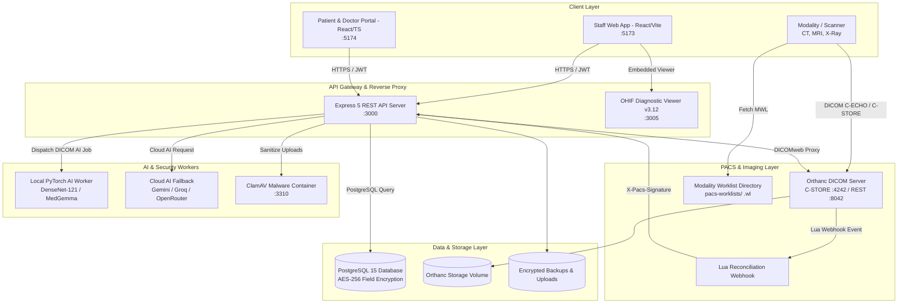
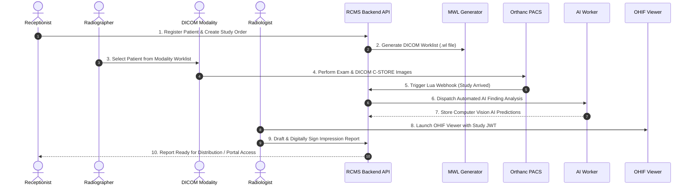

# Radiology Center Management System (RCMS)


**RCMS** is a high-availability, enterprise-grade **Radiology Information System (RIS)** and **Picture Archiving and Communication System (PACS)** orchestrator. It connects clinical radiology operations, DICOM image acquisition, web diagnostic viewing, AI-assisted finding analysis, patient self-service, referring physician collaboration, and financial management into a unified platform.

---

## 📐 System Architecture Diagram



---

## 🔄 End-to-End Clinical DICOM Workflow



---

## 🌟 Key Features

### 🩺 Radiology Information System (RIS)
* **Patient Lifecycle & Scheduling:** Complete workflow management from appointment scheduling, check-in, modality assignment, scan completion, to reporting and archiving.
* **Modality Worklist (MWL):** Real-time generation of standard DICOM `.wl` worklists for CT, MRI, X-Ray, Ultrasound, and Mammography modalities.
* **Structured Radiology Reporting:** Feature-rich reporting editor supporting pre-configured templates, macros, AI assistance, digital signatures, and PDF generation.

### 🖼️ PACS & Diagnostic Web Viewing
* **Orthanc DICOM Storage:** Native DICOM C-STORE, C-ECHO, QIDO-RS, and WADO-RS web services.
* **OHIF Diagnostic Viewer v3.12:** Embedded zero-footprint web viewer with study-scoped, short-lived JWT authentication for secure DICOMweb image streaming.
* **Real-time Webhook Reconciliation:** Lua script event handlers triggering immediate database state sync upon study receipt.

### 🤖 AI-Assisted Radiographic Finding Analysis
* **Local Computer Vision Worker:** PyTorch / TorchXRayVision container trained on chest radiography datasets (DenseNet-121, MedGemma).
* **Multi-Provider Cloud LLM Engine:** Automated fallback supporting Google Gemini Flash, Groq, OpenRouter, Anthropic Claude, and OpenAI.
* **De-identification & SSRF Protection:** Strict automated pixel & metadata de-identification prior to cloud calls, with private loopback IP range validation.

### 👥 Patient & Referring Physician Portal
* **Patient Self-Service:** Portal for reviewing report history, downloading invoices, and launching web image previews.
* **Referring Doctor Hub:** Real-time order status tracking, digital requisition forms, and secure document access.

### 🛡️ Enterprise Security & Data Protection
* **Field-Level PII Encryption:** AES-256-GCM encryption for sensitive patient fields with blind indexing for exact-match database queries.
* **Tamper-Evident Audit Chaining:** Cryptographically linked audit logs guaranteeing non-repudiation of data modifications.
* **Malware & Upload Protection:** ClamAV socket scanning for attachments and disk-quarantine byte caps for DICOM uploads.
* **Fail-Closed Startup Validation:** Strict environment schema validator (`validateEnv.js`) enforcing secret entropy, CORS rules, and backup parameters.

---

## 🏗️ Technology Stack

| Layer | Component | Technologies & Frameworks |
| :--- | :--- | :--- |
| **Backend** | API Server | Node.js (Express 5), Zod validation, Winston logger, `bcrypt`, `pg`, `dcmjs` |
| | Authentication | JWT Bearer Tokens, TOTP 2FA (`otplib`), Progressive Lockout |
| **Frontend** | Staff Client | React 18, Vite, Redux Toolkit, React Router v6, Tailwind CSS, Lucide Icons, Vitest |
| | Patient Portal | React 18, Vite, TypeScript 5.9, Redux Toolkit, Tailwind CSS, Sonner |
| **PACS / DICOM**| DICOM Core | Orthanc DICOM Server (v24.3.5), GDCM plugin |
| | Web Viewer | OHIF Diagnostic Viewer (v3.12.6) |
| **Database** | RDBMS | PostgreSQL 15 (Alpine), 94+ Transactional Migrations with Advisory Locks |
| **AI / Security**| Local Inference | Python 3.10, PyTorch, TorchXRayVision |
| | Security Scanner| ClamAV Container |
| **Orchestration**| System Runtime | Docker Engine v24+, Docker Compose v2, Node.js Orchestrator (`start-services.js`) |

---

## 📂 Detailed Repository Structure

```
RCMS/
├── backend/                  # Express.js REST API Server
│   ├── src/
│   │   ├── config/           # Database pool, Winston logger, CORS & env settings
│   │   ├── controllers/      # Business logic handlers (Auth, Patients, PACS, Reports, Billing)
│   │   ├── middleware/       # Auth JWT, RBAC role guard, rate limiters, upload validators
│   │   ├── routes/           # Modular REST API routes (/api/v1/...)
│   │   ├── schemas/          # Zod input validation schemas
│   │   ├── services/         # Encryption, audit chaining, DICOM MWL, AI dispatcher
│   │   ├── utils/            # Role governance, PII blind indexers, helper utilities
│   │   └── server.js         # API entry point & graceful connection draining
│   ├── scripts/              # Developer scripts (migrate, user create, backup decrypt)
│   └── tests/                # Jest backend unit and integration test suite
├── frontend/                 # Staff Web Client (React + Vite + Redux)
│   └── src/                  # Workstation components, DICOM viewer integration, i18n
├── portal/                   # Patient & Referring Doctor Portal (React + TS + Vite)
│   └── src/                  # Self-service portal pages, authentication, report viewer
├── pacs/                     # PACS & DICOM Services
│   ├── orthanc/              # Orthanc configuration (`orthanc.json`) & `reconcile.lua`
│   ├── ohif/                 # OHIF Viewer Nginx config & Docker context
│   └── ai-worker/            # Local PyTorch AI inference engine
├── pacs-worklists/           # DICOM Modality Worklist directory (.wl files)
├── database/                 # SQL schemas, seeders, and transactional migration engine (`migrate.js`)
├── start-services.js         # Master cross-platform launcher & process manager
├── start-services.bat        # Windows Command Prompt launcher
├── start-services.ps1        # PowerShell launcher
├── start-services.sh         # Linux/macOS Shell launcher
├── docker-compose.yml        # Multi-container production & development orchestration
└── WINDOWS_SERVER_2019_...   # Detailed Windows Server production deployment guide
```

---

## ⚙️ Environment Variables Reference

Below is the complete configuration matrix for `.env`. Copy from `.env.example` to start.

| Parameter | Required | Default | Description |
| :--- | :---: | :--- | :--- |
| `NODE_ENV` | Yes | `development` | Runtime mode (`development`, `production`, `test`) |
| `POSTGRES_USER` | Yes | `rcms` | PostgreSQL database user |
| `POSTGRES_PASSWORD` | **Yes** | — | High-entropy database password |
| `POSTGRES_DB` | Yes | `rcms` | Database name |
| `POSTGRES_PORT` | No | `5432` | Host port binding for PostgreSQL |
| `JWT_SECRET` | **Yes** | — | Minimum 32-character secret for signing JWT tokens |
| `ENCRYPTION_KEY` | **Yes** | — | Exactly 64 hex characters (32 bytes) for PII field encryption |
| `BACKUP_ENCRYPTION_KEY`| **Yes** | — | Separate 64 hex characters key for database backups |
| `BLIND_INDEX_KEY` | **Yes** | — | Separate secret key for HMAC blind indexing |
| `CLIENT_URL` | **Yes** | `http://localhost:5173` | Public HTTPS URL of the staff web application |
| `PORTAL_CLIENT_URL` | **Yes** | `http://localhost:5174` | Public HTTPS URL of the patient portal |
| `ALLOWED_ORIGINS` | **Yes** | — | Comma-separated list of allowed CORS origins |
| `ORTHANC_URL` | Yes | `http://orthanc:8042` | Orthanc REST API endpoint |
| `ORTHANC_USERNAME` | Yes | `rcms` | Orthanc REST authentication username |
| `ORTHANC_PASSWORD` | **Yes** | — | Orthanc REST authentication password |
| `ORTHANC_AET` | Yes | `MiPACS2` | Application Entity Title of the PACS server |
| `PACS_SERVER_IP` | Yes | `127.0.0.1` | LAN/VPN IP address used by modalities |
| `PACS_DICOM_PORT` | Yes | `4242` | Port modalities connect to for DICOM C-STORE |
| `PACS_WEBHOOK_SECRET` | **Yes** | — | Shared HMAC secret for Orthanc Lua webhooks |
| `GEMINI_API_KEY` | Optional | — | Google Gemini Flash API key for cloud AI report assistance |
| `OPENROUTER_API_KEY` | Optional | — | OpenRouter API key for fallback cloud AI models |
| `GROQ_API_KEY` | Optional | — | Groq API key for high-speed cloud inference |

---

## 👥 Staff Roles & Governance Matrix

RCMS enforces fine-grained Role-Based Access Control (RBAC):

| Role | System & Governance | Patient & Clinical | PACS & Viewing | Billing & Financial |
| :--- | :---: | :---: | :---: | :---: |
| **Developer** | Full System Control & Role Mgmt | Full Access | Full Access | Full Access |
| **Admin** | Manage Staff (except Protected) | Full Access | Full Access | Full Access |
| **Radiologist** | Read-Only Settings | Full Clinical & Reporting | Full OHIF & AI Tools | Read Invoices |
| **Technician / Nurse**| Read-Only Settings | Patient Check-in & Worklists | Modality & MWL Sync | None |
| **Receptionist** | None | Registration & Scheduling | View Study Status | Generate Invoices |
| **Cashier / Accountant**| None | View Patient Basic Info | None | Full Payment & Refund |
| **Insurance_Staff** | None | View Patient & Policy Info | None | Process Claims |
| **Referring_Doctor**| Portal Only | Assigned Patients Only | Portal Study Viewer | None |
| **Marketing / HR** | Manage HR/Marketing | None | None | None |

---

## 🚀 Quick Start & Development

### 1. Clone & Install
```bash
git clone https://github.com/abdo-elshaikh/RCMS.git
cd RCMS
npm install
```

### 2. Configure Environment
```bash
cp .env.example .env
# Edit .env and supply valid random secret strings
```

### 3. Launch Services

```bash
# Standard Dev Mode (Docker for DB/PACS/ClamAV, Node local for app code)
npm start

# Full Containerized Mode (Everything in Docker)
npm run dev:docker-all

# Bare-Metal Mode (Local Node processes against local DB/PACS)
npm run dev:no-docker
```

---

## 🌐 Endpoint Reference Table

| Component | URL / Port | Access | Description |
| :--- | :--- | :--- | :--- |
| **Staff App** | `http://localhost:5173` | Staff | Main RIS/PACS workstation interface |
| **Patient Portal** | `http://localhost:5174` | Public / Portal | Patient & Referring Physician Portal |
| **Backend REST API**| `http://localhost:3000` | Service | Express REST API |
| **API Health Check**| `http://localhost:3000/health/ready` | Public | Liveness & Database Readiness Check |
| **OHIF Viewer** | `http://localhost:3005` | Embedded | Diagnostic Web DICOM Viewer |
| **Orthanc REST API**| `http://localhost:8042` | Restricted | Orthanc Administration Interface |
| **DICOM C-STORE** | `127.0.0.1:4242` | Modalities | DICOM Modality Network Listener |

---

## 🧪 Testing & Validation Harness

```bash
# Execute backend unit test suite
npm test --prefix backend

# Execute frontend unit test suite
npm test --prefix frontend

# Run frontend ESLint checks
npm run lint --prefix frontend

# Verify TypeScript types on the patient portal
npm run typecheck --prefix portal

# Run complete pre-deployment verification harness
npm run validate-deployment --prefix backend
```

---

## ❓ Frequently Asked Questions & Troubleshooting

<details>
<summary><b>1. Error: "Environment validation failed: Missing secret key" on startup</b></summary>
RCMS uses a fail-closed environment validator (<code>validateEnv.js</code>). Ensure that <code>JWT_SECRET</code>, <code>ENCRYPTION_KEY</code>, <code>BACKUP_ENCRYPTION_KEY</code>, <code>BLIND_INDEX_KEY</code>, and <code>PACS_WEBHOOK_SECRET</code> are populated in your <code>.env</code> file with sufficient length/entropy.
</details>

<details>
<summary><b>2. DICOM Modality cannot send images to port 4242</b></summary>
Ensure that <code>PACS_DICOM_BIND</code> in <code>.env</code> is bound to the server's actual LAN IP (e.g. <code>192.168.1.100</code>) rather than <code>127.0.0.1</code>, and verify that firewall port <code>4242/TCP</code> is open for the modality subnet.
</details>

<details>
<summary><b>3. OHIF Viewer fails to load DICOM images (CORS error)</b></summary>
Check that <code>ALLOWED_ORIGINS</code> contains the exact origin URL where the staff application is being accessed (e.g. <code>http://localhost:5173</code> or <code>https://ris.center.com</code>).
</details>

<details>
<summary><b>4. How do I create the initial Admin / Developer account?</b></summary>
Run <code>npm run create:developer --prefix backend</code> from the project root. This CLI script will interactively guide you through generating a initial administrative account.
</details>

---

## 📄 License & Confidentiality

This codebase is **Proprietary & Confidential**. All rights reserved. Unauthorized copying, modification, or distribution is strictly prohibited.
