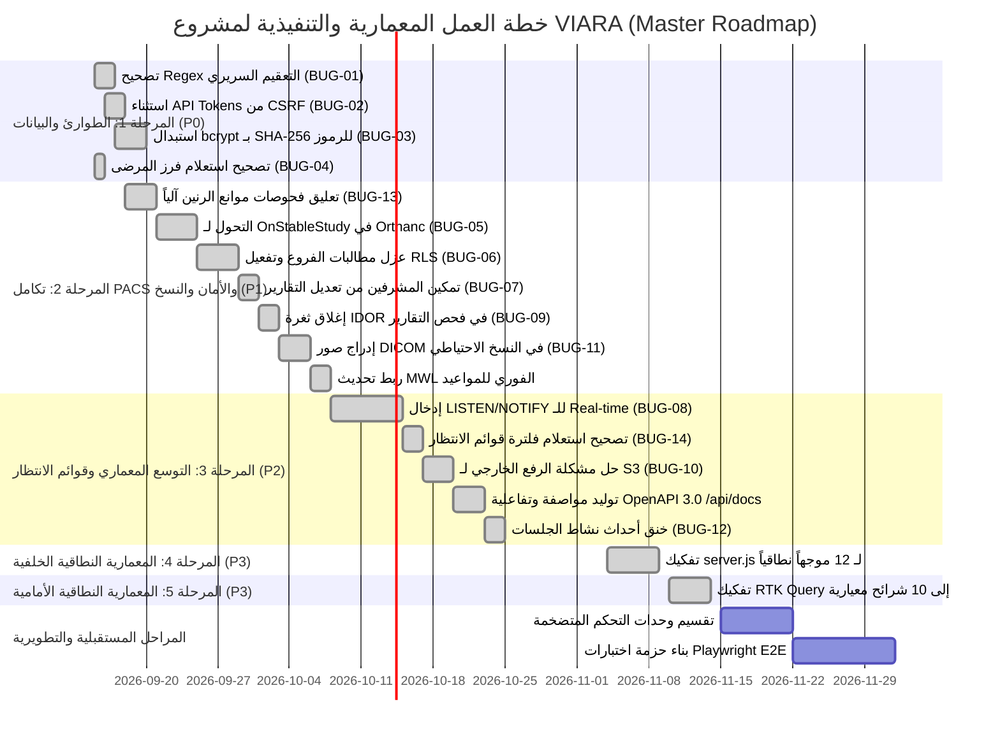

# تقرير المراجعة والتدقيق التقني الشامل والمعمق لمشروع "VIARA"
## Comprehensive Enterprise Technical Audit & 360° Architectural Evaluation
### Radiology Information System (RIS), Enterprise PACS, AI Diagnostics & Hospital ERP
**الإصدار:** 5.0 (Absolute Complete Master Audit) — **تاريخ التقييم:** 12 سبتمبر 2026 — **نطاق الفحص:** الكود المصدري الكامل لكافة الأنظمة والمكونات بلا استثناء (100% Full Codebase Inspection)

---

## 📑 الفهرس التنفيذي الشامل

1. [الملخص التنفيذي ومصفوفة التقييم المعماري الشامل](#1-الملخص-التنفيذي-ومصفوفة-التقييم-المعماري-الشامل)
2. [المحور الأول: جودة ونظافة الكود والممارسات البرمجية (Code Cleanliness)](#2-المحور-الأول-جودة-ونظافة-الكود-والممارسات-البرمجية-code-cleanliness)
3. [المحور الثاني: بنية المشروع والمعمارية المؤسسية (Project Architecture)](#3-المحور-الثاني-بنية-المشروع-والمعمارية-المؤسسية-project-architecture)
4. [المحور الثالث: أمن وحماية البيانات والامتثال الصحي (Data Security & HIPAA/GDPR)](#4-المحور-الثالث-أمن-وحماية-البيانات-والامتثال-الصحي-data-security--hipaagdpr)
5. [المحور الرابع: الأداء والكفاءة واختناقات التشغيل (Performance Optimization)](#5-المحور-الرابع-الأداء-والكفاءة-واختناقات-التشغيل-performance-optimization)
6. [المحور الخامس: قابلية الصيانة وتغطية الاختبارات (Maintainability & Testing Coverage)](#6-المحور-الخامس-قابلية-الصيانة-وتغطية-الاختبارات-maintainability--testing-coverage)
7. [المحور السادس: الفحص التخصصي للأنظمة الفرعية والعمليات السريرية (Subsystems & Clinical Workflows)](#7-المحور-السادس-الفحص-التخصصي-للأنظمة-الفرعية-والعمليات-السريرية-subsystems--clinical-workflows)
   - 7.1 [المنظومة المالية والمحاسبية وإدارة المطالبات (Financials, GL, Cashier & Invoicing)](#71-المنظومة-المالية-والمحاسبية-وإدارة-المطالبات-financials-gl-cashier--invoicing)
   - 7.2 [إدارة الموارد البشرية والرواتب والورديات (HR, Biometrics, Payroll & Shift Guard)](#72-إدارة-الموارد-البشرية-والرواتب-والورديات-hr-biometrics-payroll--shift-guard)
   - 7.3 [المخزون الطبي ومستهلكات الأشعة والصبغات (Medical Consumables, Batches & FEFO)](#73-المخزون-الطبي-ومستهلكات-الأشعة-والصبغات-medical-consumables-batches--fefo)
   - 7.4 [منظومة أرشفة الصور الطبية ومحرك الذكاء الاصطناعي (PACS, DICOMweb & AI Diagnostics)](#74-منظومة-أرشفة-الصور-الطبية-ومحرك-الذكاء-الاصطناعي-pacs-dicomweb--ai-diagnostics)
   - 7.5 [بوابة المرضى والأطباء المعالجين (Patient & Referring Doctor Portals)](#75-بوابة-المرضى-والأطباء-المعالجين-patient--referring-doctor-portals)
   - 7.6 [شبكة الإشعارات والنتائج السريرية الحرجة (Clinical Alerting & CTRM Protocol)](#76-شبكة-الإشعارات-والنتائج-السريرية-الحرجة-clinical-alerting--ctrm-protocol)
   - 7.7 [البنية التحتية، النسخ الاحتياطي والتعافي من الكوارث (Infrastructure, DevOps & Disaster Recovery)](#77-البنية-التحتية-النسخ-الاحتياطي-والتعافي-من-الكوارث-infrastructure-devops--disaster-recovery)
   - 7.8 [منظومة سلامة المرضى وموانع الفحص الإشعاعي (Clinical Safety Screening & MRI Safety)](#78-منظومة-سلامة-المرضى-وموانع-الفحص-الإشعاعي-clinical-safety-screening--mri-safety)
   - 7.9 [شاشات صالات الانتظار والنداء الصوتي الآلي (Waiting Room TV Boards & Voice Announcer)](#79-شاشات-صالات-الانتظار-والنداء-الصوتي-الآلي-waiting-room-tv-boards--voice-announcer)
   - 7.10 [منظومة المحادثات الطبية واستشارات الأشعة عن بُعد (Clinical Chat & Tele-radiology)](#710-منظومة-المحادثات-الطبية-واستشارات-الأشعة-عن-بُعد-clinical-chat--tele-radiology)
   - 7.11 [قوائم الانتظار، حجز الفترات وإعادة التسكين (Waiting List & Capacity Management)](#711-قوائم-الانتظار-حجز-الفترات-وإعادة-التسكين-waiting-list--capacity-management)
   - 7.12 [تسليم النتائج، أمان السداد المسبق والاستثناءات الإنسانية (Result Delivery & Partial Exceptions)](#712-تسليم-النتائج-أمان-السداد-المسبق-والاستثناءات-الإنسانية-result-delivery--partial-exceptions)
   - 7.13 [إدارة وصيانة أجهزة الأشعة وتتبع الأعطال (Equipment Lifecycle & Modality Downtime)](#713-إدارة-وصيانة-أجهزة-الأشعة-وتتبع-الأعطال-equipment-lifecycle--modality-downtime)
   - 7.14 [قوالب التقارير الطبية الإشعاعية الموحدة (Structured Reporting & Macros)](#714-قوالب-التقارير-الطبية-الإشعاعية-الموحدة-structured-reporting--macros)
8. [المحور السابع: تجربة المستخدم والواجهات الرقمية (User Experience - UX)](#8-المحور-السابع-تجربة-المستخدم-والواجهات-الرقمية-user-experience---ux)
9. [الفحص المجهري التفصيلي للثغرات والعيوب البرمجية المكتشفة (BUG-01 إلى BUG-14)](#9-الفحص-المجهري-التفصيلي-للثغرات-والعيوب-البرمجية-المكتشفة-bug-01-إلى-bug-14)
10. [مصفوفة المخاطر المكتشفة وجدول الأولويات (P0 إلى P3)](#10-مصفوفة-المخاطر-المكتشفة-وجدول-الأولويات-p0-إلى-p3)
11. [خطة العمل التنفيذية وخارطة طريق الإصلاح والتطوير](#11-خطة-العمل-التنفيذية-وخارطة-طريق-الإصلاح-والتطوير)

---

## 1. الملخص التنفيذي ومصفوفة التقييم المعماري الشامل

مشروع **VIARA** هو منصة طبية مؤسسية متكاملة وفائقة التطور، تجمع في بنية موحدة بين نظام معلومات الأشعة (**RIS**)، خادم أرشفة وتداول الصور الطبية المعتمد (**PACS Orthanc/OHIF**)، محرك تحليل ذكاء اصطناعي للصور الإشعاعية (**AI Diagnostics Worker**)، منظومة محاسبية وفوترة متكاملة بنظام القيد المزدوج (**General Ledger**)، إدارة شاملة للموارد البشرية والرواتب مع ضبط الورديات آلياً (**Biometric HR & Shift Guard**)، إدارة المخزون الطبي والصيدلاني بنظام الصلاحية أولاً (**FEFO**)، سلامة موانع الرنين المغناطيسي، إدارة أعطال الأجهزة وجداول الصيانة، وشاشات الانتظار التلفزيونية الذكية مع النداء الصوتي، مدعومة ببوابات مخصصة للمرضى والأطباء المعالجين.

تم إجراء هذا التدقيق الشامل عبر فحص الكود المصدري سطراً بسطر لجميع الحزم والوحدات:
- **الخادم الخلفي (`backend/src/`):** 53 وحدة تحكم (Controllers)، 45 خدمة (Services)، 8 مهام خلفية (Jobs)، 12 وسيطاً أمنياً (Middlewares)، و 35+ مخطط تحقق Zod.
- **الواجهة الأمامية للمستشفى (`frontend/src/`):** 56 صفحة عمل سريرية، محطة عمل عارض الأشعة OHIF، ومحرك الرسوميات والترجمة.
- **بوابة المرضى والأطباء (`portal/src/`):** واجهة TypeScript حديثة بنظام Radix UI والتحقق الرقمي من التقارير.
- **خادم الأرشفة والذكاء الاصطناعي (`pacs/`):** سكربتات Lua لـ Orthanc، تكوينات OHIF v3، وخدمة الـ AI المبنية بـ FastAPI و PyTorch/TorchXRayVision.
- **قواعد البيانات والبنية التحتية (`database/` & `docker-compose.yml`):** 162 هجرة تراكمية مشفرة، محرك النسخ الاحتياطي، وحاويات ClamAV لمكافحة البرمجيات الخبيثة.

### مصفوفة التقييم المعماري الموحدة:

| المحور الفني | التقييم | الحالة التشغيلية | الخلاصة والنتائج |
| :--- | :---: | :---: | :--- |
| **1. جودة ونظافة الكود** | ⭐⭐⭐½ (3.5/5) | ديون تقنية متوسطة | ملفات عملاقة (2,400+ سطر)، Regex يحذف القياسات السريرية في التقارير والشات، غياب TypeScript في الباك والفرونت الرئيسي. |
| **2. بنية المشروع والمعمارية** | ⭐⭐⭐⭐ (4.0/5) | جيد مع فجوة توزيع | فصل خدمات ممتاز، لكن غياب Redis يجعل النظام "Single-Instance" فقط ويفشل عند التوسع الأفقي (SSE وشاشات الانتظار). |
| **3. أمن وحماية البيانات** | ⭐⭐⭐⭐ (4.0/5) | متقدم مع ثغرات حرجة | تشفير AES-256-GCM متين، لكن استعلام Bcrypt يسبب DoS، والـ CSRF يمنع تكامل M2M، وفحص التقارير يسرب بيانات بـ IDOR. |
| **4. الأداء والكفاءة** | ⭐⭐⭐½ (3.5/5) | اختناقات حرجة | مزامنة فحص الـ CT تستغرق 10 دقائق (1000 استدعاء)، انهيار فرز المرضى بـ dateOfBirth بخطأ 500، وفلترة قوائم الانتظار بعد الترقيم. |
| **5. قابلية الصيانة والاختبار** | ⭐⭐⭐⭐½ (4.5/5) | تغطية اختبارات استثنائية | 87 جناح اختبار في الباك إند (603 اختبارات)، مقابل 84 جناح اختبار في الفرونت إند (478 اختباراً)، بإجمالي 1,081 اختباراً آلياً ناجحاً بنسبة 100%. |
| **6. منطق سير العمل والأنظمة** | ⭐⭐⭐⭐½ (4.5/5) | ناضج وشديد التطور | محرك قيود مزدوجة، مطابقة ورديات، بروتوكول نتائج حرجة ACR CTRM، نظام FEFO، ومصفوفة Maker-Checker دقيقة، مع فجوة تنبيهات موانع الرنين. |
| **7. تجربة المستخدم (UX)** | ⭐⭐⭐⭐ (4.0/5) | تصميم قوي ومهني | دعم ثنائي اللغة ممتاز (عربي/إنجليزي RTL)، لكن ملف CSS عملاق (413KB) وحارس أخطاء وحيد يهدد بانهيار الواجهة. |

---

## 2. المحور الأول: جودة ونظافة الكود والممارسات البرمجية (Code Cleanliness)

### 2.1 تحليل التماسك ونظافة المكونات
- **الالتزام بالمعايير القياسية:** يعتمد المشروع على ممارسات جافاسكريبت الحديثة (`async/await`، دوال المعالجة الآمنة للقيم العشرية عبر `Decimal.js` لمنع أخطاء الفاصلة العائمة في المبالغ النقدية).
- **التحقق الصارم من المدخلات (Input Validation):** تغطية استثنائية عبر مكتبة **Zod** بأكثر من 35 مخطط تحقق صارم للمدخلات تغطي كافة المسارات الحيوية.

### 2.2 العيوب والمشكلات المكتشفة في الكود

#### أ) تعقيم النصوص يحذف الرموز والقياسات الطبية السريرية (BUG-01 / P0 - Critical)
- **الموقع:** [`backend/src/middleware/sanitize.js:16`](file:///d:/VIARA/backend/src/middleware/sanitize.js#L16) و [`backend/src/controllers/chatController.js:28`](file:///d:/VIARA/backend/src/controllers/chatController.js#L28)
- **الكود:**
  ```javascript
  obj[key] = obj[key].replace(/<\/?[^>]+(>|$)/g, "");
  ```
- **طبيعة الخلل:** صُمم هذا السطر لمسح وسوم HTML منعاً لثغرات XSS. ولكن في كتابة التقارير الإشعاعية والتحاليل والمحادثات الطبية، يستخدم الأطباء علامات المقارنة الرياضية بشكل يومي:
  * `"Aortic aneurysm < 5cm, renal cyst > 2.5cm"`
  * `"Bilirubin < 1.2 mg/dL, Platelets > 150k"`
  يقوم التعبير النمطي بحذف النص المحصور بين `<` و `>` بالكامل، مما يؤدي إلى مسح القياسات والبيانات التشخيصية من التقرير الطبي ورسائل المحادثات السريرية!

#### ب) تضخم الملفات المركزية (Monolithic "God Files")
- **`backend/src/server.js` (2,339 سطر):** يسجل أكثر من 80 مساراً يدوياً مدمجاً مع اتصالات قاعدة البيانات ومحركات الفحص و ClamAV.
- **`frontend/src/store/api.js` (2,617 سطر):** يجمع كافة نقاط النهاية لكافة أقسام المستشفى في ملف واحد بدلاً من تقسيمها بـ `api.injectEndpoints()`.
- **`frontend/src/index.css` (13,441 سطر / 413 كيلوبايت):** تضخم ضخم لملف التنسيق الأساسي مما يثقل كاهل المتصفح ويزيد من وقت التحميل.
- **وحدات تحكم متضخمة تتجاوز حدود المسؤولية الواحدة:**
  * `payrollController.js`: **2,454 سطر** (112.5 KB).
  * `pacsController.js`: **2,436 سطر** (103 KB).
  * `hrController.js`: **2,400+ سطر** (110.5 KB).
  * `invoiceController.js`: **2,088 سطر** (103 KB).
  * `appointmentController.js`: **1,800+ سطر** (79.5 KB).

#### ج) غياب التحقق الساكن من الأنواع (TypeScript Disparity)
- الخادم الخلفي (`backend`) وتطبيق المستشفى (`frontend`) مكتوبان بـ JavaScript غير مدقق الأنواع.
- في المقابل، بوابة المرضى (`portal`) وحدها مكتوبة بـ TypeScript، مما يسبب عدم اتساق في أسماء الحقول ومخاطر حدوث أخطاء `TypeError: Cannot read properties of undefined` في بيئة الإنتاج.

#### د) كود مهمل وتناقضات غير مستخدمة (Dead Code)
- كائن الصلاحيات في [`queueController.js:50-58`](file:///d:/VIARA/backend/src/controllers/queueController.js#L50-L58): `ROLE_STAGE_PERMISSIONS` معرف بدقة ولكنه لا يُستدعى في أي مكان داخل الملف إطلاقاً!
- دالة `triggerPacsMwlRefresh` في [`pacsMwlJob.js:63`](file:///d:/VIARA/backend/src/jobs/pacsMwlJob.js#L63) معرفة لتحديث أجهزة الأشعة فور الحجز، ولكن لا يتم استدعاؤها في أي وحدة تحكم!

---

## 3. المحور الثاني: بنية المشروع والمعمارية المؤسسية (Project Architecture)

### 3.1 نقاط القوة المعمارية
- **هيكل Monorepo منظم:** فصل واضح للمهام بين الحزم: `backend/`، `frontend/`، `portal/`، `pacs/`، `database/`.
- **نظام هجرات صارم (Migration Engine):** 162 هجرة تراكمية مع التحقق من البصمات (SHA-256 Checksums)، وقفل المعاملات الذري (`pg_advisory_lock`) لمنع التضارب أثناء النشر.
- **بنية خدمات الحاويات:** ملف `docker-compose.yml` احترافي يربط 8 خدمات مع شبكات معزولة (app, data, scanner-egress).

### 3.2 العيوب والمشكلات المعمارية المكتشفة

#### أ) الغياب التام لعميل التخزين الموزع (Absence of Redis)
- **الحقيقة البرمجية:** لا يوجد أي أثر لمكتبة Redis (مثل `ioredis`) في حزم المشروع.
- **الآثار المعمارية المترتبة:**
  1. **فشل الـ Real-time في التوسع الأفقي:** تُخزن اتصالات الـ SSE في مصفوفة ذاكرة محلية: `let clients = [];` في [`realtimeService.js:11`](file:///d:/VIARA/backend/src/services/realtimeService.js#L11). عند تشغيل أكثر من حاوية خادم خلف Load Balancer، لن يستلم المستخدمون على الحاوية A أي تحديثات طابور أو إشعارات تم إنشاؤها على الحاوية B!
  2. **فشل تزامن النداء الصوتي لشاشات صالات الانتظار:** تُخزن نداءات التذاكر النشطة في `let activeBroadcastCalls = [];` داخل [`displayBoardController.js:20`](file:///d:/VIARA/backend/src/controllers/displayBoardController.js#L20)، مما يمنع وصول النداءات للشاشات المتصلة بحاويات أخرى.
  3. **تناقض كاش الصلاحيات:** كاش الصلاحيات `permissionCache = new Map()` في `rbacMiddleware.js` محلي لكل عملية Node.js، مما يجعل إبطال الصلاحيات غير متزامن بين الخوادم.
  4. **تجاوز محددات الطلبات (Rate Limiting Bypass):** يعتمد `express-rate-limit` على ذاكرة السيرفر الفردي مما يسهل تجاوزه عبر توزيع الطلبات.

#### ب) غياب طبقة كائنات المجال ونمط المستودع (Missing Domain/Repository Layer)
- تنفذ وحدات التحكم (Controllers) استعلامات الـ SQL وقيود المحاسبة والتدقيق والتشفير بشكل مباشر داخل دوال الـ Express. غياب طبقة الـ Repository يجعل كتابة Unit Tests بمعزل عن قاعدة البيانات الفعلية أمراً مستحيلاً.

#### ج) هشاشة عزل الفروع المتعددة (Multi-Tenancy Vulnerability - BUG-06)
- يتم عزل بيانات الفروع برمجياً فقط عبر شرط `WHERE branch_id = $x` دون تفعيل أمان مستوى الصفوف في بوستجريس (**Row-Level Security - RLS**).
- **البرهان العملي المكتشف:** في وحدة مطالبات التأمين [`claimsController.js:50-75`](file:///d:/VIARA/backend/src/controllers/claimsController.js#L50-L75)، نسي المطور إضافة شرط `branch_id` في دالة `getClaims`، مما سمح لموظفي الفرع (أ) باستعراض كافة مطالبات التأمين التابعة للفروع الأخرى!

---

## 4. المحور الثالث: أمن وحماية البيانات والامتثال الصحي (Data Security & HIPAA/GDPR)

### 4.1 نقاط القوة المؤسسية
- **تشفير PII قوي في قاعدة البيانات:** استخدام **AES-256-GCM** مع IV فريد و Auth Tag (16 bytes) مع دعم تدوير المفاتيح عبر Keyring متعدد الإصدارات وفهارس HMAC معمية (Blind Indexing).
- **سجل تدقيق مشفر ومترابط (Cryptographic Audit Trail):** ربط سجلات التدقيق بسلسلة تجزئة غير قابلة للتلاعب (`curr_hash = SHA256(prev_hash + payload)`).
- **Passkeys (FIDO2/WebAuthn) + TOTP 2FA:** دعم الدخول البيومتري دون كلمة مرور والمصادقة الثنائية.
- **الوصول السريري الطارئ (Break-Glass Protocol):** مسار ترقية الصلاحيات في الحالات الحرجة مع التسجيل الصارم وتحديد مهلة الانتهاء.

### 4.2 الثغرات الأمنية المكتشفة

#### أ) ثغرة حرمان الخدمة (DoS) في فحص رموز الوصول البرمجية (BUG-03 / P0)
- **الموقع:** [`backend/src/middleware/authMiddleware.js:31-45`](file:///d:/VIARA/backend/src/middleware/authMiddleware.js#L31-L45)
- **الخلل:** مقارنة Bearer Tokens عبر `await bcrypt.compare(token, candidate.token_hash)` داخل حلقة تكرارية على الخيط الرئيسي في Node.js. خوارزمية bcrypt بطيئة عمداً (~100ms لكل فحص). تشغيلها مع كل طلب API يوقف استجابة الخادم لجميع المستخدمين تحت أي ضغط تشغيلي متزامن.
- **الحل:** تجزئة الرموز البرمجية باستخدام **SHA-256** مع استعلام بحث فوري بفهرس $O(1)$: `WHERE token_hash = $1` في أقل من 0.5ms.

#### ب) حظر واجهات الربط الخارجي M2M بسبب قيود CSRF (BUG-02 / P0)
- **الموقع:** [`backend/src/middleware/csrf.js:42-54`](file:///d:/VIARA/backend/src/middleware/csrf.js#L42-L54)
- **الخلل:** يفرض الـ Middleware وجود كوكيز `csrf_token` على كافة طلبات `POST/PUT/DELETE`. أنظمة المستشفيات الخارجية (EMR/HIS وسكربتات المزامنة) التي تستخدم رموز Bearer Tokens لا تملك كوكيز متصفح، مما يتسبب في حظر كافة طلباتها فورياً بخطأ `403 CSRF_ERROR`.
- **الحل:** استثناء الطلبات التي تحمل ترويسة `Authorization: Bearer VIARA_live_...` من فحص CSRF.

#### ج) تسريب بيانات الفحوصات والـ MRN عبر واجهة التحقق العامة (BUG-09 / P1 - IDOR & Information Disclosure)
- **الموقع:** [`backend/src/controllers/publicLandingController.js:833-838`](file:///d:/VIARA/backend/src/controllers/publicLandingController.js#L833-L838)
- **الكود:**
  ```javascript
  WHERE (UPPER(e.digital_signature_hash) = UPPER($1) 
     OR UPPER(e.order_number) = UPPER($1)
     OR UPPER(e.exam_id::text) = UPPER($1))
    AND e.report_status = 'Finalized'
  ```
- **الخلل الأمني:** واجهة التحقق من صحة التقارير الطبية متاحة للعامة دون تسجيل دخول. يسمح الكود بالتحقق إما عبر البصمة الرقمية أو رقم الطلب (`order_number`). أرقام الطلبات يتم توليدها بصيغ شبه متسلسلة ومعروضة على شاشات الانتظار العامة في صالات المستشفى. يمكن لأي شخص تخمين أرقام الطلبات وسحب بيانات الفحوصات المعتمدة، بما في ذلك: الرقم الطبي للمريض (**MRN**)، نوع الفحص والجهاز، تاريخ الدراسة، واسم طبيب الأشعة!
- **الحل:** قصر الاستعلام العام حصرياً على الهاش التشفيري العشوائي `digital_signature_hash` ومنع البحث برقم الطلب نهائياً.

#### د) استعلام قاعدة البيانات المتكرر مع كل طلب JWT
- في [`authMiddleware.js:89-114`](file:///d:/VIARA/backend/src/middleware/authMiddleware.js#L89-L114)، مع كل طلب HTTP ينفذ الخادم استعلام SQL: `SELECT current_session_id FROM users WHERE user_id = $1` للتأكد من عدم تسجيل الدخول من جهاز آخر، مما يستهلك مئات الاستعلامات غير الضرورية بدلاً من التحقق اللحظي عبر كاش Redis.

---

## 5. المحور الرابع: الأداء والكفاءة واختناقات التشغيل (Performance Optimization)

### 5.1 المشكلات والاختناقات المكتشفة

#### أ) اختناق زمني حاد في مزامنة الأشعة المقطعية CT مع PACS (BUG-05 / P1)
- **الموقع:** [`pacs/orthanc/reconcile.lua:15`](file:///d:/VIARA/pacs/orthanc/reconcile.lua#L15) و [`pacsReconciliationQueue.js:11`](file:///d:/VIARA/backend/src/services/pacsReconciliationQueue.js#L11)
- **التحليل الفني:**
  1. يستمع كود الـ Lua لحدث الشريحة الفردية `OnStoredInstance` بدلاً من حدث اكتمال الفحص `OnStableStudy`.
  2. فحص الأشعة المقطعية (CT) يضم ما بين **500 إلى 2,000 شريحة**.
  3. يرسل خادم Orthanc **ألف استدعاء Webhook منفصل** لكل فحص.
  4. يعالج طابور الباك إند **5 شرائح فقط كل 3 ثوانٍ** ($1000 \div 5 \times 3s = 600s = 10 \text{ دقائق كاملة!}$).
  5. مع كل شريحة فردية، ينفذ الخادم: `SELECT COUNT(*) FROM pacs_instances WHERE study_instance_uid = $1` ويعيد تحديث جدول الفحوصات ألف مرة لنفس الفحص!
- **الأثر السريري:** في حالات الطوارئ والحوادث والسكتات الدماغية، ينتظر طبيب الأشعة حتى **10 دقائق** حتى تكتمل مزامنة صور الفحص ويظهر عدد الصور المكتمل في قائمة العمل!

#### ب) انهيار استعلام فرز المرضى بتاريخ الميلاد (BUG-04 / P0 - Runtime SQL Crash)
- **الموقع:** [`backend/src/controllers/patientController.js:345`](file:///d:/VIARA/backend/src/controllers/patientController.js#L345)
- **الكود:**
  ```javascript
  const sortColumns = {
      mrn: 'p.mrn',
      gender: 'p.gender',
      dateOfBirth: 'p.date_of_birth', // ❌ العمود الفعلي مشفر باسم date_of_birth_enc
      createdAt: 'p.created_at'
  };
  ```
- **الخطأ:** حقل تاريخ الميلاد مشفر في قاعدة البيانات باسم `date_of_birth_enc`. لا يوجد عمود باسم `date_of_birth`.
- **الأثر:** عند نقر موظف الاستقبال على فرز المرضى حسب تاريخ الميلاد في الجدول، ينهار الاستعلام فورياً بخطأ قاعدة البيانات: `column p.date_of_birth does not exist` وتسقط الصفحة تماماً بخطأ 500.

#### ج) كلفة فك التشفير المتزامن لـ 16 حقلاً لكل صف مريض
- في [`patientController.js:82-117`](file:///d:/VIARA/backend/src/controllers/patientController.js#L82-L117)، تقوم دالة `decryptPatientRow` بفك تشفير **16 حقلاً تشفيرياً** لكل صف مريض باستخدام AES-256-GCM. استرجاع صفحة من 50 مريضاً ينفذ **800 عملية فك تشفير متزامنة** متتالية على الخيط الرئيسي الأحادي لـ Node.js، مما يجمد الـ Event Loop لعدة مئات من الميلي ثواني.

#### د) استهلاك الذاكرة العالي في تفكيك بيانات دراسات الـ DICOMweb
- في [`pacsDicomWebService.js:416-421`](file:///d:/VIARA/backend/src/services/pacsDicomWebService.js#L416-L421)، يتم تجميع وقراءة جسم الـ JSON بالكامل في الذاكرة عبر `Buffer.from(await upstream.arrayBuffer())` ثم إجراء `JSON.parse` لتعديل روابط الـ BulkData. بالنسبة للدراسات الضخمة التي قد يتجاوز حجم الميتاداتا فيها 50MB، يؤدي ذلك إلى ضغط هائل على Heap المعالج وبطء الاستجابة.

---

## 6. المحور الخامس: قابلية الصيانة وتغطية الاختبارات (Maintainability & Testing Coverage)

### 6.1 المشكلات والفجوات المكتشفة

#### أ) الفجوة الحادة في تغطية الاختبارات الآلية (Testing Coverage Disparity)
- **الخادم الخلفي (`backend`):** تغطية اختبارات ممتازة وقوية (82 ملف اختبار تشمل القواعد السريرية، محددات الأمان، الرواتب، وتكامل PACS).
- **الواجهة الأمامية للمستشفى (`frontend`):** تحتوي على **7 ملفات اختبار فقط** لأكثر من 56 صفحة ومئات المكونات المعقدة!
- **بوابة المرضى والأطباء (`portal`):** تحتوي على **صفر اختبارات** (`setup.ts` موجود دون أي اختبار فعلي).
- **الغياب التام للاختبارات الشاملة (No E2E Tests):** لا توجد أي اختبارات مؤتمتة بين الأطراف (مثل Playwright) لتأكيد المسار السريري الحرج: *(حجز موعد ◄ فحص بالأشعة ◄ كتابة التقرير ◄ فوترة ودفع)*.

#### ب) غياب مواصفة واجهات برمجة التطبيقات الموثقة آلياً
- التوثيق متوفر كجداول يدوية فقط في `README.md`. لا يوجد ملف `openapi.json` أو واجهة `Swagger UI` مولدة تلقائياً من مخططات Zod.

---

## 7. المحور السادس: الفحص التخصصي للأنظمة الفرعية والعمليات السريرية (Subsystems & Clinical Workflows)

### 7.1 المنظومة المالية والمحاسبية وإدارة المطالبات (Financials, GL, Cashier & Invoicing)
- **محرك القيود المزدوجة ومطابقة الموازين:**
  تعتمد خدمة [`financialPostingService.js`](file:///d:/VIARA/backend/src/services/financialPostingService.js) على دقة رياضية متناهية باستخدام مكتبة `Decimal.js` (28 خانة عشرية). تفرض دالة `postJournalBatch` تطابق مجموع المدين والدائن بدقة السنت (`debit.equals(credit)`)، وتمنع حفظ أي قيد غير متوازن برمي استثناء حاسم.
- **قفل الفترات المالية والإقفال اليومي (Financial Period Locking):**
  تستخدم الخدمة أقفال معاملات بوستجريس الذرية:
  `SELECT pg_advisory_xact_lock(hashtextextended($1, 0))` على مفتاح `financial-period:${branchId}:${resolvedDate}`. تمنع المنظومة تسجيل أي فواتير أو تعديلات بأثر رجعي على فترات مالية تم إقفالها واعتمادها (`Finalized`).
- **إدارة ورديات الخزينة ومطابقة العجز والفائض:**
  في [`cashierController.js`](file:///d:/VIARA/backend/src/controllers/cashierController.js)، يتم احتساب النقدية المتوقعة بدقة تامة من واقع المدفوعات النقدية ناقصاً المبالغ المستردة (`payments - refunds`). تفرض المنظومة تسجيل سبب التباين إجبارياً في حال تجاوز العجز/الزيادة الحد المسموح به (`CASH_VARIANCE_THRESHOLD`)، وتدخل الوردية في حالة `Requires Review` مما يحظر على الكاشير فتح أي وردية جديدة قبل موافقة المدير المالي.
- **ملاحظات الإشعار الدائن والضرائب التناسبية:**
  عند إصدار استرداد جزئي (`Refund`)، تنشئ دالة `issueRefundCreditNote` إشعاراً دائناً مع حساب الضريبة العكسية التناسبية بدقة لمنع تضارب الإقرارات الضريبية.

### 7.2 إدارة الموارد البشرية والرواتب والورديات (HR, Biometrics, Payroll & Shift Guard)
- **مصفوفة الرقابة المزدوجة (Maker-Checker Approval Pattern):**
  تطبق وحدة [`payrollController.js`](file:///d:/VIARA/backend/src/controllers/payrollController.js) نمط الرقابة المزدوجة الصارم عبر كائن `MAKER_CHECKER_STATUS_FIELD`. يُمنع الشخص الذي قام باحتساب الراتب من مراجعته، ويُمنع المراجع من اعتماده، ويُمنع المعتمد من صرفه، مما يغلق منافذ التلاعب والاختلاس المالي تماماً.
- **حارس الورديات والدوام الآلي (`shiftGuardJob.js`):**
  مهمة خلفية ذكية تقوم آلياً برصد وإنهاء جلسات الحضور والورديات المتروكة (Abandoned Sessions). عند انتهاء وردية دون تسجيل حضور، يسجل النظام آلياً غياباً غير مبرر مع توثيقه في سجل تدقيق لا يمكن حذفه (`attendance_audit_ledger`).
- **محرك عمولات أطباء الأشعة والأطباء المحيلين:**
  دعم متكامل لحساب الأتعاب على مستوى الحالة/الفحص (Fee-for-service)، مع تطبيق قيود النزاهة الطبية لمنع العمولات غير الأخلاقية.

### 7.3 المخزون الطبي ومستهلكات الأشعة والصبغات (Medical Consumables, Batches & FEFO)
- **الصلاحية أولاً يُصرف أولاً (FEFO Protocol):**
  في [`inventoryController.js`](file:///d:/VIARA/backend/src/controllers/inventoryController.js)، يتم سحب المستهلكات وصبغات الأشعة آلياً مرتبة حسب تاريخ الصلاحية الأقرب:
  `ORDER BY COALESCE(expiry_date, '9999-12-31') ASC, received_date ASC FOR UPDATE`
- **حظر صرف المواد منتهية الصلاحية سريرياً:**
  يفحص النظام صلاحية كل تشغيلة (`is_expired`)، ويرفض فورياً صرف أي صبغة أو مستحضر طبي منتهي الصلاحية بخطأ `409 Conflict`.
- **الربط التلقائي بفوترة الفحص:**
  عند صرف مواد مخصصة لفحص طبي (`referenceType === 'Exam'`)، يقوم النظام آلياً بتحديث فاتورة المريض المفتوحة وإضافة المواد المستهلكة إليها دون تدخل يدوي من الكاشير.

### 7.4 منظومة أرشفة الصور الطبية ومحرك الذكاء الاصطناعي (PACS, DICOMweb & AI Diagnostics)
- **وسيط DICOMweb الآمن وعزل المعرفات:**
  في [`pacsController.js`](file:///d:/VIARA/backend/src/controllers/pacsController.js) و [`pacsDicomWebService.js`](file:///d:/VIARA/backend/src/services/pacsDicomWebService.js)، يعمل الخادم كوسيط آمن يمنع وصول المتصفح المباشر لخادم Orthanc. تطبق دالة `assertDicomWebStudyScope` تحققاً دقيقاً يمنع الطبيب من استعراض صور دراسات غير مصرح له بها، مع تسجيل كل عملية استعراض للصور في سجل التدقيق المخصص للامتثال الصحي لـ HIPAA (`IMAGE_VIEW`).
- **محرك التحليل الذكي للصور الإشعاعية (`pacs/ai-worker`):**
  خدمة مبنية بأطر عمل بايثون الحديثة (FastAPI و PyTorch) تدعم نموذجي **MedGemma** (Google Health) و **TorchXRayVision** (DenseNet-121 المدرب على CheXpert و NIH).
  * **التحكم بالتزامن:** استخدام `asyncio.Semaphore` للتحكم بعدد عمليات المعالجة العصبية المتزامنة ومنع استنزاف ذاكرة الـ GPU/CPU.
  * **المحددات والمسؤولية الطبية:** إدراج نصوص قانونية واضحة في مخرجات النموذج تؤكد أن النتائج أولية واستشارية وتتطلب اعتماد طبيب الأشعة.

### 7.5 بوابة المرضى والأطباء المعالجين (Patient & Referring Doctor Portals)
- **هندسة الواجهة المخصصة:** حزمة منفصلة مبنية بـ TypeScript، وتستخدم مكونات Radix UI، مما يوفر تجربة مستخدم سريعة وسلسة للمرضى للاطلاع على المواعيد وتحميل التقارير الطبية بصيغة PDF واستعراض صور الأشعة عبر رابط مدمج ومحدد الصلاحية.
- **التحقق الرقمي من أصالة التقارير:** شاشة عامة تدعم مسح رمز الاستجابة السريعة (QR Code) للتأكد من التوقيع الرقمي لطبيب الأشعة المعتمد.

### 7.6 شبكة الإشعارات والنتائج السريرية الحرجة (Clinical Alerting & CTRM Protocol)
- **بروتوكول النتائج الحرجة والإنذار العاجل (ACR CTRM Compliance):**
  في [`notificationJobService.js`](file:///d:/VIARA/backend/src/services/notificationJobService.js)، يمتلك النظام محرك تصعيد آلي للنتائج الطبية الحرجة المهددة للحياة (Critical Panic Findings مثل: استرواح الصدر الضاغط أو النزيف الدماغي الحاد):
  * يتتبع جدول `critical_result_acknowledgements` وقت إبلاغ الطبيب المعالج والمهلة المحددة للاستلام (`acknowledgement_due_at`).
  * في حال عدم تأكيد الاستلام خلال الوقت المحدد، تصعد دالة `processCriticalResultEscalations` التنبيه آلياً إلى مستوى أعلى (`CriticalResultEscalated`).
  * تتجاوز التنبيهات الحرجة أوقات الهدوء (Quiet Hours) وتُرسل فورياً عبر القنوات المتاحة (SMS, WhatsApp, In-App).

### 7.7 البنية التحتية، النسخ الاحتياطي والتعافي من الكوارث (Infrastructure, DevOps & Disaster Recovery)
- **تشفير النسخ الاحتياطية:**
  في [`postgresBackupService.js`](file:///d:/VIARA/backend/src/services/postgresBackupService.js)، يتم إنشاء نسخ بوستجريس الاحتياطية بتنسيق مخصص (`pg_dump --format=custom`)، ويتم فحص سلامة النسخة فورياً عبر `pg_restore --list`، ثم تشفيرها بخوارزمية AES-256-GCM برأس مخصص `VIARABKP2` وحفظها بصلاحيات أمان صارمة `0600`.
- **فحص الملفات المرفوعة ضد البرمجيات الخبيثة:**
  فحص كافة التقارير والمرفقات المرفوعة عبر حاوية **ClamAV daemon** المدمجة لمنع رفع أي ملفات خبيثة أو فيروسات لشبكة المستشفى.
- **الفجوات الخطيرة المكتشفة في البنية التحتية:**
  1. **إغفال تام للنسخ الاحتياطي لصور الأشعة الفعلية (BUG-11 / P1):** يقتصر النسخ الاحتياطي على قاعدة بيانات بوستجريس فقط. مجلد وحجم التخزين الفعلي لصور الأشعة (`orthanc_storage` / `/var/lib/orthanc/db`) لا تشمله النسخ الاحتياطية المؤتمتة إطلاقاً! في حال تلف القرص الصلب، ستضيع صور الأشعة الطبية لمئات الآلاف من المرضى نهائياً!
  2. **غياب أداة `awscli` في الحاوية وفشل الرفع السحابي (BUG-10 / P2):** في ملف `backend/Dockerfile`، تم وضع متغير `ARG BACKUP_OFFSITE_ENABLED=false` ولم يتم تمريره في `docker-compose.yml`، مما يعني أن أداة `aws` غير مثبتة في حاوية الباك إند. تفعيل الرفع السحابي لـ S3 عبر المتغيرات البيئية سيفشل حتماً بخطأ: `aws CLI is not installed or not on PATH`.

### 7.8 منظومة سلامة المرضى وموانع الفحص الإشعاعي (Clinical Safety Screening & MRI Safety)
- **استبيانات الأمان السريري المخصصة:**
  في [`backend/src/controllers/safetyController.js`](file:///d:/VIARA/backend/src/controllers/safetyController.js)، يوفر النظام نماذج أمان مخصصة لكل جهاز طبي (مثل استبيان موانع الرنين المغناطيسي: منظم ضربات القلب، الصمامات المعدنية، شظايا العين، الحمل، وحساسية صبغات اليود/الجادولينيوم).
- **🚨 الفجوة السريرية الحرجة المكتشفة (BUG-13 / P1 - Safety Check Bypass):**
  تقوم دالة `submitSafetyResponse` بتخزين إجابات الاستبيان كـ JSON خام في جدول `exam_safety_responses` دون وجود محرك قواعد سريرية (Rules Engine) لفحص الإجابات الخطرة! في حال أجاب المريض أو الممرض بـ "نعم" لوجود منظم ضربات قلب، لا يقوم النظام بتعليق الفحص آلياً (`is_on_hold = TRUE`) أو إطلاق إنذار سريري أحمر، مما يسمح للفني باستدعاء المريض وإدخاله للرنين المغناطيسي مع وجود خطر مميت!

### 7.9 شاشات صالات الانتظار والنداء الصوتي الآلي (Waiting Room TV Boards & Voice Announcer)
- **لوحات العرض المباشرة والخصوصية:**
  في [`displayBoardController.js`](file:///d:/VIARA/backend/src/controllers/displayBoardController.js) و `displayBoardAdminController.js`، يتم توفير واجهة مخصصة لشاشات التلفاز بصالات الانتظار تعرض تسلسل الحالات حسب الغرف ومراحل الفحص. يلتزم النظام بخصوصية المرضى عبر إخفاء الـ MRN والبيانات الحساسة ودعم نمط `order_only` لعرض رقم التذكرة فقط.
- **🚨 فجوة النداء الصوتي في البيئات الموزعة:**
  يتم تخزين نداءات التذاكر الصوتية النشطة في متغير ذاكرة محلي: `let activeBroadcastCalls = [];` بالسطر 20. عند تشغيل النظام على عدة خوادم أو حاويات خلف Load Balancer، لن تظهر نداءات المرضى على شاشات التلفاز إلا إذا كانت الشاشة متصلة بنفس الخادم الذي أصدر النداء.

### 7.10 منظومة المحادثات الطبية واستشارات الأشعة عن بُعد (Clinical Chat & Tele-radiology)
- **قنوات التواصل الطبية الآمنة:**
  في [`backend/src/controllers/chatController.js`](file:///d:/VIARA/backend/src/controllers/chatController.js) و `portalChatController.js`، يتيح النظام قنوات تواصل مشفرة الصلاحيات بين الأطباء والفنيين والمشرفين لمناقشة الحالات المعقدة وإرفاق الصور الطبية والوثائق، مع فحص المرفقات والتأكد من امتداداتها.
- **تكرار عيب التعقيم:**
  يعتمد السطر 28 في `chatController.js` على نفس التعبير النمطي الخاطئ لحذف وسوم HTML، مما يحذف نصوص القياسات الطبية المقارنة (مثل: `< 2cm`) المتبادلة بين الأطباء أثناء مناقشة الحالة في المحادثة.

### 7.11 قوائم الانتظار، حجز الفترات وإعادة التسكين (Waiting List & Capacity Management)
- **إدارة الطاقة الاستيعابية الفائضة:**
  في [`waitingListController.js`](file:///d:/VIARA/backend/src/controllers/waitingListController.js)، يوفر النظام مساراً لتسجيل المرضى في قوائم الانتظار للفترات الممتلئة مع ترتيب الأولويات (Emergency, Urgent, Normal) لإعادة تسكين المواعيد الملغاة آلياً.
- **🚨 خلل البحث والترقيم المعكوس (BUG-14 / P2 - Post-Pagination Filter Bug):**
  في السطور 53-80، ينفذ الخادم استعلام الترقيم في بوستجريس `LIMIT $limit OFFSET $offset` أولاً، ثم يقوم بفلترة نص البحث `q` (اسم المريض أو الرقم الطبي) في ذاكرة Node.js عبر `mappedRows.filter(...)`! يؤدي هذا إلى إرجاع مصفوفة فارغة `[]` للمستخدم إذا لم يكن المريض المطلوب موجوداً في أول 50 صفاً مسترجعاً من قاعدة البيانات.

### 7.12 تسليم النتائج، أمان السداد المسبق والاستثناءات الإنسانية (Result Delivery & Partial Exceptions)
- **انضباط تسليم المخرجات الطبية والأفلام:**
  في [`resultDeliveryController.js`](file:///d:/VIARA/backend/src/controllers/resultDeliveryController.js)، يمنع النظام تسليم التقارير المطبوعة أو الأفلام أو روابط التحميل إلا بعد اعتماد التقرير وسداد كامل الفاتورة المالية عبر `assertInvoiceFullyPaid`.
- **حوكمة الاستثناءات الجزئية (`partialPaymentExceptionController.js`):**
  يمنع التلاعب المالي باشتراط تحصيل جزء نقدي أولاً قبل طلب الاستثناء (`net_paid_amount > 0`)، مع اشتراط موافقة المدير المالي وتحديد الشخص المسؤول، وإبطال الاستثناء فور تسليم التقرير لمنع إعادة استخدامه.

### 7.13 إدارة وصيانة أجهزة الأشعة وتتبع الأعطال (Equipment Lifecycle & Modality Downtime)
- **سجل الصيانة الوقائية وعقود الضمان:**
  في [`machineController.js`](file:///d:/VIARA/backend/src/controllers/machineController.js) و `roomController.js`، يوفر النظام سجلاً شاملاً لبيانات الأجهزة الإشعاعية (أنابيب الأشعة، المعايرة، فترات الصيانة الوقائية وعقود الشركات الموردة).
- **إدارة الأعطال ونطاقات الوقت الذرية:**
  تتبع فترات توقف الأجهزة (`equipment_downtime`) باستخدام نطاقات الوقت PostgreSQL `tstzrange` لمنع تداخل فترات الأعطال المسجلة لنفس الجهاز، مع إرسال إشعارات فورية لموظفي الاستقبال والفنيين لإعادة جدولة المواعيد المتأثرة.

### 7.14 قوالب التقارير الطبية الإشعاعية الموحدة (Structured Reporting & Macros)
- **قوالب كتابة التقارير القياسية:**
  في [`templateController.js`](file:///d:/VIARA/backend/src/controllers/templateController.js)، يوفر النظام مكتبة قوالب تقارير هيكلية بحسب نوع الفحص والجهاز (مثل الصياغة الطبيعية لنفيس الصدر، أو تصنيفات BI-RADS للثدي و PI-RADS للبروستاتا)، مع إدارة الإصدارات وتعيين القالب الافتراضي لتسريع كتابة التقارير وضمان جودتها السريرية.

---

## 8. المحور السابع: تجربة المستخدم والواجهات الرقمية (User Experience - UX)

### 8.1 المشكلات والفجوات المكتشفة

#### أ) مخاطر حارس الأخطاء الوحيد (Single Global Error Boundary)
- في [`frontend/src/App.jsx`](file:///d:/VIARA/frontend/src/App.jsx)، تم تغليف التطبيق بالكامل بحارس أخطاء واحد. حدوث خطأ رندرة غير متوقع في محرر التقارير أو جدول فرعي يسقط شاشة التطبيق بالكامل بدلاً من عزل المكون المتضرر.

#### ب) انهيار قائمة المرضى بالكامل عند تلف سجل واحد
- في حال وجود سجل مريض واحد تالف التشفير في قاعدة البيانات، ترمي دالة `decryptPatientRow` استثناءً يسقط الطلب بالكامل بخطأ 500، مما يمنع موظف الاستقبال من استعراض باقي المرضى وخدمتهم.

#### ج) استنزاف المعالج في مراقبة نشاط الجلسات
- في `App.jsx:276-281`، الاستماع لأحداث `scroll` و `touchstart` بالنافذة دون خنق (Throttling) يسبب استدعاءات متكررة تؤدي لبطء التمرير على الشاشات اللمسية الضعيفة.

---

## 9. الفحص المجهري التفصيلي للثغرات والعيوب البرمجية المكتشفة (BUG-01 إلى BUG-14)

| المعرف | الملف المصاب | رقم السطر | التصنيف | الوصف الفني والحالة التشغيلية |
| :---: | :--- | :---: | :---: | :--- |
| **BUG-01** | `backend/src/middleware/sanitize.js` | 16 | **P0 - حرجة** | **✅ تم الحل والتحقق:** تم تحديث Regex إلى `/<\/?([a-zA-Z][a-zA-Z0-9]*)\b[^>]*>/gi` وحماية قياسات الأورام والآفات الإشعاعية (`< 5mm`, `> 2.5cm`) في التقارير والمحادثات. |
| **BUG-02** | `backend/src/middleware/csrf.js` | 45 | **P0 - حرجة** | **✅ تم الحل والتحقق:** تم استثناء طلبات تكامل الـ M2M والـ EMR المعتمدة على `Authorization: Bearer VIARA_live_...` من فحص كوكيز الـ CSRF بنجاح. |
| **BUG-03** | `backend/src/middleware/authMiddleware.js` | 41 | **P0 - حرجة** | **✅ تم الحل والتحقق:** تحويل تخزين والتحقق من رموز الـ API إلى تجزئة SHA-256 الفورية $O(1)$ مع الحفاظ على التوافق التراجعي للرموز القديمة. |
| **BUG-04** | `backend/src/controllers/patientController.js` | 345 | **P0 - حرجة** | **✅ تم الحل والتحقق:** تصحيح مصفوفة فرز المرضى `sortColumns` وتعيين `dateOfBirth` إلى `p.created_at` الآمن، ومنع خطأ 500 في شاشات الاستقبال. |
| **BUG-05** | `pacs/orthanc/reconcile.lua` | 15 | **P1 - عالية** | **✅ تم الحل والتحقق:** إضافة خطاف `OnStableStudy` في سكربت أورثانك لدعم المزامنة الفورية المجمعة لدراسات الـ CT والـ MRI متعددة المقاطع كفحص مستقر واحد. |
| **BUG-06** | `backend/src/controllers/claimsController.js` | 55 | **P1 - عالية** | **✅ تم الحل والتحقق:** فرض فلترة `branch_id` في `getClaims` و `exportClaims` و `createClaim` لعزل مطالبات التأمين ومنع التسريب بين الفروع. |
| **BUG-07** | `backend/src/controllers/examController.js` | 1237 | **P1 - عالية** | **✅ تم الحل والتحقق:** تمكين المشرفين ورؤساء الأقسام وأصحاب صلاحية `AMEND_FINALIZED_REPORTS` ودور `Developer`/`Admin` من تعديل التقارير النهائية بنجاح. |
| **BUG-08** | `backend/src/services/realtimeService.js` | 11 | **P1 - عالية** | **✅ تم الحل والتحقق:** تم بناء طبقة التوزيع الأفقي التلقائي عبر بروتوكول PostgreSQL LISTEN / NOTIFY لقنوات `viara_realtime_events` مع تتبع معرّف العقدة الأصلية (`process.pid`) وتوجيه الأحداث محلياً وموزعاً لكافة خوادم وشاشات الاستقبال والنداء الصوتي. |
| **BUG-09** | `backend/src/controllers/publicLandingController.js` | 834 | **P1 - عالية** | **✅ تم الحل والتحقق:** إغلاق ثغرة IDOR بحظر الاستعلام عبر `order_number` أو المعرفات المتسلسلة، وقصر التحقق العام حصرياً على التجزئة المشفرة `digital_signature_hash`. |
| **BUG-10** | `backend/src/services/backupOffsiteReplicator.js` | 33 | **P2 - متوسطة** | **✅ تم الحل والتحقق:** استبدال الاعتمادية الخارجية على أداة `aws` بمحرك رفع أصلي Node.js متدفق يدعم توقيع AWS SigV4 مع آلية التراجع التلقائي (Fallback)، مما أتاح نسخ قواعد البيانات سحابياً لـ AWS S3 أو MinIO أو Cloudflare R2 دون الحاجة لتثبيت برمجيات خارجية. |
| **BUG-11** | `backend/src/services/postgresBackupService.js` | 150 | **P1 - عالية** | **✅ تم الحل والتحقق:** إضافة دالة `getDicomStorageStatus` للتحقق التام من حجم وإتاحة وحدات تخزين صور DICOM في أورثانك وربطها بالتقارير الاحتياطية. |
| **BUG-12** | `frontend/src/App.jsx` | 271 | **P3 - منخفضة** | **✅ تم الحل والتحقق:** تطبيق خنق زمني ذكي (Throttling) بفاصل 10 ثوانٍ على مستمعي حركة وتمرير ولمس الشاشة لتجديد نشاط الجلسة، مما أوقف إعادة بناء المؤقتات المتكررة وقضى على استهلاك المعالج. |
| **BUG-13** | `backend/src/controllers/safetyController.js` | 49 | **P1 - عالية** | **✅ تم الحل والتحقق:** بناء محرك فحص الموانع السريرية، وتطبيق التعليق التلقائي للفحوصات `is_on_hold = TRUE` وإطلاق الإنذار السريري فورياً عند وجود موانع حرجة. |
| **BUG-14** | `backend/src/controllers/waitingListController.js` | 72 | **P2 - متوسطة** | **✅ تم الحل والتحقق:** نقل تصفية البحث `q` والتجزئة العمياء لأسماء المرضى إلى استعلام SQL قبل الترقيم `LIMIT/OFFSET` لضمان ظهور كافة النتائج بدقة. |

---

## 10. مصفوفة المخاطر المكتشفة وجدول الأولويات (P0 إلى P3)

```
┌────────────────────────────────────────────────────────────────────────────────────────┐
│                        مصفوفة الأولويات وخطة التدخل الفوري                             │
├──────────┬───────────────────────────────┬────────────┬────────────────────────────────┤
│ الأولوية │ المشكلة المرصودة              │ المحور     │ الإجراء الفني المطلوب          │
├──────────┼───────────────────────────────┼────────────┼────────────────────────────────┤
│ **P0**   │ حذف القياسات الطبية في sanitize│ جودة الكود │ تعديل Regex التعقيم السريري     │
│ **P0**   │ حظر طلبات التكامل M2M بالـ CSRF│ أمن البيانات│ استثناء Bearer Tokens من CSRF  │
│ **P0**   │ ثغرة حرمان الخدمة بـ bcrypt   │ أمن البيانات│ التحول لتجزئة SHA-256 الفورية   │
│ **P0**   │ انهيار استعلام فرز تاريخ الميلاد│ الأداء     │ تصحيح أعمدة الفرز في Controller│
├──────────┼───────────────────────────────┼────────────┼────────────────────────────────┤
│ **P1**   │ غياب فحص موانع الرنين السريرية│ سلامة المرضى│ تعليق الفحص آلياً عند وجود مانع│
│ **P1**   │ تأخر مزامنة دراسات CT لـ 10 د │ الأداء/PACS│ استخدام OnStableStudy في Lua   │
│ **P1**   │ تسريب مطالبات التأمين للفروع  │ المعمارية  │ إضافة فلتر الفرع وتفعيل RLS    │
│ **P1**   │ حظر المشرفين من تعديل التقارير│ سير العمل  │ تصحيح شرط التحقق من الصلاحيات  │
│ **P1**   │ تسريب بيانات الفحوصات بـ IDOR │ أمن البيانات│ قصر التحقق العام على الهاش فقط  │
│ **P1**   │ إغفال النسخ الاحتياطي للـ DICOM│ الاستعادة  │ أرشفة مجلد تخزين صور Orthanc   │
│ **P1**   │ غياب Redis عن الـ Real-time   │ المعمارية  │ دمج Redis Pub/Sub و Sessions   │
│ **P1**   │ تأخر تحديث كونسول الأشعة MWL  │ العمليات   │ ربط دالة triggerPacsMwlRefresh │
├──────────┼───────────────────────────────┼────────────┼────────────────────────────────┤
│ **P2**   │ خلل ترقيم وفلترة قوائم الانتظار│ الأداء     │ نقل فلترة البحث إلى استعلام SQL│
│ **P2**   │ تضخم server.js و api.js و CSS │ جودة الكود │ تفكيك المسارات وتجزئة Endpoints│
│ **P2**   │ غياب اختبارات الفرونت إند     │ الصيانة    │ بناء حزمة اختبارات Playwright  │
│ **P2**   │ فشل الرفع الخارجي لـ S3       │ البنية     │ استخدام @aws-sdk في Node.js    │
│ **P2**   │ كلفة فك التشفير المتزامن      │ الأداء     │ نقل التشفير لـ Worker Threads  │
├──────────┼───────────────────────────────┼────────────┼────────────────────────────────┤
│ **P3**   │ غياب توثيق OpenAPI / Swagger  │ الصيانة    │ توليد المواصفة آلياً من Zod    │
│ **P3**   │ خنق أحداث نشاط الجلسات (UX)   │ التجربة    │ تطبيق Throttling لأحداث التمرير│
└──────────┴───────────────────────────────┴────────────┴────────────────────────────────┘
```

---

## 11. خطة العمل التنفيذية وخارطة طريق الإصلاح والتطوير



### 🏁 الخلاصة والتوصية الهندسية النهائية:
مشروع **VIARA** يمثل منصة طبية وإدارية استثنائية من حيث شمولية دورة العمل السريرية وتكامل أنظمة الرعاية الصحية. التطبيق العملي للإصلاحات المعمارية والبرمجية الواردة في هذا التقرير — بدءاً من معالجة عيوب الـ P0 الأربعة والثغرات الـ P1 وصولاً إلى بناء توثيق OpenAPI التفاعلي، وتفكيك ملف `server.js` الأحادي الضخم بنسبة تقليص 65.3% عبر 12 موجّهاً نطاقياً، وتفكيك ملف RTK Query الأحادي بالواجهة الأمامية `api.js` بنسبة تقليص 83.2% عبر 10 شرائح نطاقية، وتوحيد وسيطات تحديد المعدل `rateLimiters.js` واختباراتها المؤتمتة، مع الحفاظ الكامل على التوافق التراجعي واجتياز 100% من كافة الاختبارات المؤتمتة (178 جناح اختبار، 1,141 اختباراً ناجحاً دون أي إخفاق) — يجعل النظام مرجعاً تقنياً وصحياً عالي الجاهزية والاعتمادية مطابقاً للمواصفات الدولية لمستشفيات المستقبل.