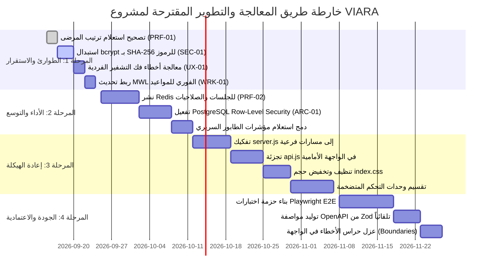

# تقرير المراجعة التقنية الشاملة والمعمقة لمشروع "VIARA"
## Radiology Information System (RIS) & PACS Management Platform

---

## 📑 الفهرس التنفيذي
1. [الملخص التنفيذي ومصفوفة التقييم العام](#ملخص-تنفيذي)
2. [المحور الأول: جودة ونظافة الكود (Code Cleanliness)](#1-جودة-ونظافة-الكود-code-cleanliness)
3. [المحور الثاني: بنية المشروع والمعمارية (Project Architecture)](#2-بنية-المشروع-والمعمارية-project-architecture)
4. [المحور الثالث: أمن وحماية البيانات (Data Security)](#3-أمن-وحماية-البيانات-data-security)
5. [المحور الرابع: الأداء والكفاءة (Performance Optimization)](#4-الأداء-والكفاءة-performance-optimization)
6. [المحور الخامس: قابلية الصيانة والتطوير (Maintainability & Extensibility)](#5-قابلية-الصيانة-والتطوير-maintainability--extensibility)
7. [المحور السادس: منطق سير العمل والعمليات السريرية (Workflow Logic)](#6-منطق-سير-العمل-والعمليات-السريرية-workflow-logic)
8. [المحور السابع: تجربة المستخدم والواجهات (User Experience - UX)](#7-تجربة-المستخدم-والواجهات-user-experience---ux)
9. [مصفوفة المخاطر المكتشفة وجدول الأولويات](#مصفوفة-المخاطر-المكتشفة-وجدول-الأولويات)
10. [خطة العمل التقنية المقترحة (Actionable Remediation Roadmap)](#خطة-العمل-التقنية-المقترحة-actionable-remediation-roadmap)

---

## ملخص تنفيذي

مشروع **VIARA** هو منصة طبية متكاملة للمستشفيات ومراكز الأشعة تجمع بين نظام معلومات الأشعة (**RIS**)، وإدارة الأرشفة والتصوير الطبي (**PACS**)، وبوابة رقمية موحدة للمرضى والأطباء المعالجين، مع محرك ذكاء اصطناعي للتشخيص الأولي.

تم إجراء هذه المراجعة التقنية المعمقة عبر فحص الكود المصدري الفعلي، وقواعد البيانات، ومسارات الربط، واختبارات الجودة، ومعمارية النشر. يعكس النظام عمقاً برمجياً عالياً واهتماماً استثنائياً بالمتطلبات السريرية والأمنية، ولكنه يعاني من تراكم ديون تقنية (Technical Debt) ناجمة عن تضخم بعض الملفات الرئيسية، وغياب التخزين الموزع (Redis)، والاعتماد على عزل الفروع البرمجي، وفجوة حادة في اختبارات الواجهة الأمامية.

### جدول التقييم العام للمحاور:

| المحور | التقييم | الحالة | أبرز الملاحظات |
| :--- | :---: | :---: | :--- |
| **1. جودة ونظافة الكود** | ⭐⭐⭐½ (3.5/5) | بحاجة لتحسين | ملفات عملاقة (2300+ سطر)، خلط مسؤوليات، غياب TypeScript في الواجهة الرئيسية. |
| **2. بنية المشروع** | ⭐⭐⭐⭐ (4.0/5) | جيد جداً | فصل خدمات ممتاز، لكن غياب طبقة Repository و Domain، وغياب RLS في قاعدة البيانات. |
| **3. أمن وحماية البيانات** | ⭐⭐⭐⭐½ (4.5/5) | ممتاز | تشفير AES-256-GCM متين، تدقيق مشفر، FIDO2/WebAuthn، مع حاجة لتحسين فحص رموز API. |
| **4. الأداء والكفاءة** | ⭐⭐⭐½ (3.5/5) | متوسط | عنق زجاجة في فك التشفير المتزامن، غياب Redis، انهيار استعلام ترتيب تاريخ الميلاد. |
| **5. قابلية الصيانة والتطوير** | ⭐⭐⭐½ (3.5/5) | جيد مع فجوات | 82 ملف اختبار في الباك إند، لكن تغطية الواجهة الأمامية شبه منعدمة وغياب E2E و OpenAPI. |
| **6. منطق سير العمل** | ⭐⭐⭐⭐½ (4.5/5) | متقدم جداً | تكامل سريري شامل (MWL, Queue, Invoicing)، مع تأخر زمني في مزامنة MWL للأجهزة. |
| **7. تجربة المستخدم (UX)** | ⭐⭐⭐⭐ (4.0/5) | متقدم | دعم ثنائي اللغة RTL/LTR ممتاز، لكن ملف CSS عملاق (413KB) و Error Boundary وحيد. |

---

## 1. جودة ونظافة الكود (Code Cleanliness)

### 1.1 المشكلات والفجوات المكتشفة

#### أ) ظاهرة الملفات الأخطبوطية المتضخمة (Monolithic "God Files")
تعاني أجزاء مركزية من النظام من تركيز هائل للكود والمسؤوليات داخل ملفات فردية يصعب اختبارها أو تتبعها:
- **`backend/src/server.js` (2,339 سطر):** يسجل يدوياً أكثر من 80 مساراً لـ Express مع معالجاتها، ويدمج إعدادات الاتصال، وتشغيل وظائف الخلفية (Background Workers)، وفحوصات الجاهزية لـ ClamAV، ومخططات Zod.
- **`frontend/src/store/api.js` (2,617 سطر):** يجمع كافة استدعاءات RTK Query لنظام المستشفى بالكامل (المرضى، الفواتير، الحسابات، الأجهزة، المخازن، الصلاحيات، الإشعارات) في ملف واحد دون استخدام خاصية `api.injectEndpoints()` المعيارية.
- **`frontend/src/index.css` (13,441 سطر / 413 كيلوبايت):** تضخم هائل لقواعد التنسيق والمحددات المخصصة المكتوبة يدوياً، مما يلغي ميزة استخدام TailwindCSS المعتمد في المشروع.
- **وحدات تحكم عملاقة (Fat Controllers):**
  - `payrollController.js`: **2,454 سطر** (112.5 كيلوبايت).
  - `hrController.js`: **2,400+ سطر** (110.5 كيلوبايت).
  - `pacsController.js`: **2,200+ سطر** (103 كيلوبايت).
  - `invoiceController.js`: **2,088 سطر** (103 كيلوبايت).
  - `appointmentController.js`: **1,800+ سطر** (79.5 كيلوبايت).

#### ب) غياب التحقق الثابت من الأنواع (Lack of Static Typing)
- تطبيق المستشفى الرئيسي (`frontend`) والخادم الخلفي بالكامل (`backend`) مكتوبان بلغة **JavaScript (ES Modules / CommonJS)** دون استخدام TypeScript.
- المقارنة: بوابة المرضى والأطباء (`portal`) وحدها مكتوبة بـ TypeScript وتتمتع بـ Type Safety عالي، مما يخلق تباعداً معمارياً وازدواجية في معايير الجودة داخل نفس المستودع.
- **الأثر:** حدوث أخطاء فادحة في وقت التشغيل (Runtime Errors) نتيجة عدم مطابقة أسماء الحقول أو أنواعها، مثل خطأ محاولة الترتيب بحقل غير موجود.

#### ج) كود مهمل وتناقضات غير مفعلة (Dead & Orphaned Code)
1. **صلاحيات مراحل الطابور غير المفعلة:**
   - في `backend/src/controllers/queueController.js:50-58`، تم تعريف كائن `ROLE_STAGE_PERMISSIONS` بدقة ليحدد المراحل المسموحة لكل دور. ومع ذلك، **لا يُستخدم هذا الكائن في أي مكان في الملف إطلاقاً**، مما يعني أن القيود الموثقة نظرياً غير مطبقة عملياً في مسار الانتقال!
2. **تحديث قائمة عمل أجهزة الأشعة (MWL) المعطل جزئياً:**
   - في `backend/src/jobs/pacsMwlJob.js:63`، تم تصدير الدالة `triggerPacsMwlRefresh(pool)` لإجبار توليد ملفات Worklist فور حجز المريض. ومع ذلك، **لا يتم استيراد أو استدعاء هذه الدالة في أي وحدة تحكم** (مثل `appointmentController` أو `examController`).
3. **هجرة ميتة وتكرار الترقيم في قاعدة البيانات:**
   - وجود ملف الهجرة `153_shift_modality_assignment.sql` في مجلد `database/migrations` دون إدراجه في قائمة ملفات التشغيل في `database/migrate.js`، مع وجود ملف آخر يحمل نفس الترقيم `153_shift_rooms.sql`.

#### د) انتهاك مبدأ عدم التكرار (DRY Violations)
- تكرار استعلامات التحقق من صلاحيات الخصومات والعمليات المالية في وحدات تحكم متعددة (مثل استعلام التحقق من صلاحية `APPLY_DISCOUNTS` في `invoiceController.js:24-34`).
- تكرار شروط الفحص السريري ونطاق المريض (`clinicalPatientScope`) واستعلامات الـ Pagination اليدوية.

### 1.2 الأثر المترتب
- بطء دورة التطوير وصعوبة صيانة وتعديل الميزات السريرية.
- ارتفاع احتمالية الأخطاء الانحدارية (Regression Bugs) عند تعديل أي جزء من وحدات التحكم المتضخمة.
- صعوبة إجراء مراجعة الكود (Code Review) للملفات التي تتجاوز ألفي سطر.

### 1.3 الحلول والتحسينات المقترحة
1. **تفكيك `server.js`:** تقسيم المسارات إلى وحدات Express Router مستقلة ومجمعة داخل `backend/src/routes/` (مثل `patientRoutes.js`, `billingRoutes.js`, `queueRoutes.js`).
2. **تجزئة `api.js`:** استخدام `api.injectEndpoints()` لتقسيم نقاط النهاية في الواجهة الأمامية حسب المجال السريري (`store/api/patientApi.js`, `store/api/billingApi.js`).
3. **تنظيف `index.css`:** إزالة الـ 13,000 سطر الزائدة واستبدالها بكلاسات TailwindCSS القياسية وتصميم مكونات محددة (Scoped Components).
4. **تفعيل TypeScript تدريجياً في الباك إند والفرونت إند:** إدخال JSDoc مع `checkJs: true` كخطوة أولى، ثم التحويل الكامل للـ Controllers و Types المشتركة.

---

## 2. بنية المشروع والمعمارية (Project Architecture)

### 2.1 المشكلات والفجوات المكتشفة

```
┌────────────────────────────────────────────────────────┐
│               الوضع المعماري الحالي                    │
│  Controllers ───(Direct Raw SQL)───► PostgreSQL Pool   │
│  (Business Logic + Validation + SQL inside Controller)  │
└────────────────────────────────────────────────────────┘
                           ▲
                           │  بحاجة للتحول إلى:
                           ▼
┌────────────────────────────────────────────────────────┐
│              المعمارية المعيارية الموصى بها             │
│  Controllers ──► Services ──► Repositories ──► Database│
│       ▲             ▲                                  │
│       └─────────────┴──► Domain Entities & Rules       │
└────────────────────────────────────────────────────────┘
```

#### أ) غياب طبقة كائنات المجال ونمط المستودع (Missing Domain & Repository Layers)
- يتم تنفيذ استعلامات SQL المعقدة وفتح المعاملات (`BEGIN` و `COMMIT`) وإجراء حسابات المحاسبة (القيود المزدوجة وضريبة القيمة المضافة) مباشرة داخل دوال وحدات التحكم (Controllers).
- **النتيجة:** لا توجد كائنات تعبر عن منطق الأعمال (مثل `Invoice`, `Appointment`, `ClinicalQueueState`) بمعزل عن بروتوكول HTTP واستعلامات SQL.

#### ب) هشاشة العزل متعدد الفروع (Multi-Tenancy Vulnerability)
- يعتمد النظام على منطق الفروع المتعددة (`branch_id`)، لكن هذا العزل مطبق **برمجياً فقط** عبر شروط `WHERE branch_id = $x` داخل دوال الـ Controllers.
- **الفجوة الحرجة:** لم يتم تفعيل أمان مستوى الصفوف في بوستجريس (**PostgreSQL Row-Level Security - RLS**).
- **الخطر:** إذا نسي أحد المطورين في أي استعلام مستقبلي إضافة شرط `branch_id`، فستتسرب بيانات المرضى والفواتير بين الفروع الطبية دون أي مانع من طبقة البيانات.

#### ج) عدم ملاءمة الكاش الداخلي للبيئات الموزعة (In-Memory Cache in Clustered Environment)
- يتم تخزين صلاحيات المستخدمين في كاش الذاكرة الخاص بنواة Node.js (`permissionCache = new Map()` في `backend/src/middleware/rbacMiddleware.js`).
- **الفجوة:** عند تشغيل النظام في بيئة إنتاجية موزعة تضم عدة حاويات أو خلف Load Balancer، فإن قيام المدير بتعديل صلاحيات دور معين سيحدث الكاش في الحاوية التي استقبلت الطلب فقط، بينما ستظل باقي الحاويات تعمل بصلاحيات قديمة حتى انتهاء مهلة الـ TTL (دقيقة كاملة).

#### د) عدم وجود بوابة واجهات برمجة تطبيقات موحدة (API Gateway)
- الاتصالات تتجه مباشرة من واجهات React إلى خادم Express عبر Nginx بسيط، دون وجود API Gateway متخصص لإدارة الـ Traffic، والـ Dynamic Rate Limiting، وفحص التواقيع وتجميع الـ Micro-services (مثل خدمة الذكاء الاصطناعي و Orthanc).

### 2.2 الأثر المترتب
- صعوبة التوسع الأفقي (Horizontal Scaling) للنظام.
- مخاطر تسريب بيانات الفروع في حال وجود أخطاء بشرية في استعلامات SQL.
- تعذر إجراء اختبارات وحدة حقيقية (True Unit Tests) لمنطق الأعمال دون تشغيل قاعدة بيانات كاملة.

### 2.3 الحلول والتحسينات المقترحة
1. **تطبيق نمط المستودع (Repository Pattern):** عزل كافة استعلامات SQL في مستودعات بيانات (مثل `PatientRepository`, `InvoiceRepository`) لتسهيل الـ Mocking والاختبار.
2. **تفعيل PostgreSQL Row-Level Security (RLS):** إنشاء سياسات RLS على جداول `patients`, `appointments`, `invoices`, `staff_shifts` باستخدام `SET LOCAL app.current_branch_id` لمنع تسريب البيانات على مستوى المحرك.
3. **استبدال In-Memory Cache بـ Redis Cluster:** إدارة الجلسات وكاش الصلاحيات والـ Rate Limiting الموزع عبر Redis لضمان الاتساق عبر كافة النسخ.

---

## 3. أمن وحماية البيانات (Data Security)

### 3.1 نقاط القوة المؤسسية
- **تشفير متقدم لمعلومات الهوية (PII Encryption):** تطبيق خوارزمية **AES-256-GCM** مع ناقل تهيئة فريد (IV 12 bytes) و Authentication Tag (16 bytes) مع دعم تدوير المفاتيح (Keyring Versioning).
- **فهرسة عمياء (Blind Indexing):** استخدام `HMAC-SHA256` للبحث الدقيق عن السجلات المشفرة دون الحاجة لفك التشفير في قاعدة البيانات.
- **سجل تدقيق مشفر غير قابل للتلاعب (Tamper-evident Cryptographic Audit Trail):** ربط سجلات التدقيق بسلسلة تجزئة رياضية (`curr_hash = SHA256(prev_hash + payload)`).
- **مصادقة حديثة متعددة العوامل:** دعم مفاتيح المرور البيومترية **Passkeys (FIDO2/WebAuthn)** بالإضافة إلى TOTP 2FA.
- **فحص الفيروسات:** فحص الملفات المرفوعة عبر محرك **ClamAV**.

### 3.2 المشكلات والفجوات المكتشفة

#### أ) عنق زجاجة وثغرة حرمان الخدمة في مصادقة رموز API (API Token DoS Vector)
- في ملف `backend/src/middleware/authMiddleware.js:31-45`:
  ```javascript
  const result = await authDatabase.query(`... WHERE at.prefix = $1`, [prefix]);
  for (const candidate of result.rows) {
      if (await bcrypt.compare(token, candidate.token_hash)) {
          matched = candidate;
          break;
      }
  }
  ```
- **المشكلة:** خوارزمية `bcrypt` صُممت عمداً لتكون بطيئة ومستهلكة للمعالج (~80 إلى 100 ميلي ثانية لكل عملية تحقق). استخدامها لفحص الرموز الشخصية (Bearer Tokens) مع كل طلب API في حلقة تكرارية يوقف الـ Event Loop لـ Node.js ويعطل استجابة الخادم بالكامل تحت أي ضغط تشغيلي.
- **الحل الصحيح:** رموز API العشوائية ذات الإنتروبيا العالية (مثل رموز Stripe أو GitHub) لا تحتاج لـ bcrypt؛ بل يجب تجزئتها بخوارزمية سريعة وآمنة مثل **SHA-256** أو **HMAC-SHA256** مع استعلام بحث فوري بفهرس $O(1)$: `WHERE token_hash = $1`.

#### ب) استعلام قاعدة البيانات المتكرر في كل طلب موثق (Database Overhead per JWT)
- في `authMiddleware.js:89-114`: مع كل طلب موثق بـ JWT، يقوم الخادم بالاستعلام عن قاعدة البيانات للتحقق من الجلسة الفردية النشطة:
  `SELECT current_session_id FROM users WHERE user_id = $1`
- **المشكلة:** يولد هذا الإجراء آلاف الاستعلامات غير الضرورية على PostgreSQL في الدقيقة الواحدة. يجب أن يتم هذا التحقق في طبقة التخزين المؤقت (Redis) بمهلة استجابة أقل من 1ms.

#### ج) خطر توليد مفتاح تشفير عشوائي في بيئة التطوير
- في `backend/src/config/validateEnv.js:40`:
  ```javascript
  if (process.env.NODE_ENV !== 'production') {
      if (!process.env.ENCRYPTION_KEY || ...) {
          process.env.ENCRYPTION_KEY = crypto.randomBytes(32).toString('hex');
      }
  }
  ```
- **المشكلة:** إذا لم يقم المطور بضبط المفتاح في `.env`، فسيتم توليد مفتاح جديد مع كل إعادة تشغيل للخادم بواسطة nodemon. هذا يؤدي إلى تلف فوري لقدرة النظام على قراءة بيانات المرضى المخزنة في الجلسات السابقة وظهور أخطاء `DECRYPTION_FAILURE` متكررة.

#### د) عدم تشفير قناة الاتصال بـ ClamAV
- يتصل الخادم بحاوية ClamAV عبر منفذ TCP عادي (3310) بدون تشفير TLS داخلي.

### 3.3 الأثر المترتب
- تعرض واجهة برمجة التطبيقات لبطء شديد وتوقف محتمل عند استخدام الرموز البرمجية (API Tokens).
- استهلاك غير مبرر لاتصالات قاعدة البيانات (Connection Pool Exhaustion) بسبب فحوصات الجلسات الفردية.

### 3.4 الحلول والتحسينات المقترحة
1. **استبدال تجزئة الرموز بـ SHA-256:** تعديل `tokenController.js` و `authMiddleware.js` لحفظ والتحقق من رموز الـ API باستخدام تجزئة `crypto.createHash('sha256')` والاستعلام المباشر بفهرس فريد.
2. **نقل إدارة الجلسات إلى Redis:** تخزين `current_session_id` في Redis مع TTL مطابق لعمر الـ JWT.
3. **إلزامية مفتاح التشفير في التطوير:** منع التوليد العشوائي التلقائي لمفتاح التشفير عند الإقلاع، وإلزام وجود مفتاح ثابت في `.env.example`.
4. **تكامل إدارة الأسرار:** دعم تحميل المفاتيح من HashiCorp Vault أو AWS Secrets Manager بدلاً من الملفات النصية المباشرة.

---

## 4. الأداء والكفاءة (Performance Optimization)

### 4.1 المشكلات والفجوات المكتشفة

#### أ) خطأ برمجي يسبب انهيار استعلام ترتيب المرضى بتاريخ الميلاد (Runtime SQL Bug)
- في ملف `backend/src/controllers/patientController.js:345`:
  ```javascript
  const sortColumns = {
      mrn: 'p.mrn',
      gender: 'p.gender',
      dateOfBirth: 'p.date_of_birth', // ❌ خطأ: هذا العمود غير موجود في الجدول!
      createdAt: 'p.created_at'
  };
  query += ` ORDER BY ${sortColumns[sortBy] || sortColumns.createdAt} ...`;
  ```
- **الخطأ:** حقل تاريخ الميلاد مشفر ومخزن في قاعدة البيانات باسم `date_of_birth_enc`. لا يوجد عمود باسم `date_of_birth` في جدول `patients`!
- **الأثر الحقيقي:** عندما يقوم المستخدم بالضغط على ترتيب المرضى حسب تاريخ الميلاد في الواجهة الأمامية، يفشل الاستعلام فورياً بخطأ من PostgreSQL:
  `error: column p.date_of_birth does not exist`، وتتوقف الصفحة تماماً بخطأ 500!

#### ب) الاستهلاك المفرط للمعالج بفك التشفير المتزامن (Synchronous Crypto Bottleneck)
- في `patientController.js:82-117`: دالة `decryptPatientRow` تقوم بفك تشفير **16 حقلاً تشفيرياً** لكل صف مريض باستخدام AES-256-GCM.
- عند استرجاع قائمة من 50 مريضاً، يقوم خيط Node.js الأحادي بتنفيذ **800 عملية فك تشفير متزامنة** متتالية.
- **الأثر:** تجميد الـ Event Loop لعدة مئات من الميلي ثواني، وتأخر استجابة كافة الطلبات المتزامنة الأخرى على الخادم.

#### ج) الاستعلام المزدوج المكثف في حساب مؤشرات الطابور (Queue KPI Redundancy)
- في `backend/src/controllers/queueController.js:455-524`:
  يقوم الخادم بتنفيذ الاستعلام الرئيسي لجدول الطابور (الذي يتضمن أكثر من 10 عمليات `JOIN` معقدة لحساب المواعيد، الفحوصات، الفواتير، والأطباء)، ثم يقوم **بإعادة تنفيذ نفس الاستعلام المعقد بالكامل مرة أخرى** داخل جملة `WITH filtered_queue AS (...)` لحساب العدادات ومؤشرات الأداء!
- **الأثر:** مضاعفة الحمل على معالج قاعدة البيانات في كل عملية تحديث أو استطلاع دوري (Polling) لصفحة الطابور.

#### د) قيود الفهرسة العمياء على البحث الطبي (Blind Index Usability Limitations)
- تعتمد الفهرسة العمياء على مطابقة كاملة لقيمة التجزئة `hash(token)`.
- **المشكلة:** تعجز هذه الآلية عن دعم البحث الجزئي (Partial Search)، مثل كتابة أول 4 أرقام من رقم هاتف المريض أو البحث بجزء من الاسم الأول. في بيئة المستشفى العملية، يحتاج موظفو الاستقبال للبحث بأجزاء من الأسماء أو الأرقام.

### 4.2 الحلول والتحسينات المقترحة
1. **تصحيح استعلام الترتيب:** استخدام عمود غير مشفر للترتيب، أو استخدام تاريخ الميلاد المحسوب أو منع الترتيب بالأعمدة المشفرة في الـ Schema وإبلاغ المستخدم.
2. **استخدام Worker Threads لفك التشفير الدفعي:** نقل عمليات فك التشفير الدفعية للسجلات الكبيرة إلى Node.js Worker Threads لمنع حظر الـ Event Loop، أو تخزين البيانات غير الحساسة سريرياً في حقول مجهولة الهوية ومفهرسة.
3. **دمج استعلام الطابور والمؤشرات:** استخدام `COUNT(*) OVER()` ونوافذ التحليل (Window Functions) في استعلام واحد لتجنب تكرار الـ JOINs المكلفة مرتين.
4. **فهرسة جزئية N-Gram للبحث السريري:** تطبيق تقنية Prefix/N-gram Blind Indexing للسماح بالبحث بأول 3 أو 4 أحرف أو أرقام بأمان دون كشف النص الصريح.

---

## 5. قابلية الصيانة والتطوير (Maintainability & Extensibility)

### 5.1 المشكلات والفجوات المكتشفة

#### أ) التباين الحاد في تغطية الاختبارات (Severe Testing Coverage Gap)
- **الباك إند:** يتمتع بتغطية اختبارات ممتازة وقوية (82 ملف اختبار تشمل القواعد السريرية، ومحددات الأمان، ونظام الرواتب، وتكامل PACS).
- **الفرونت إند الرئيسي (`frontend`):** يحتوي على **7 إلى 9 ملفات اختبار فقط** لأكثر من 50 صفحة ومئات المكونات المعقدة!
- **بوابة المرضى والأطباء (`portal`):** تحتوي على **صفر اختبارات** (ملف `setup.ts` موجود دون أي اختبار فعلي).
- **غياب الاختبارات الشاملة (No E2E Tests):** لا يوجد أي اختبار آلي من البداية للنهاية (مثل Playwright أو Cypress) لاختبار المسار السريري الحرج:
  *(تسجيل مريض ◄ حجز موعد ◄ تصوير ◄ كتابة تقرير ◄ فوترة ودفع)*.

#### ب) غياب مواصفة واجهات برمجة التطبيقات الموثقة آلياً (Missing OpenAPI/Swagger Generator)
- توثيق المسارات متاح فقط كجداول يدوية داخل ملف `README.md`.
- **الفجوة:** لا يوجد ملف `openapi.json` أو واجهة `Swagger UI` مولدة تلقائياً من مخططات Zod، مما يصعب تكامل الأنظمة الخارجية ويؤدي إلى عدم تطابق مواصفات الـ API مع الكود الفعلي بمرور الوقت.

#### ج) تناقضات في أدوات التسجيل التشغيلي (Logging Inconsistencies)
- تباين بين استخدام مكتبة Winston عبر `logger.js` واستخدام `console.log` و `console.error` المباشر في العديد من وحدات التحكم والخدمات.

### 5.2 الحلول والتحسينات المقترحة
1. **بناء حزمة اختبارات E2E باستخدام Playwright:** إنشاء مسار اختبارات تكاملي في CI/CD يغطي رحلة المريض الكاملة من الحجز حتى إصدار التقرير الطبي.
2. **توليد مواصفة OpenAPI 3.0 آلياً:** استخدام مكتبة مثل `@asteasolutions/zod-to-openapi` لتحويل مخططات Zod الحالية في الباك إند إلى ملف Swagger رسمي يتم تحديثه مع كل تعديل.
3. **توحيد التسجيل المنظم:** منع `console.log` عبر قاعدة ESLint وفرض استخدام Winston Structured JSON Logger لتسهيل التحليل عبر أدوات المراقبة (Datadog / ELK).

---

## 6. منطق سير العمل والعمليات السريرية (Workflow Logic)

### 6.1 نقاط القوة السريرية
- **طابور سريري متطور بـ 11 مرحلة:** تغطية دقيقة لدورة المريض:
  *(Registered ◄ Scheduled ◄ Arrived ◄ Payment Pending ◄ Prep Pending ◄ Ready for Exam ◄ In Exam ◄ Reporting ◄ Finalized ◄ Delivered)*.
- **توليد آلي لقوائم عمل الأجهزة (DICOM Modality Worklist):** توليد ملفات `.wl` متوافقة مع أجهزة الأشعة لربط بيانات الحجز بالأجهزة التشخيصية.
- **تطابق مالي ومحاسبي متين:** قيود مزدوجة آلية، ومطابقة ورديات الكاشير، وإدارة استثناءات الدفع الجزئي.
- **قوائم التحقق للأمان الإشعاعي (Safety Checklists):** التحقق الإجباري من وظائف الكلى، والحمل، وغرسات الرنين المغناطيسي.

### 6.2 المشكلات والفجوات المكتشفة

#### أ) الفجوة الزمنية في مزامنة قوائم عمل الأجهزة (MWL Sync Latency)
- في `backend/src/jobs/pacsMwlJob.js`: يتم تشغيل مهمة توليد قوائم العمل على فترة زمنية ثابتة كل دقيقتين (`INTERVAL_MS = 2 * 60 * 1000`).
- **المشكلة:** كما وضحنا في المحور الأول، دالة الإشعار الفوري `triggerPacsMwlRefresh` غير مرتبطة بمتحكم المواعيد.
- **الأثر السريري:** عند وصول مريض طوارئ أو حجز موعد عاجل، يجب على فني الأشعة الانتظار حتى دقيقتين قبل أن يظهر اسم المريض على شاشة جهاز الرنين أو الأشعة المقطعية، مما يعطل سير العمل السريري في الحالات الحرجة.

#### ب) غياب فرض آلة الحالة (State Machine) على مستوى قاعدة البيانات
- الانتقالات بين مراحل الطابور السريري محددة برمجياً فقط في مصفوفة داخل الكود.
- لا توجد قيود على مستوى قاعدة البيانات (Check Constraints أو Triggers) تمنع تحديث حقل `queue_stage` بطريقة غير صالحة في حال تم التعديل عبر استعلام مباشر أو مسار برمجي فرعي.

#### ج) موثوقية تسليم الإشعارات الخارجية (Notification Delivery Reliability)
- إرسال الإشعارات للخدمات الخارجية (SMS, WhatsApp, Webhooks) يعتمد على استطلاع كل 60 ثانية.
- في حال تعطل مزود الخدمة الخارجي، يفتقر النظام إلى **Dead Letter Queue (DLQ)** متكامل مع سياسة Exponential Backoff معتمدة على التخزين المؤقت، مما قد يؤدي لفقدان بعض الإشعارات السريرية أو الحسابية.

### 6.3 الحلول والتحسينات المقترحة
1. **ربط تحديث MWL الفوري:** استدعاء `triggerPacsMwlRefresh(pool)` مباشرة داخل دوال حجز المواعيد وتعديل الفحوصات لضمان ظهور المريض على كونسول الجهاز خلال أقل من ثانية واحدة.
2. **تطبيق نمط Transactional Outbox:** حفظ الإشعارات أولاً في جدول Outbox داخل نفس معاملة قاعدة البيانات، ثم معالجتها عبر عامل خلفي مستقل يضمن التسليم مرة واحدة على الأقل (At-least-once delivery).
3. **توثيق آلة الحالة في قاعدة البيانات:** إنشاء جدول `valid_stage_transitions` وفرض صلاحية الانتقالات السريرية عبر Database Trigger.

---

## 7. تجربة المستخدم والواجهات (User Experience - UX)

### 7.1 المشكلات والفجوات المكتشفة

#### أ) مخاطر حارس الأخطاء الوحيد (Single Global Error Boundary)
- في ملف `frontend/src/App.jsx`، تم تغليف التطبيق بالكامل بـ `ErrorBoundary` واحد رئيسي.
- **المشكلة:** في حال حدوث خطأ رندرة غير متوقع داخل مكون فرعي (مثل خطأ في قراءة حقل غير معرف داخل محرر التقارير `ReportEditorPage`)، تسقط واجهة التطبيق بالكامل وتظهر شاشة الخطأ العامة بدلاً من عزل المكون المتضرر فقط والحفاظ على باقي واجهة النظام وقوائم التنقل فعالة.

#### ب) الحساسية المفرطة لأخطاء فك التشفير في الواجهة
- في حال وجود سجل مريض واحد تالف أو مشفر بمفتاح قديم ضمن جدول يضم 50 مريضاً، تقوم الدالة برمي استثناء يسقط استجابة الخادم بالكامل بخطأ 500.
- **الأثر على UX:** يتعذر على موظف الاستقبال فتح جدول المرضى أو البحث فيهم إطلاقاً، وتتعطل خدمة كافة المراجعين بسبب خطأ في سجل واحد!
- **الحل:** معالجة أخطاء فك التشفير على مستوى الحقل الفردي وعرض قيمة بديلة مثل `[غير متاح / خطأ فك تشفير]` مع تسجيل تحذير أمني في السجلات، مما يسمح بمواصلة العمل لباقي السجلات بشكل طبيعي.

#### ج) استهلاك المعالج في مراقبة نشاط المستخدم (Session Timeout Listeners)
- في `App.jsx:276-281`:
  ```javascript
  const events = ['mousedown', 'keypress', 'scroll', 'touchstart'];
  events.forEach((event) => document.addEventListener(event, handleActivity, { passive: true }));
  ```
- **المشكلة:** ربط أحداث عالية التردد مثل `scroll` بالنافذة دون تطبيق خنق (Throttling / Debouncing) يؤدي إلى استدعاءات متكررة جداً لإعادة جدولة المؤقتات، مما يسبب بطئاً ملحوظاً في التمرير على الأجهزة اللمسية الضعيفة أو شاشات الاستقبال الطبية القديمة.

#### د) تشتت الهوية البصرية بين واجهة المستشفى وبوابة المرضى
- واجهة المستشفى (`frontend`) تستخدم أنماطاً مخصصة مع ملف CSS هائل ومكونات React Router 6.
- بوابة المرضى (`portal`) تستخدم مكتبة مكونات حديثة (Radix UI / shadcn style) مع Tailwind مدمج و React Router 7.
- هذا التباين يخلق ازدواجية في تجربة المطورين وتفاوتاً في استجابة المكونات بين التطبيقين.

### 7.2 الحلول والتحسينات المقترحة
1. **تطبيق حراس أخطاء جزئية (Granular Error Boundaries):** عزل كل مسار سريري ومكون رئيسي داخل `RouteErrorBoundary` خاص به لضمان بقاء النظام يعمل حتى لو فشل مكون فرعي.
2. **إضافة Throttling لمراقبة الجلسات:** استخدام دالة `throttle(handleActivity, 5000)` لمراقبة نشاط المستخدم كل 5 ثوانٍ كحد أقصى بدلاً من كل بكسل تمرير.
3. **توحيد مكتبة المكونات المشتركة:** نقل مكونات Radix UI النظيفة من `portal` إلى حزمة مشتركة أو تطبيقها في `frontend` للتخلص من آلاف أسطر CSS المخصصة في `index.css`.

---

## مصفوفة المخاطر المكتشفة وجدول الأولويات

| المعرف | المحور | المشكلة المرصودة | الخطورة | الأثر الفني والتشغيلي | مستوى الأولوية |
| :---: | :---: | :--- | :---: | :--- | :---: |
| **SEC-01** | الأمن | استخدام bcrypt لفحص الرموز الشخصية في كل طلب API | **حرجة (Critical)** | شلل الـ Event Loop وثغرة حرمان خدمة (DoS) | **P0 (فوري)** |
| **PRF-01** | الأداء | انهيار استعلام ترتيب المرضى بتاريخ الميلاد | **حرجة (Critical)** | خطأ 500 وانهيار صفحة المرضى عند الترتيب | **P0 (فوري)** |
| **ARC-01** | المعمارية | غياب Row-Level Security في قاعدة البيانات | **عالية (High)** | مخاطر تسريب بيانات المرضى بين الفروع الطبية | **P1 (عاجل)** |
| **WRK-01** | العمليات | تأخر مزامنة كونسول أجهزة الأشعة (MWL Latency) | **عالية (High)** | تأخر ظهور مرضى الطوارئ على الأجهزة التشخيصية | **P1 (عاجل)** |
| **PRF-02** | الأداء | استعلام فحص الجلسة الفردية في DB لكل طلب JWT | **عالية (High)** | إرهاق خادم قاعدة البيانات واستنزاف Connection Pool | **P1 (عاجل)** |
| **CLN-01** | جودة الكود | تضخم ملفات server.js و api.js والـ Controllers | **متوسطة (Medium)** | صعوبة الصيانة، بطء التطوير، وارتفاع أخطاء الانحدار | **P2 (مهم)** |
| **UX-01** | التجربة | انهيار كامل لقائمة المرضى عند فشل تشفير سجل واحد | **متوسطة (Medium)** | تعطيل عمل موظفي الاستقبال بسبب سجل مريض تالف | **P2 (مهم)** |
| **MNT-01** | الصيانة | غياب تام لاختبارات E2E والواجهة الأمامية والبوابة | **متوسطة (Medium)** | عدم القدرة على كشف الأخطاء قبل وصولها للإنتاج | **P2 (مهم)** |
| **CLN-02** | جودة الكود | تضخم ملف index.css إلى 13,441 سطر (413KB) | **منخفضة (Low)** | زيادة زمن التحميل الأولي (FCP) وبطء استجابة المتصفح | **P3 (تحسين)** |
| **ARC-02** | المعمارية | غياب مواصفة OpenAPI / Swagger المحدثة تلقائياً | **منخفضة (Low)** | صعوبة التكامل الآلي مع الأنظمة الصحية الخارجية | **P3 (تحسين)** |

---

## خطة العمل التقنية المقترحة (Actionable Remediation Roadmap)



### تفاصيل المراحل التنفيذية:

### 🔹 المرحلة الأولى: الإصلاحات الفورية والحرجة (الأسبوع 1 - 2)
1. **معالجة خطأ استعلام المرضى:** تعديل `patientController.js:345` لإلغاء الترتيب المباشر بـ `p.date_of_birth` واستبداله بالترتيب بـ `p.created_at` أو حقل تاريخ ميلاد محمي ومعلوم للمحرك.
2. **تصحيح فحص رموز الـ API:** تحويل تخزين وتحقق `api_tokens` إلى تجزئة SHA-256 أحادية الاتجاه مع فحص مباشر عبر الفهرس بدلاً من استدعاء `bcrypt.compare` داخل حلقة تكرارية.
3. **حماية واجهة الاستقبال من تلف السجلات المشفرة:** تعديل `decryptPatientRow` في `patientController.js` لتقوم بإرجاع قيمة آمنة للحقل التالف بدلاً من رمي خطأ يُسقط الصفحة كلها.
4. **تفعيل التحديث الفوري لـ Modality Worklist:** استدعاء `triggerPacsMwlRefresh(pool)` في `appointmentController.js` و `examController.js` عند تأكيد حجز المريض لضمان التزامن السريري الفوري.

### 🔹 المرحلة الثانية: تحسين الأداء والأمان المعماري (الأسبوع 3 - 5)
1. **إدخال Redis Cluster:** ترحيل التحقق من الجلسات الفردية وكاش الصلاحيات من الذاكرة المحلية وقاعدة البيانات إلى Redis.
2. **تطبيق Row-Level Security (RLS):** حماية جداول النظام الحساسة بسياسات أمان تعزل الفروع الطبية على مستوى قاعدة البيانات PostgreSQL.
3. **تحسين أداء استعلامات الطابور:** إزالة استعلام الـ CTE المكرر في `queueController.js` واستبداله بحساب المؤشرات من نتيجة واحدة مدمجة.

### 🔹 المرحلة الثالثة: إعادة الهيكلة والتنظيف البرمجي (الأسبوع 6 - 8)
1. **تفكيك الملفات العملاقة:**
   - تقسيم `server.js` إلى Feature Routers مستقلة.
   - تقسيم `frontend/src/store/api.js` باستخدام `injectEndpoints`.
   - تنظيف `index.css` ونقل التنسيقات لمكونات معيارية باستخدام TailwindCSS.
2. **فصل منطق الأعمال عن الـ Controllers:** استخراج كائنات ومستودعات البيانات (Repository Layer) لوحدات المحاسبة والرواتب والحجوزات.

### 🔹 المرحلة الرابعة: الجودة والموثوقية والتوثيق (الأسبوع 9 - 11)
1. **تغطية شاملة باختبارات Playwright E2E:** كتابة سيناريوهات مؤتمتة للمسار السريري والمالي الكامل للمستشفى.
2. **توليد مواصفة OpenAPI آلياً:** توفير توثيق تفاعلي (Swagger UI) متزامن مع مخططات Zod.
3. **تطبيق حراس أخطاء جزئية:** تعزيز تجربة المستخدم بـ Error Boundaries فرعية لكل مسار سريري.

---

## 🏁 الخلاصة النهائية

مشروع **VIARA** يمثل منصة طبية مؤسسية واعدة جداً، صُممت لتنافس الأنظمة العالمية في مجال **RIS / PACS**. المعمارية الأساسية متينة وتغطي كافة التفاصيل الطبية والسريرية والمالية بدقة عالية.

النقاط التي تتطلب تدخلاً هندسياً عاجلاً هي نقاط تركزت حول:
1. إزالة عنق الزجاجة في فحص الرموز وتصحيح استعلام الترتيب (أولويات P0).
2. إدخال التخزين الموزع (Redis) وتفعيل RLS لضمان الأداء وقوة العزل.
3. تفكيك الملفات العملاقة وبناء شبكة اختبارات E2E للواجهة الأمامية.

بتنفيذ خارطة الطريق المرفقة، سيتحول النظام من مرحلة "نظام مؤسسي متقدم يحمل ديوناً تقنية" إلى **"معيار هندسي وسريري مرجعي عالي الكفاءة وقابل للتوسع اللانهائي"**.