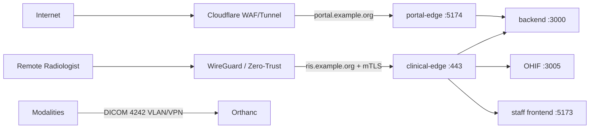

# VIARA Remote Access Kit (On-Premise + Secure Remote)

Production deployment kit for exposing an on-premise VIARA (RIS/PACS) install to
**remote radiologists**, the **patient / referring-physician portal**, and
**imaging modalities**, while keeping the clinical viewer off the public internet.

These templates support the three trust tiers described in the architecture review.
They require site-specific certificates, addresses, firewall rules and acceptance
testing. Their presence does not establish a working or approved deployment.

## Trust tiers

| Tier | Audience | Reachability | Artifact |
| :--- | :--- | :--- | :--- |
| **A — Public** | Patients, referring physicians | Internet via WAF/Tunnel | `nginx/portal-edge.conf` |
| **B — Clinical** | Radiologists (Worklist + OHIF), staff | Zero-Trust / WireGuard **+ mTLS** only | `nginx/clinical-edge.conf` |
| **C — On-prem** | Modalities, DB, Orthanc, AI | LAN/VPN, no public exposure | existing `docker-compose.yml` |



## Hard rules

1. **OHIF is never reachable from the public internet.** It is served only by
   `clinical-edge.conf` behind mTLS + WireGuard/Zero-Trust.
2. **The portal edge must return 404 for `/pacs-viewer/` and every admin path.**
3. **OHIF stays on the same HTTPS origin as the staff app** (`/pacs-viewer/`),
   never a separate hostname — viewer session auth is origin-scoped.
4. **DICOM 4242 is bound to the modality LAN/VPN interface only**, never
   `0.0.0.0`, with a network ACL per AE Title.
5. All clinical endpoints require TLS 1.2+; TLS 1.3 is preferred.

## Prerequisites

- A running VIARA stack reachable on the loopback interfaces used below
  (`backend:3000`, `frontend` build served on `5173`, `ohif` on `3005`, portal on `5174`).
  In the packaged Compose these are host-published on `127.0.0.1`; the edge
  configs proxy to those host ports. Adjust `*_upstream` values if your packaging
  publishes them on another address.
- An internal PKI (or a dedicated clinical CA) that can issue **client
  certificates** for radiologist devices.
- Public DNS for the portal hostname; the clinical hostname resolves only on the
  tunnel/VPN network.
- A reverse-proxy host, or run nginx in front of the Compose stack. The clinical
  template binds to `10.20.0.1` (the example WireGuard address); replace it with
  the real private interface. Do not replace it with a wildcard public listener.

## Deployment steps

### 1. Clinical tier (Tier B)

```bash
# 0. Include the rate-limit zones at http{} scope (edit the main nginx.conf):
#      http { include /etc/nginx/conf.d/http-ratelimit.conf; ... }
sudo install -m 0644 nginx/http-ratelimit.conf.example /etc/nginx/conf.d/http-ratelimit.conf
# Then uncomment the `limit_req zone=viara_api ...` line in clinical-edge.conf.

# 1. Install the CA bundle and issue per-device client certificates from your PKI.
sudo install -m 0644 clinical-ca.crt /etc/nginx/clinical-ca.crt

# 2. Install the edge config and TLS server certificate/key.
sudo install -m 0644 nginx/clinical-edge.conf /etc/nginx/conf.d/ris.conf
# Place the server cert/key at the paths referenced in the config.

# 3. Provision WireGuard so radiologist devices join the clinical network first.
#    See wireguard/README.md and wireguard/wg0.conf.example.

# 4. Validate and reload.
sudo nginx -t && sudo systemctl reload nginx
```

### 2. Public tier (Tier A)

```bash
sudo install -m 0644 nginx/portal-api-policy.conf /etc/nginx/portal-api-policy.conf
sudo install -m 0644 nginx/portal-edge.conf /etc/nginx/conf.d/portal.conf
# Restrict the origin to Cloudflare IP ranges (see comments in the file) or
# terminate the tunnel locally. See cloudflare/tunnel-config.yml.example.
sudo nginx -t && sudo systemctl reload nginx
```

A managed outbound tunnel is one option when inbound connectivity is unavailable.
Choose it after checking medical-data processing, TLS termination, bandwidth,
streaming limits and availability. For the supplied connector template, only the
local connector should reach `127.0.0.1:4433`. A static-IP DMZ ingress is an alternative.

The public portal forwards only the methods and paths in
`portal/nginx/portal-api-policy.json` (repository root). This excludes staff review,
staff login, PACS, administration and unknown endpoints. Query parameters do not
grant access. Backend authentication and per-resource authorization remain mandatory.
After a portal API change, run `node scripts/generate-portal-api-policy.cjs` from
the repository root, review the changes, rebuild the portal image and install the
updated edge policy. CI checks that the two generated copies match the source.
The policy must be included once in the edge nginx `http{}` context; both edge
server files can share that context without duplicate upstream names.

### 3. Verify

```bash
# From an authorised clinical device (mTLS cert present):
bash scripts/verify-remote-access.sh ris.example.org portal.example.org rad01.pem rad01.key clinical-ca.pem

# Negative checks (must FAIL):
#  - a device without a client certificate must not reach ris.example.org
#  - portal.example.org/pacs-viewer/ and staff APIs must return 404
```

On Windows (including a Windows Server edge host), use the PowerShell variant:

```powershell
.\scripts\verify-remote-access.ps1 -ClinicalHost ris.example.org -PortalHost portal.example.org `
    -ClientCert C:\certs\rad01.pem -ClientKey C:\certs\rad01.key -ClinicalCA C:\certs\clinical-ca.pem
```

Checks verify server certificates; do not use `-k` to obtain a passing result.
A valid clinical client certificate is required for a complete result. A failed
connection without a certificate alone does not demonstrate mTLS enforcement.

## Packaged deployment migration (8 October 2026)

- The optional `caddy-ssl` profile now publishes the **portal only**. Staff and OHIF
  use the private clinical ingress; the old public staff/PACS Caddy routes are removed.
- Rebuild and distribute the portal image to include the API policy. An older image
  does not gain filtering merely because the source configuration changed.
- New defaults bind frontend, portal, API, PACS REST and DICOM to loopback. Configure
  `PACS_DICOM_BIND` to the actual modality LAN address and apply device firewall rules
  before acquisition testing. Keep frontend and portal behind the ingress.
- Existing `.env` files are preserved: explicit old public bindings still override
  new defaults and must be reviewed. Required secrets cannot be empty; automatic
  generation occurs only for a new environment. Do not rotate encryption keys on
  an installed system without a data and backup migration plan.
- Windows initialization supports PowerShell 5.1 using the cryptographic RNG;
  Linux initialization requires OpenSSL and fails if secure generation fails.
- `TRUST_PROXY` lists the actual Caddy/frontend/portal addresses, not entire subnets.
  Adjust it if you change addresses; prevent clients from reaching backend directly.

Local integration checks from the repository root:

```bash
node scripts/generate-portal-api-policy.cjs --check
node scripts/verify-production-access-config.cjs
node scripts/verify-remote-access-local.cjs /path/to/nginx /path/to/openssl
```

The last command uses synthetic upstreams and temporary localhost listeners to
test real nginx routing/TLS/mTLS. It does not test application ownership checks,
public firewall reachability, clinical correctness or production throughput.

## Files

| File | Purpose |
| :--- | :--- |
| `nginx/clinical-edge.conf` | Tier B reverse proxy: mTLS, TLS 1.2+, OHIF on same origin, WADO streaming |
| `nginx/portal-edge.conf` | Tier A reverse proxy: portal only, viewer/admin paths blocked, edge WAF rules |
| `nginx/portal-api-policy.conf` | Generated method/path allowlist included at nginx http scope |
| `nginx/http-ratelimit.conf.example` | Rate-limit/connection zones to include at nginx `http{}` scope |
| `wireguard/wg0.conf.example` | WireGuard server interface for the clinical network |
| `wireguard/peer-client.conf.example` | Radiologist device peer template |
| `wireguard/README.md` | Key generation and peer provisioning |
| `cloudflare/tunnel-config.yml.example` | Cloudflare Tunnel ingress for the portal |
| `scripts/verify-remote-access.sh` | Acceptance checks for both tiers (Linux/macOS) |
| `scripts/verify-remote-access.ps1` | Acceptance checks for both tiers (Windows / PowerShell) |

## What this kit intentionally does not do

- It does not open, change, or weaken DICOM/Orthanc exposure. Do that in the
  Compose/env layer (`PACS_DICOM_BIND`, `orthanc.json`) and the network ACLs.
- It does not alter application auth, sessions, or RBAC. Those controls are
  already enforced by the backend.
- It does not replace a formal security review or penetration test.
