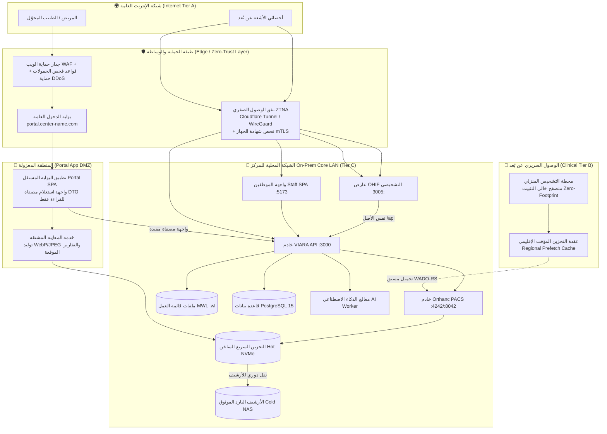

# مراجعة معمارية شاملة — نشر VIARA (RIS/PACS) محلياً مع الوصول عن بُعد

**تاريخ الإصدار:** 7 أكتوبر 2026  
**الحالة:** معتمدة كمرجع معماري رسمي (Approved Reference Architecture)  
**المجال:** نشر نظام معلومات الأشعة (RIS) ونظام أرشفة الصور (PACS) محلياً (On-Premise) مع تمكين الوصول السريري والعام الآمن عن بُعد (Secure Remote Access).

---

## 1. الحكم التنفيذي على الحالة الراهنة

| المحور | التقييم | الأساس الفعلي في الكود والإعدادات |
|---|---|---|
| الفصل الشبكي | 🟢 جيد جداً | المنافذ الافتراضية مربوطة بـ loopback (`docker-compose.yml:85,210,235,258,301`)، وشبكة `data` داخلية معزولة (`internal: true`, :382). |
| معمارية PACS | 🟢 جيد جداً | Orthanc + OHIF + proxy موحّد؛ المتصفح لا يتصل بـ Orthanc مباشرة. |
| ضبط DICOM | 🟢 مُحصَّن في المصدر | `DicomAlwaysAllowFind/FindWorklist/Store=false` و`DicomCheckModalityHost=true` (`orthanc.json:9-15`). |
| أمن الجلسات | 🟢 مُعالج بالكود | تم ربط جلسة العارض بـ 10 دقائق مع التحقق من جلسة الموظف وقاعدة البيانات، مع عزل `sessionStorage` للتبويبات (F03/F11). |
| الوصول عن بُعد | 🟠 يتطلب ضبط البنية | لا توجد طبقة وصول عن بُعد مُهيأة تشغيلياً (ZTNA/VPN)؛ البوابة العامة والواجهة السريرية تتطلبان فصلاً في أسماء النطاقات والـ Ingress. |
| نقل DICOM كبير | 🟡 جزئي | بثّ pixel و`proxy_buffering off` مفعل (`pacs/ohif/nginx.conf:40`)؛ التصدير بـ ZIP64 Streaming مفعّل؛ ينقص transcoding و prefetch و HTTP/2/3. |
| الخصوصية/الامتثال | 🟢 قوي الأساس | AES-256-GCM + Blind Indexing + تدقيق تسلسلي + WebAuthn/TOTP + فحص هوية المريض الصارم. |

### المبدأ الحاكم للفصل المعماري:
عزل ثلاث بيئات وصول بمستويات ثقة متباينة، ومنع دمجها في طبقة شبكية واحدة:
* **مستوى أ — عام (Internet Tier):** بوابة المريض والطبيب المحوّل فقط، ببيانات مُصفّاة تماماً (تقارير موقعة رقمياً + معاينات مشتقة WebP/JPEG)، دون كشف أي واجهات تشخيصية داخلية.
* **مستوى ب — سريري (Remote Clinical Tier):** قائمة العمل (Worklist) + العارض التشخيصي (OHIF) لأخصائيي الأشعة، عبر نفق شبكي صفري (ZTNA / WireGuard) مع التحقق من هوية وسلامة الجهاز (Device Posture / mTLS).
* **مستوى ج — محلي (On-Premise Core LAN Tier):** أجهزة التصوير الطبي (DICOM Modalities)، خوادم المعالجة، قاعدة البيانات، وسائط التخزين (Hot/Cold PACS Storage).

---

## 2. المعمارية المرجعية المعتمدة (Reference Architecture)

---

## 3. استراتيجية الربط والشبكات الآمنة

### 3.1 مقارنة تقنيات الربط وقرار الاعتماد
1. **البوابة العامة (Patient & Referring Doctors Portal):**
   * تُنشر خلف **Cloudflare Tunnel / Reverse Proxy مع WAF** وشهادة TLS 1.3 معتمدة.
   * لا تتطلب فتح أي منافذ واردة (No Inbound Ports) في جدار حماية المركز.
   * تُربط بنطاق فرعي مخصص مثل `portal.hospital.com`.
2. **الوصول السريري (Teleradiology / PACS & Worklist):**
   * يُمنع منعاً باتاً نشر عارض OHIF أو واجهة الموظفين على الإنترنت المفتوح.
   * يُعتمد **Cloudflare Zero-Trust (ZTNA) أو WireGuard VPN** مع التحقق الإلزامي من:
     * المصادقة متعددة العوامل (MFA / WebAuthn).
     * شهادة الجهاز المعتمدة (mTLS) أو التحقق من سلامة نظام التشغيل (Device Posture).
3. **منافذ DICOM للأجهزة (Port 4242 / 104):**
   * محصورة كلياً داخل شبكة أجهزة الأشعة المحلية المعزولة (Modality VLAN) عبر توجيه مباشر.
   * تفعيل التحقق الصارم من الـ Calling AE Title و Called AE Title وعنوان الـ IP المطابق في إعدادات Orthanc.

### 3.2 مصفوفة التعرض والحدود الأمنية (Exposure Matrix)

| الخدمة / المنفذ | المصدر المسموح به | الطبقة الأمنية | السياسة المعمارية |
|---|---|---|---|
| 443 (`portal`) | شبكة الإنترنت العامة عبر WAF | المستوى أ (عام) | مقتصر على تصفح المريض والطبيب المحول بروابط مؤقتة وOTP |
| 443 (`staff` / `OHIF`) | ZTNA / WireGuard فقط | المستوى ب (سريري) | محظور على العامة ومقيد بحسابات أطباء الأشعة المسجلين |
| 4242 (DICOM) | Modality VLAN فقط | المستوى ج (محلي) | محظور من الإنترنت وشبكة الموظفين الإداريين تماماً |
| 5432 / 8042 / 3000 / 3005 | Loopback / Docker Internal | المستوى ج (محلي) | خدمات خلفية لا تتعرض للشبكة الخارجية |

---

## 4. أمن الجلسات والهوية والامتثال للبيانات الطبية

1. **نموذج الهوية والتفويض:**
   * **الموظفون وأطباء الأشعة:** WebAuthn (Passkeys) + TOTP، مع تطبيق سياسة الصلاحيات الأدنى (Least Privilege) وعزل أدوار النظام عن الحسابات السريرية.
   * **بوابة المرضى:** توثيق ثنائي عبر رمز مؤقت (SMS / WhatsApp OTP) مقترن بالرقم القومي / رقم الملف (MRN) مع تشفير الـ Hash.
   * **جلسات العارض (OHIF Session Token):**
     * صلاحية الجلسة لا تتجاوز 10 دقائق مع التجديد النشط أثناء فحص الدراسة.
     * إبطال الجلسة فوراً عند تسجيل الخروج (Logout) أو تعطيل الحساب من لوحة الإدارة.
     * عزل الجلسات على مستوى الـ Tab الواحد باستخدام `sessionStorage` و URL fragments لمنع تداخل الدراسات المتزامنة.
2. **حماية البيانات الطبية (PHI):**
   * **أثناء السكون (At-Rest):** تشفير الأقراص لوحدات التخزين + تشفير الحقول الحساسة بقاعدة البيانات باستخدام خوارزمية AES-256-GCM مع Blind Indexing (HMAC-SHA256).
   * **أثناء النقل (In-Transit):** فرض بروتوكول TLS 1.3 مع شهادات مشفرة قوية و Perfect Forward Secrecy.
   * **إخفاء الهوية عند المشاركة (De-identification):** تفريغ وسوم DICOM الحساسة تلقائياً وفق معيار DICOM PS 3.15 Annex E عند إتاحة الصور للتحميل الخارجي.
   * **العلامات المائية الرقمية (Dynamic Watermarking):** وسم الصور المعروضة باسم الطبيب وعنوان الـ IP ووقت الجلسة للحد من تسريب الشاشات.

---

## 5. تجربة المستخدم وسير العمل لأخصائيي الأشعة (Clinical UX)

1. **قائمة العمل الذكية (STAT Prioritization):**
   * تصنيف الحالات تلقائياً حسب الأولوية السريرية (طوارئ STAT، عناية مركزة ICU، حالات روتينية).
   * تطبيق نظام قفل الحالات التلقائي (Concurrency Soft Locking عبر WebSockets) لمنع تضارب أطباء الأشعة على نفس الحالة.
2. **بروتوكولات العرض المسبقة (Hanging Protocols & Windowing):**
   * تطبيق قوالب النوافذ الفورية (Bone, Lung, Brain, Soft Tissue) ودعم الشاشات المزدوجة الطبية ومعايرة الرمادي القياسية (DICOM GSDF - Part 14).
3. **تكامل التقارير والإملاء الصوتي والذكاء الاصطناعي:**
   * محرر تقارير مدمج يدعم مفاتيح الاختصار السريعة (Ctrl+Enter للاعتماد، Ctrl+S للحفظ).
   * مزامنة نتائج مساعد الذكاء الاصطناعي التشخيصي وتوحيد حالات المعالجة (Queued / Running / Completed).

---

## 6. تسريع نقل ملفات DICOM الضخمة واستقرار الأداء

1. **مسار النقل المتقدم (WADO-RS Streaming):**
   * اعتماد DICOMweb (WADO-RS) عبر اتصال HTTP/2 مجزأ بدلاً من C-MOVE التقليدي.
   * تعطيل تخزين الوسيط المؤقت (`proxy_buffering off`) لبدء تسليم الإطارات فورياً إلى المتصفح.
2. **التحميل التنبؤي الذكي (Predictive Prefetching):**
   * تحميل الـ Scout/Localizer والشرائح الإرشادية أولاً في أجزاء من الثانية.
   * جلب دراسات المريض السابقة (Prior Studies) في الخلفية فور تحديد الحالة في الـ Worklist.
3. **ضغط الصور عالي الإنتاجية:**
   * استخدام ضغط غير فاقد للجودة (Lossless HTJ2K / JPEG-LS) يقلل الحجم بنسبة 60-75% للاستخدام عن بُعد دون المساس بالدقة التشخيصية.
4. **تخزين متعدد الطبقات (Tiered Lifecycle):**
   * **الطبقة الساخنة (Hot Tier):** أقراص NVMe فائقة السرعة لفحوصات آخر 30-60 يوماً.
   * **الطبقة الباردة (Cold Tier):** وحدات NAS / MinIO S3 للأرشيف التاريخي، مع الحفاظ على النسخ المشفرة وشهادات التحقق SHA-256.
5. **ضبط حدود الرفع والتصدير:**
   * اعتماد تصدير ZIP64 المتدفق (Streaming) لمنع استهلاك ذاكرة الخادم.
   * تقسيم الرفع متعدد الأجزاء بحد أقصى 25 MiB للملف و 190 MiB للدفعة مع معالجة واضحة لنتائج الرفع الجزئي.

---

## 7. النسخ الاحتياطي واستمرارية الأعمال (Disaster Recovery)

1. **النسخة الاحتياطية المتزامنة للـ PACS:**
   * تتكون النسخة الشاملة دوماً من قاعدة بيانات PostgreSQL وملف DICOM Companion مشفر (`.pacs.zip.enc`) مع ملف `manifest.json` وبصمات SHA-256 لكل ملف.
   * رفض النسخ أو الاستعادة في حال عدم تطابق البصمات أو تعديل الأرشيف أثناء العملية.
2. **الصمود المحلي عند انقطاع الإنترنت (Offline Survivability):**
   * استمرار العمل الطبي داخل المركز بشكل طبيعي 100% في حال انقطاع الاتصال الخارجي، وتجميع طلبات المزامنة الخارجية في طابور محلي يُستأنف فور عودة الشبكة.
3. **أهداف الاستعادة المعتمدة:**
   * نقطة استعادة البيانات (RPO) < 5 دقائق.
   * زمن استعادة الخدمة (RTO) < 15 دقيقة.

---

## 8. خطة التنفيذ المرحلية (Phased Execution Plan)

### المرحلة 0 (المتطلبات الحرجة الإلزامية قبل فتح أي وصول عن بُعد - Blocking Gaps):
- [x] التحقق من تطبيق إصلاحات F01 إلى F20 الخاصة بالجلسات و Orthanc و OHIF.
- [x] التحقق من تقييد صلاحيات DICOM في `orthanc.json` وتطابقها في الحاوية التشغيلية.
- [x] تفعيل مسار العارض الموحد `/pacs-viewer/` على أصل HTTPS آمن.
- [x] تثبيت وتفعيل حزمة ضغط الـ API (`compression` middleware) في `backend/src/server.js:516` مع حد 1024 بايت.

### المرحلة 1 (تهيئة البنية الشبكية والوصول الآمن):
- [ ] تهيئة نفق Cloudflare Tunnel للبوابة العامة (`portal.center-domain.com`).
- [ ] تهيئة بوابة الوصول السريري (Cloudflare Zero-Trust / WireGuard) مع سياسات الـ MFA والـ Device Posture.
- [ ] فصل VLAN الأجهزة الطبية وحظر المنفذ 4242 عن أي وصول خارجي.

### المرحلة 2 (تحسينات الأداء وتجربة المستخدم السريرية):
- [ ] تفعيل التحميل التنبؤي للدراسات السابقة في عارض الـ PACS.
- [ ] توثيق معايير الـ SLA عبر تشغيل اختبارات الأداء القياسية في `performance-tests`.
- [ ] تمكين التخصيص التلقائي لبروتوكولات العرض (Hanging Protocols) وقوالب التقارير.

### المرحلة 3 (الموثوقية والامتثال الخارجي):
- [ ] إجراء تمرين استعادة دوري للنسخ الاحتياطية للـ PACS في بيئة اختبار معزولة.
- [ ] تفعيل تصدير سجلات التدقيق إلى نظام SIEM خارجي.
- [ ] إجراء فحص اختراق أمني خارجي والتأكد من مطابقة وثائق الاعتماد لمعايير HIPAA و GDPR.

---

## 9. معايير القبول والجاهزية للتشغيل (Acceptance Criteria)

- [ ] عارض OHIF وقائمة العمل السريرية غير متاحين نهائياً من الإنترنت العام دون نفق Zero-Trust/VPN.
- [ ] المنفذ 4242 لا يستجيب إلا لأجهزة الأشعة المسجلة بالـ Calling AET وعنوان الـ IP المطابق.
- [ ] تسجيل الخروج من حساب الطبيب يبطل صلاحية رموز جلسة عارض الصور فوراً في قاعدة البيانات.
- [ ] فتح دراستين مختلفتين في تبويبين مستقلين يعمل بسلاسة دون تداخل أو تعارض في الجلسات.
- [ ] دراسة أشعة مقطعية CT بحجم 1000 شريحة تبدأ المعاينة الأولية في أقل من ثانية واحدة عبر WADO-RS.
- [ ] تصدير حزمة صور DICOM ZIP يعمل بأسلوب الـ Streaming ولا يسبب ارتفاعاً حاداً في ذاكرة الخادم.
- [ ] استعادة نسخة احتياطية مشفرة في بيئة معزولة تتيح عرض الصور الأصلية والتقارير بنجاح تام وبمطابقة 100% لبصمات SHA-256.
