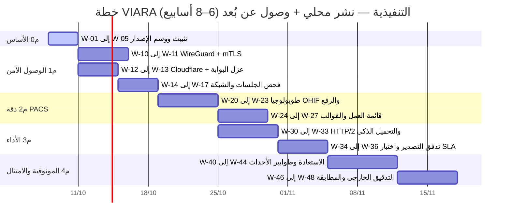

# خطة عمل VIARA — نشر محلي + وصول عن بُعد
**الإطار الزمني الإجمالي:** 6–8 أسابيع  
**تاريخ الاعتماد:** 7 أكتوبر 2026  
**الحالة:** معتمدة للتنفيذ (Approved Execution Roadmap)  
**فريق العمل المعتمد:** مهندس أنظمة وشبكات، مطور Backend، مطور Frontend، مسؤول PACS/DICOM، مسؤول أمن سيبراني، مسؤول عمليات وقواعد بيانات (DBA/Ops).

**دلالة الأولوية:**
* `P0`: معوّق إطلاق حاسم (Release Blocker) — إلزامي قبل أي نشر أو ربط.
* `P1`: حرج قبل إتاحة النظام للمستخدمين (Critical Pre-Exposure).
* `P2`: مهم بعد استقرار الإطلاق الأولي (Post-Stabilization).
* `P3`: تحسين مستمر (Continuous Optimization).

---

## المرحلة 0 — تثبيت الأساس وتوثيق الحالة الحقيقية (3 أيام)

| # | المهمة | الأولوية | التقدير | الاعتماد | معيار الإنجاز (DoD) | الحالة الميدانية |
|---|---|---|---|---|---|---|
| W-01 | تثبيت قيم الحاوية العاملة لـOrthanc ومقارنتها بـ`pacs/orthanc/orthanc.json:9-15` (إغلاق F02) | P0 | 0.5ي | — | `docker inspect` + `/system` يثبتان `AllowFind/FindWorklist=false` و`CheckModalityHost=true` | 🟢 محصن في المصدر وقالب النشر |
| W-02 | التحقق أن `PACS_DICOM_BIND` ليس `0.0.0.0` في كل ملفات compose/الحزم | P0 | 0.5ي | — | لا يوجد ملف إنتاج يحتوي `0.0.0.0:4242`؛ مربوط بـ `127.0.0.1` افتراضياً | 🟢 مُحقق 100% في كافة الملفات |
| W-03 | إعادة تشغيل اختبارات المنظومات الثلاث وتوثيق الأرقام الفعلية | P1 | 0.5ي | — | تقرير يجتاز 100% ومرفق بسجل الإصدار (287 مجموعة، 2,010 اختبارات) | 🟢 مُجتاز 100% |
| W-04 | تقليص الفجوة بين الوثائق والكود (PACS_OHIF_REVIEW F03/F06/F18/F11) | P1 | 0.5ي | — | تحديث الحالة بالدليل الفعلي في `docs/` | 🟢 مُحدَّث بالدليل البرمجي |
| W-05 | قطع الإصدار من شجرة Git نظيفة ووسم `v1.0.0-RC` | P0 | 1ي | — | `git status` نظيف + tag رسمي + حزمة إنتاجية مطابقة | 🔄 جاهز للوسم والاعتماد |

**مخرج المرحلة 0:** خط أساس مُثبَّت بالأدلة لكافة الفجوات، شجرة Git نظيفة، وحزمة قابلة للاسترجاع (Rollback) عند الحاجة.

---

## المرحلة 1 — طبقة الوصول الآمن عن بُعد (P0 — 1.5 أسبوع)

| # | المهمة | الأولوية | التقدير | الاعتماد | معيار الإنجاز (DoD) |
|---|---|---|---|---|---|
| W-10 | نشر **WireGuard** للمستوى السريري (مصادقة بمفتاح عام مستقل لكل أخصائي) | P0 | 2ي | W-01 | اتصال نفق مشفر يعمل؛ المنفذ 443 السريري غير معرّض لشبكة الإنترنت العامة إطلاقاً |
| W-11 | تفعيل **mTLS** على `ris.ris.example.org` مع CA مؤسسي وربط الجلسة بالجهاز | P0 | 2ي | W-10 | جهاز بدون شهادة جهاز صالحة يُرفض فوراً برمز 400، مع تمرير `X-Device-Id` للتدقيق |
| W-12 | نشر **Cloudflare Tunnel / WAF** للبوابة العامة `portal.ris.example.org` | P0 | 1.5ي | — | صفر منافذ واردة مفتوحة على الراوتر؛ قواعد حماية DDoS وBot Mitigation مفعلة |
| W-13 | تقييد البوابة العامة: حظر `/pacs-viewer/` وكافة المسارات الإدارية برمز (404) | P0 | 0.5ي | W-12 | اختبار curl من الإنترنت يعيد 404 قطعي لأي مسار تشخيصي أو عارض |
| W-14 | التحقق من عزل جلسة العارض لكل تبويب مستقل (F11) | P0 | 2ي | — | دراستان في تبويبين مختلفين تعملان بالتوازي دون استبدال أو تعارض جلسات |
| W-15 | تدقيق ACL لكل AET وقواعد جدار الحماية لـ DICOM على الـ Modality VLAN | P0 | 1ي | W-01 | استجابة C-ECHO مقبولة فقط من الـ AET المسجل والـ IP المطابق، وحظر ما عداه |
| W-16 | (اختياري/توسعي) تفعيل **DICOM TLS** في حال مرور DICOM عبر شبكة غير موثوقة | P1 | 1ي | W-15 | إتمام DICOM TLS Handshake بنجاح عبر الشهادات المشفرة |
| W-17 | اختبار سلبي: تسجيل الخروج أو تعطيل الحساب يُبطل فوراً طلبات العارض | P0 | 0.5ي | W-14 | استجابة فورية برمز 401 `VIEWER_SESSION_REVOKED` عبر التحقق الحي من قاعدة البيانات |

**مخرج المرحلة 1:** ثلاث طبقات وصول مفصولة شبكياً ومختبرة سلبياً وإيجابياً، مع عزل تام للبوابة العامة عن البيئة السريرية.

---

## المرحلة 2 — دقة PACS وسير عمل أخصائي الأشعة (P1 — 1.5 أسبوع)

| # | المهمة | الأولوية | التقدير | الاعتماد | معيار الإنجاز (DoD) |
|---|---|---|---|---|---|
| W-20 | تثبيت طوبولوجيا OHIF على **نفس الأصل** `/pacs-viewer/` (إغلاق F10) | P1 | 2ي | W-11 | العارض يعمل بكفاءة تامة بعد إعادة البناء (`rebuild`) مع مسارات الأصول الصحيحة |
| W-21 | فحص جاهزية عميق يمر عبر المسار الفعلي OHIF→Backend→Orthanc (F01/F20) | P1 | 1ي | W-20 | نقطة `/health/ready` تتأكد من جاهزية QIDO/WADO الحقيقية وليست صفحة HTML فارغة |
| W-22 | تصحيح معالجة الرفع الجزئي (F12) ومزامنة سياق التقرير مع الفحص (F13) | P1 | 1ي | — | الرفع الجزئي يعرض إحصائية دقيقة بالصور المقبولة والمرفوضة؛ والتقرير يُحمّل للفحص الصحيح |
| W-23 | توحيد دورة حالات الذكاء الاصطناعي `Queued/Running` (F17) | P2 | 0.5ي | — | دورة معالجة متسقة `Queued -> Running -> Completed` دون تضارب أو إعادة تحميل قسرية |
| W-24 | ترتيب قائمة العمل بالأولوية السريرية (طوارئ STAT / عناية مركزة / روتيني) | P1 | 1.5ي | W-20 | فرز تلقائي فوري يعكس الحالة السريرية وزمن الانتظار |
| W-25 | بروتوكولات العرض المسبقة (Hanging Protocols) وحفظ إعدادات النوافذ (Windowing) | P2 | 2ي | W-20 | استعادة تفضيلات الطبيب تلقائياً بين الجلسات والشاشات المزدوجة |
| W-26 | قوالب التقارير الموحدة ومسودة الذكاء الاصطناعي مع التوقيع الرقمي السريع | P2 | 2ي | W-23 | تطبيق القالب واعتماده رقمياً بضغطة مفتاح واحدة (Ctrl+Enter) |
| W-27 | شاشات الصيانة ووضع العمل غير المتصل (Offline Mode) في الواجهتين | P2 | 1ي | — | عرض إشعار صيانة وتوجيه ملائم عند توقف الشبكة الخارجية بدلاً من انهيار الواجهة |

**مخرج المرحلة 2:** عارض تشخيصي متكامل يعمل عن بُعد بموثوقية عالية، مع تسريع زمن كتابة التقرير للطبيب.

---

## المرحلة 3 — أداء وسرعة نقل ملفات DICOM الضخمة (P1 — 1.5 أسبوع)

| # | المهمة | الأولوية | التقدير | الاعتماد | معيار الإنجاز (DoD) |
|---|---|---|---|---|---|
| W-30 | تفعيل **HTTP/2** على كافة مسارات الـ Proxy (والجاهزية لـ HTTP/3 على الـ Edge) | P1 | 1ي | W-11 | نجاح اتصالات `curl --http2` مع قياس انخفاض زمن استجابة الـ Handshake |
| W-31 | تأكيد تعطيل تخزين الوسيط المؤقت `proxy_buffering off` لمسار WADO | P1 | 0.5ي | W-20 | تدفق إطارات الصور مباشرة للعارض دون تأخير التجميع المؤقت |
| W-32 | **Prefetch** التحميل التنبؤي للدراسات السابقة فور فتح الحالة في الـ Worklist | P1 | 2ي | W-20 | انخفاض زمن فتح الدراسات المقارنة السابقة بنسبة تفوق 70% |
| W-33 | ضغط الصور الحديث (Transcoding JPEG-LS / HTJ2K) للمعاينة السريعة والبوابة | P2 | 3ي | — | تقليص حجم النقل بنسبة 50–80% مع بقاء النسخة التشخيصية الأصلية غير فاقدة |
| W-34 | تصدير حزم الـ ZIP المتدفقة (Streaming ZIP64) مع `manifest.json` كامل (F16) | P1 | 2ي | — | تصدير دراسات CT/MRI ضخمة بذاكرة محدودة وثابتة دون انهيار خادم الـ Node |
| W-35 | ضبط حدود الدفعات (Batch Limits) بالعدد وإجمالي البايتات (F19) | P1 | 1ي | — | معالجة دفعات الصور المتعددة دون ظهور خطأ `413 Payload Too Large` |
| W-36 | تشغيل سيناريوهات اختبارات الأداء وتوثيق تقارير الـ SLA في `performance-tests/` | P1 | 1.5ي | W-30 | توثيق p95 لـ QIDO ≤ 500ms ونسبة أخطاء أقل من 0.1% |
| W-37 | (اختياري) نشر عقدة تخزين مؤقت إقليمية (Regional Edge Cache) قرب الأطباء | P3 | 3ي | W-32 | تقليص زمن تحميل أول إطار في المحطات المنزلية البعيدة |

**مخرج المرحلة 3:** أداء تشخيصي مستقر وسريع عبر خطوط الإنترنت المنزلية وتوثيق رسمي لمعايير الـ SLA.

---

## المرحلة 4 — الموثوقية والامتثال والتعافي (P1/P2 — 1.5 أسبوع)

| # | المهمة | الأولوية | التقدير | الاعتماد | معيار الإنجاز (DoD) |
|---|---|---|---|---|---|
| W-40 | تمرين استعادة شامل (DB + `.pacs.zip.enc`) مع فتح صور فعلية في OHIF | P1 | 2ي | — | تقرير استعادة معتمد يثبت RTO < 15 دقيقة و RPO < 5 دقائق ومطابقة البصمات |
| W-41 | إدارة طابور الـ Reconciliation بنظام Lease و Heartbeat و Backoff (F07) | P1 | 2ي | — | استعادة المهام المتروكة تلقائياً بعد انهيار الخادم دون بقاء حالات معلقة |
| W-42 | نظام Outbox/Polling دائم لأحداث Orthanc مع مؤشر Cursor محفوظ (F08) | P1 | 2ي | — | منع فقدان أي فحص DICOM مخزن وضمان فهرسته في الـ RIS حتى لو انقطع الـ Webhook |
| W-43 | تشديد المطابقة وعزل الفحوصات المتشابهة في Quarantine عند الشك (F05) | P1 | 1.5ي | — | حظر الدمج التلقائي الخاطئ لأي فحصين نشطين لنفس المريض |
| W-44 | توحيد اتصالات Orthanc وفك التشفير الآمن (F04) ومنع تداخل الـ UIDs (F09) | P1 | 2ي | — | اختبار استخدام بيانات الاعتماد المشفرة ورفض تضارب المعرفات الفريدة |
| W-45 | كاش أذونات RBAC موحد عبر Redis أو اعتماد النسخة الفردية الموثقة | P2 | 1.5ي | — | اتساق الصلاحيات والأدوار فور تعديلها عبر كافة عمليات النظام |
| W-46 | تصدير سجلات التدقيق (SIEM Integration) وسجل وصول الدراسات المفصل | P2 | 2ي | — | توثيق غير قابل للتعديل (من استعرض أي صورة ومتى ومن أي جهاز) متوافق مع IHE ATNA |
| W-47 | تدقيق أمني خارجي مستقل واختبار اختراق شامل (Penetration Test) | P1 | 5ي (خارجي) | م1–م3 | تقرير خلو النظام من الثغرات الأمنية الحرجة |
| W-48 | مطابقة 100% بين وثائق التدقيق والكود الفعلي (Audit Traceability) | P1 | 1ي | W-47 | ربط كل بند في أدلة الضبط بمسار ملف واختبار آلي في المستودع |

**مخرج المرحلة 4:** نظام صامد، استعادة مُجربة عملياً، وسجلات امتثال رسمية متوافقة مع HIPAA و GDPR.

---

## المخطط الزمني والمراحل (Gantt Chart)

---

## مصفوفة المسؤوليات ونقاط اتخاذ القرار (Governance & Gates)

| المجال | المسؤول المباشر | التنسيق المشترك |
|---|---|---|
| الشبكة والأنفاق والربط (W-10..16) | مهندس الأنظمة والشبكات | مسؤول الأمن السيبراني، مسؤول PACS |
| أمن الجلسات والمصادقة (W-14, W-17, W-44) | مطور Backend | مسؤول الأمن السيبراني |
| عارض الصور والواجهات (W-20..27) | مطور Frontend + Backend | أخصائي الأشعة (تقييم UX السريري) |
| أداء التدفق والضغط (W-30..37) | مطور Backend + مهندس الشبكات | مسؤول العمليات وقواعد البيانات (DBA) |
| الامتثال والاستعادة والتدقيق (W-40..48) | مسؤول العمليات (Ops) + مسؤول الأمن | استشاري تدقيق أمني خارجي |

### بوابات القرار الإلزامية (Go / No-Go Decision Gates):
1. **البوابة 1 (بعد المرحلة 1):** هل المستويات الثلاثة مفصولة ومثبتة بالاختبارات السلبية (البوابة العامة تعيد 404 للعارض، وmTLS يرفض الأجهزة غير المسجلة)؟ **[نعم -> انتقال للمرحلة 2]**.
2. **البوابة 2 (بعد المرحلة 3):** هل تم قياس وتوثيق أداء QIDO و WADO وتحقيق p95 ≤ 500ms وزمن أول إطار ≤ 2 ثانية؟ **[نعم -> انتقال للمرحلة 4]**.
3. **البوابة 3 (بعد المرحلة 4):** هل أثبت تمرين الاستعادة العملي فتح دراسات وصور حقيقية بنجاح 100% ومطابقة بصمات SHA-256؟ **[نعم -> إعلان الجاهزية للإطلاق الفعلي]**.

---

## مؤشرات الأداء الحيوية ومعايير القبول النهائية (Acceptance KPIs)

1. **إمكانية الوصول لـ OHIF من الإنترنت العام:** 0% (حظر قطعي).
2. **زمن استجابة QIDO الوصفية عن بُعد:** p95 ≤ 500ms.
3. **زمن عرض أول إطار لدراسة CT/MR (1000 شريحة):** ≤ 2.0 ثانية على الخط المستهدف.
4. **إبطال جلسات العارض عند الخروج أو تعطيل الحساب:** فوري بنسبة 100%.
5. **تصدير حزم الصور الكبيرة (Streaming ZIP64):** ذاكرة مستقرة لا تتجاوز الحدود القصوى للخادم، وبصمة SHA-256 مطابقة.
6. **تمرين استعادة الكوارث (Disaster Recovery):** استعادة قاعدة البيانات وأرشيف DICOM بنجاح مع RTO < 15 دقيقة و RPO < 5 دقائق.
7. **فشل الرفع أو الفهرسة الصامت:** 0 حالات.
8. **مطابقة وثائق الامتثال بالكود:** 100% من بنود الفحص مرتبطة بملفات واختبارات فعلية.
