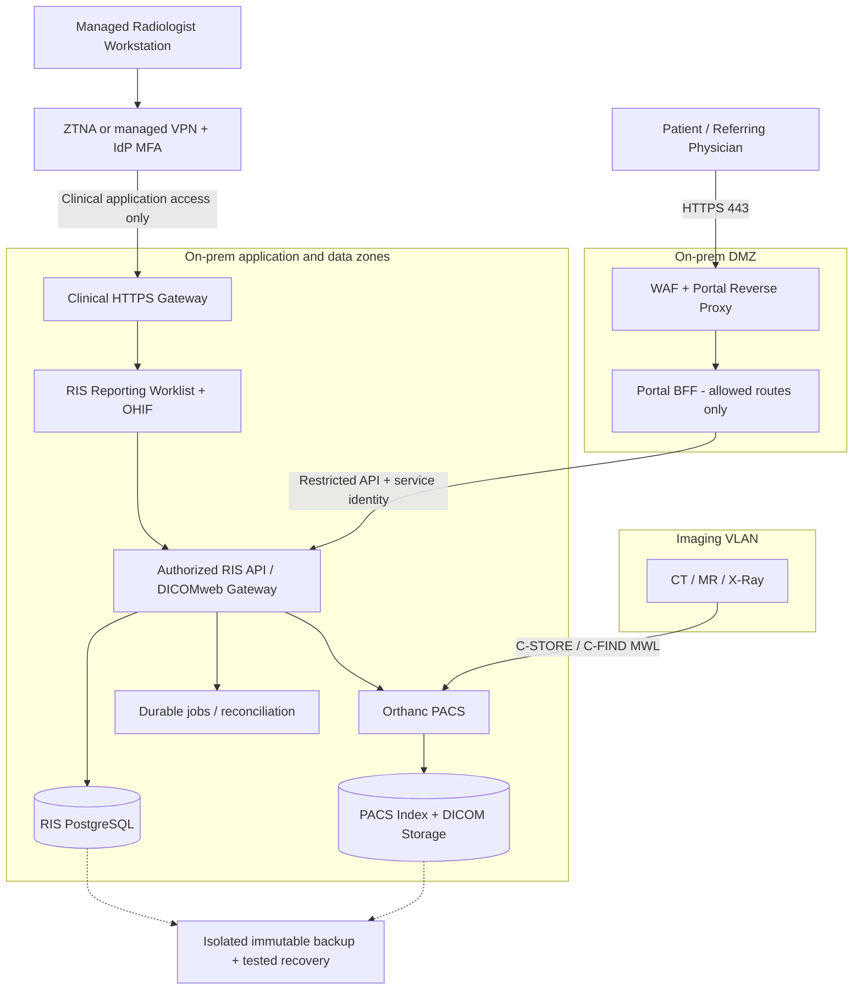

# مراجعة ومقترح معماري لنشر VIARA RIS/PACS محلياً وإتاحة الوصول البعيد

**التاريخ:** 8 أكتوبر 2026. **الحالة:** مقترح هندسي للمراجعة والتنفيذ؛ لا يمثل اعتماداً تشغيلياً أو سريرياً.

## 1. الملخص التنفيذي

التوصية هي إبقاء RIS والأرشيف الأصلي وقواعد البيانات داخل المركز، مع مسارين مستقلين للوصول: بوابة عامة محدودة للمرضى والأطباء المحولين خلف بوابة حماية في DMZ، ووصول سريري لأخصائيي الأشعة عبر ZTNA أو VPN مُدار، مع MFA وصلاحيات على مستوى الفحص. تبقى أجهزة التصوير وModality Worklist داخل شبكة تصوير معزولة.

Orthanc وOHIF وواجهة VIARA الحالية أساس مناسب لهذا النمط. الأولوية قبل الإتاحة الخارجية هي إغلاق مسارات تجاوز بوابة الحماية، تحديد API العامة بقائمة سماح، إزالة كلمات المرور الافتراضية، وضبط الربط الصحيح بين الفحص والصور والتقرير. تحسين سرعة الصور يأتي عبر تحميل البيانات اللازمة أولاً وضغط متوافق وتخزين مؤقت منضبط، مع قياس سرعة الرفع الفعلية من المركز.

هذه مراجعة للمصدر وملفات الإعداد المتاحة ومقارنة بالمراجع الرسمية. لم تتضمن اختبار اختراق حي، أو اختبار أحمال على تجهيزات الإنتاج، أو اعتماد شاشة تشخيصية. لا توجد معلومات مؤكدة عن حجم الدراسات أو التزامن أو سرعة خطوط الاتصال؛ الأرقام التشغيلية أدناه أهداف مقترحة وليست نتائج قياس أو ضماناً.

## 2. النتائج الخاصة بالمشروع الحالي

| الدليل في المصدر | النتيجة | الإجراء المطلوب |
|---|---|---|
| `backend/src/routes/pacsRoutes.js` و`backend/src/controllers/pacsController.js` | توجد مصادقة وصلاحيات للصور وتوكن عارض بنطاق فحص؛ مسار DICOMweb يسمح بالقراءة وOPTIONS ويمنع الكتابة | الحفاظ على التحقق لكل طلب، واختبار تغيير UID والفحص والحساب، والإلغاء بعد تعطيل الحساب أو انتهاء جلسة الموظف |
| `pacs/ohif/app-config.js` | OHIF يستخدم `/api/pacs/dicom-web` وتحميلاً كسولاً، ويستقبل توكن العارض من fragment ثم يخزنه في sessionStorage ويزيل fragment من العنوان | إبقاء Orthanc خلف الخادم؛ تقليل أثر XSS ومدة التوكن والتحقق من تجديد الجلسة والإلغاء |
| `backend/src/services/pacsDicomWebService.js` | بث ثنائي عبر pipeline وإلغاء عند انقطاع العميل؛ يوجد fallback يقرأ ملف DICOM كاملاً إلى الذاكرة قبل فكّه | قياس RAM/CPU لهذا المسار، ووضع حدود حجم وتزامن ونقل التحويلات الثقيلة إلى عامل منفصل عند الحاجة |
| `portal/nginx.conf` | `/api/` يمرر API الخادم كاملاً | إضافة قائمة سماح للمسارات والطرق، ثم API/BFF مخصص للبوابة؛ المصادقة الموجودة تظل ضرورية |
| `deploy/remote-access/nginx/portal-edge.conf` | توجد بداية فصل، لكن `/api/` ما زال عاماً وGET/POST/PATCH/DELETE مسموحة؛ منع كلمات في URL لا يثبت عزل جميع وظائف الموظفين | جرد طلبات البوابة الفعلية وتقييدها بدقة، واختبار رفض كل مسارات الموظفين والإدارة من النطاق العام |
| `deploy/remote-access/nginx/clinical-edge.conf` | يوجد قالب mTLS ومسار عارض موحد الأصل؛ الاستماع 443 غير مقيد بعنوان VPN في القالب | تقييد الواجهة أو الجدار الناري على VPN، والتحقق من عدم الوصول إلى upstreams مباشرة؛ شهادة الجهاز ليست MFA للمستخدم |
| `viara-production-package/docker-compose.yml` | واجهة الموظفين والبوابة وDICOM ترتبط افتراضياً بكل الواجهات؛ توجد قيم احتياطية ضعيفة للأسرار ووسوم صور متحركة | ربط واجهات الويب بـ loopback/شبكة خاصة خلف ingress فقط؛ تقييد DICOM بعناوين الأجهزة؛ جعل الأسرار مطلوبة وتثبيت الصور المعتمدة بالـ digest |
| `pacs/orthanc/orthanc.json` | فحص AE/Host وتقييد العمليات موجودان؛ عناوين الأجهزة أمثلة loopback، وPostgreSQL EnableIndex=false في الملف | إدخال عناوين الأجهزة الحقيقية، والتحقق من الإعداد الفعلي داخل الحاوية. وجود قسم PostgreSQL وحده لا يعني استخدامه كفهرس |
| `viara-production-package/docs/REVERSE_PROXY_NGINX.conf` | قالب أقدم يمرر واجهة الموظفين عبر `/` وتوجد اختلافات منافذ ومسار viewer عن الملفات الحالية | اعتماد مخطط ingress واحد، ومطابقة upstreams مع Compose وCaddy وأي Nginx مستخدم فعلياً؛ منع تضارب منافذ أو حلقات proxy |

الارتباط بـ `0.0.0.0` يوسع قابلية الوصول الشبكي لكنه لا يثبت انكشاف الخدمة على الإنترنت دون مراجعة NAT والجدار الناري. كذلك وجود قوالب VPN وmTLS لا يثبت نشرها أو سلامة تشغيلها. وثيقة 7 أكتوبر الموجودة في المستودع تصف بعض البنود بأنها معتمدة؛ لا تُستخدم هذه الصفة بديلاً عن أدلة الاختبار والاعتماد الفعلي.

## 3. المعمارية المرجعية المقترحة

### مناطق الثقة وقواعد الاتصال

- **الإنترنت → DMZ:** HTTPS 443 للبوابة العامة فقط. اختياري منفذ VPN وفق التقنية المختارة. حماية DDoS كبيرة الحجم تحتاج تعاون مزود الاتصال أو خدمة حافة؛ WAF محلي وحده لا يمنع تشبع الخط.
- **المرضى/المحولون:** نطاق `portal.example.org` وهوية وصلاحيات مستقلة. يمكن مشاركة مكونات التطبيق مع بقاء سياسة الوصول منفصلة. لا يحق للطبيب المحول الاطلاع على كل مرضى المركز.
- **أخصائيو الأشعة:** نطاق سريري `ris.example.org` عبر سياسة مستخدم وجهاز؛ MFA مقاوم للتصيد حيث أمكن، وإدارة الأجهزة والتحديثات والتشفير وقفل الشاشة. VPN محدود إلى بوابة التطبيق وليس إلى شبكة المركز كلها.
- **DMZ → التطبيق:** منفذ ووجهة محددان، وهوية خدمة محدودة أو mTLS؛ لا وصول مباشر من DMZ إلى قاعدة البيانات أو ملفات الأرشيف.
- **التطبيق → البيانات:** حسابات خدمة منفصلة وأقل صلاحية، مع عزل قاعدة RIS وفهرس PACS والنسخ الاحتياطية. منع مشاركة حساب superuser.
- **الأجهزة → PACS/MWL:** فقط AE وعناوين IP والعمليات المعتمدة. AE Title وحده ليس إثبات هوية تشفيرياً. استخدم DICOM TLS حين تدعمه الأجهزة، أو حماية شبكة/نفق للأجهزة القديمة.
- لا نشر مباشر لـ Orthanc REST أو DICOM DIMSE أو PostgreSQL أو Redis أو RDP. منفذ DICOM 4242 خاص بأجهزة المركز؛ 104 قد تستخدمه أجهزة أخرى بحسب الإعداد.
- Split-horizon DNS يسمح بالوصول الداخلي المباشر، مع هوية محلية متاحة وخطة دخول طوارئ مراقبة؛ انقطاع الإنترنت لا ينبغي أن يوقف الاستقبال المحلي أو التصوير أو كتابة التقارير.

فلسفة ZTNA هي التحقق من الهوية والجهاز والموارد المطلوبة، لا افتراض الثقة لمجرد وجود اتصال VPN. [NIST SP 800-207](https://csrc.nist.gov/pubs/sp/800/207/final).

## 4. خيارات الربط الآمن

| الخيار | متى يناسب | المزايا | القيود وقرار الاستخدام |
|---|---|---|---|
| عنوان عام ثابت + اتصال أعمال + DMZ | المركز يستطيع استقبال اتصال مضبوط | تحكم مباشر بمسار الصور وتقليل الاعتماد على وسيط | يحتاج إدارة جدار ناري وشهادات ومراقبة وحماية من تشبع الخط؛ الخيار الأساسي عند توفره |
| ZTNA تطبيقي | أطباء موزعون وأجهزة مُدارة | سياسات هوية وجهاز وموارد محددة | قياس مسار البيانات، اعتماد الهوية، الإلغاء، والتوافر؛ يفضّل للوصول السريري حين تتوفر قدرة تشغيله |
| VPN مُدار + MFA تطبيقية | عدد محدود من الأطباء أو دعم DICOM تقليدي بين مواقع | مسار خاص وتوافق واسع | WireGuard بمفرده لا يوفر MFA مستخدم أو فحص سلامة الجهاز؛ يلزم ACL وإدارة مفاتيح وهوية ومراقبة |
| نفق صادر إلى حافة معتمدة | CGNAT أو غياب IP عام | لا يتطلب اتصالاً وارداً إلى المركز | مرور الصور عبر طرف ثالث، عرض نطاق وتكلفة وزمن إضافي؛ راجع مكان معالجة البيانات ونقطة إنهاء TLS وحدود النقل |
| Site-to-site VPN + cache مشفر بمركز قراءة | عدة أطباء في موقع بعيد واحد | مشاركة التحميل المسبق وتقليل النقل المكرر | نسخة إضافية من بيانات طبية تحتاج حوكمة وصلاحيات وحذفاً وتدقيقاً؛ تضاف بعد قياس الاحتياج |
| VDI عبر بوابة محمية | روابط ضعيفة أو ضرورة إبقاء المعالجة داخل المركز | ينقل العرض بدلاً من نقل كل الدراسة للجهاز | لا يضمن صلاحية التشخيص: يلزم اعتماد جودة العرض والضغط والكمون والشاشات لكل الاستخدامات؛ لا نشر RDP مباشرة |

النفق الصادر ليس بديلاً عن WAF أو صلاحيات التطبيق. والتشفير أثناء النقل لا يعني أن مزود الحافة لا يستطيع معالجة البيانات إذا أنهى TLS. لا أوصي باختيار نفق تجاري للصور الضخمة قبل تجربة فعلية ومراجعة تعاقدية وسياسة الخصوصية المحلية.

## 5. البوابة العامة: الأمن وتجربة المستخدم

1. API/BFF مخصص يعرض بيانات المريض المصرح بها والتقارير النهائية المنشورة. حالات انتظار واضحة دون تسريب مسودات أو ملاحظات داخلية. الصلاحيات تُفحص في الخادم لكل مورد وكل تنزيل.
2. إثبات هوية المريض عند التسجيل؛ لا يكفي رقم ملف مع تاريخ ميلاد. تفويض ولي الأمر/الوكيل محدد ومسجل وقابل للإلغاء. حساب الطبيب المحول مرتبط بالإحالات أو علاقة علاجية مصرح بها.
3. الرسائل النصية والبريد تتضمن إشعاراً عاماً ورابط دخول؛ لا تتضمن تشخيصاً أو توكن وصول دائم. روابط المشاركة قصيرة الصلاحية وبسياسة مصادقة واضحة مع سجل فتح وإلغاء.
4. صور المعاينة مناسبة للاستعراض العام مع توضيح حدودها. الطبيب المحول قد يحتاج عارضاً تفاعلياً أو تنزيل DICOM؛ يُتاح هذا لصورة/دراسة مصرح بها عبر API البوابة، دون فتح البحث في الأرشيف كله.
5. واجهة عربية RTL وإنجليزية، مقاسات هاتف، تنقل بلوحة المفاتيح وتباين مناسب ورسائل أخطاء مفهومة. فصل حالات «الصور وصلت» و«التقرير قيد الكتابة» و«النتيجة منشورة».
6. جلسات وقائية: HttpOnly/Secure/SameSite عند استخدام cookies، حماية CSRF لعمليات التغيير، CORS محدود، CSP واختبارات XSS، وقيود محاولات على الحساب والمصدر دون حظر مركز كامل خلف NAT.
7. لا تخزين لبيانات طبية في service worker أو CDN عام. حتى الصور المصغرة قد تتضمن بيانات تعريفية أو معلومات حساسة؛ تعامل معها كبيانات طبية.

## 6. PACS وWorklist وكتابة التقارير

**يوجد نوعان مختلفان من قوائم العمل:** Modality Worklist يستعلم عنها جهاز التصوير عبر DICOM C-FIND لتقليل إعادة كتابة بيانات المريض؛ Reporting Worklist يعرض فحوصات القراءة والتوزيع والأولوية وحالة التقرير للطبيب عبر تطبيق RIS. إتاحة الأخيرة عن بعد لا تستلزم نشر الأولى.

سير العمل المستهدف: طلب RIS بمعرف accession صحيح → MWL للجهاز → استقبال الدراسة → مطابقة وتحقق → قائمة الطبيب → مراجعة الصور والسوابق → مسودة محفوظة → اعتماد التقرير → نشر النتيجة وفق السياسة.

- المطابقة بواسطة Patient ID مع جهة إصداره، accession وStudyInstanceUID؛ لا ربط تلقائي اعتماداً على الاسم فقط. الدراسات الغامضة تنتقل إلى quarantine ومراجعة بشرية.
- أحداث PACS موقعة، وطابور دائم مع retries وidempotency وdead-letter وإعادة مطابقة دورية. وصول webhook مرة واحدة ليس ضماناً لكفاية الدراسة أو اكتمالها.
- RIS مرجع حالة الطلب والتقرير، وPACS مرجع الصور المستقبلة. إظهار عدد الصور والسلاسل والحالة الجزئية؛ اعتماد التقرير يحتاج تحققاً من اكتمال المحتوى المطلوب وسياسة الطبيب.
- Worklist حسب التخصص والأولوية ووقت الانتظار، مع تعيين/حجز الفحص بمهلة lease ومنع تعارض التأليف. مسودات ذات version وoptimistic concurrency وحفظ تلقائي مع تأكيد آخر حفظ على الخادم.
- فتح التقرير والعارض على نفس سياق المريض والفحص، وإبراز الهوية والجهة التشريحية. القياسات المنقولة إلى التقرير تحتاج مراجعة الطبيب وتوثيق مصدرها.
- قوالب وهياكل مناسبة، سوابق قابلة للمقارنة، اختصارات آمنة وشاشات متعددة. تجنب اختصار اعتماد يُفعّل أثناء الكتابة دون مراجعة واضحة.
- التقرير النهائي ثابت؛ التصحيح بملحق مؤرخ وموقع، مع تنبيه المتلقين المناسبين. النتائج الحرجة تحتاج إقرار استلام وتصعيداً، لا إشعاراً صامتاً فقط.
- ربط HIS/EHR عند الحاجة عبر HL7 v2 ORM/ORU أو موارد FHIR المناسبة، مع اختبار معرفات المرضى والطلبات والتوقيتات؛ لا يلزم إدخال محرك تكامل كبير إذا لا توجد أنظمة خارجية.

عارض ويب يعمل على جهاز عادي لا يُعد تلقائياً محطة تشخيص معتمدة. يجب توثيق صلاحية برنامج العرض وإصداره للاستخدام المقصود، ومعايرة الشاشات وبيئة الإضاءة ومتطلبات الأنماط مثل mammography، ثم إجراء قبول سريري.

## 7. سرعة نقل DICOM واستقرار مسار الصور

### أ. تقليل ما يُنقل قبل زيادة السعة

استخدم QIDO للبحث وWADO-RS للبيانات والصور/الإطارات المطلوبة؛ لا تنزّل ZIP الدراسة كاملة قبل إظهار أول صورة. حمّل metadata ثم السلسلة النشطة وأولويات viewport، وألغِ طلبات الخلفية غير اللازمة عند الانتقال. هذه موارد مميزة في معيار [DICOM PS3.18](https://dicom.nema.org/medical/dicom/current/output/chtml/part18/chapter_10.html).

- حمّل السوابق والفحص التالي بشكل محدود، وفق صلاحية الطبيب وسعة الشبكة؛ prefetch غير المحدود قد يبطئ الفحص الجاري.
- حافظ على transfer syntax المضغوط دون فقد حيث تدعمه سلسلة PACS والعارض، وتجنب فك الضغط وإعادة الضغط لكل طلب. نسبة التوفير تعتمد على نوع الصور؛ لا توجد نسبة ثابتة لكل الدراسات.
- في إصدارات Orthanc DICOMweb الداعمة، أبقِ `Full` للـ metadata مع cache دافئ وتجهيز الدراسات القديمة؛ لا تستبدله عشوائياً بـ Extrapolate الذي يستنتج بعض الوسوم من عينات. تحقق من إصدار plugin داخل الصورة، وليس وسم Orthanc وحده. [وثائق Orthanc](https://orthanc.uclouvain.be/book/plugins/dicomweb.html).
- HTJ2K تدريجي خيار تجريبي مضبوط بعد إثبات دعم الترميز ونمط RPCL وdecoder ونسخ OHIF/Cornerstone المستخدمة. مسارات byte-range تحتاج دعماً حقيقياً من الخادم؛ دعم DICOMweb وحده لا يثبت ذلك. [متطلبات Cornerstone](https://www.cornerstonejs.org/docs/concepts/progressive-loading/requirements/)، [تحميل stack التدريجي](https://www.cornerstonejs.org/docs/concepts/progressive-loading/stackprogressive/).
- تمييز المعاينة الأولية منخفضة الدقة عن اكتمال الصورة التشخيصية؛ لا يُسمح بأن يفهم الطبيب أن التحميل الجزئي مكتمل.

### ب. مسار بيانات متحكم فيه

- بث مع backpressure وإلغاء طلب المنبع عند إغلاق العميل؛ قياس ذاكرة fallback وتحديده. لا يجتمع تنزيل كبير وتحويل غير محدود داخل نفس عامل API الحرج.
- HTTP/2 عند بوابة HTTPS، وضبط اتصالات keepalive وعدد الطلبات المتوازية بناء على قياس. HTTP/3 تحسين محتمل وليس شرط جاهزية أو ضماناً لتسريع الصور.
- تعطيل buffering على مسارات البث عند الحاجة، وتوحيد idle/total timeouts بين الحافة والخادم وOrthanc؛ لا تجعل كل API بمهلة ساعات لمعالجة مشكلة تصدير.
- التصدير الكبير مهمة خلفية ذات حالة وإلغاء وحصة استخدام وchecksum. إذا لزم الاستكمال، أنشئ مورداً ثابتاً مؤقتاً وجرّب Range/ETag فعلياً؛ ZIP المتولد مباشرة لا يُستكمل تلقائياً لمجرد أنه streaming.
- metadata/text يمكن ضغطها؛ إعادة gzip لصور مضغوطة غالباً تكلفة CPU دون مكسب مفيد.
- cache خاص مشفر مع مفاتيح تشمل المورد والترميز والسياق المناسب، وصلاحية وإلغاء وتدقيق. لا public CDN cache للصور أو النتائج. إعادة التحقق من الصلاحية مطلوبة حتى عند cache hit.
- يمكن فصل gateway الصور عن business API إذا أثبت الاختبار التزاحم، مع الحفاظ على نفس تحقق الهوية ونطاق الدراسة. لا تجاوز للتفويض باستخدام proxy مباشر إلى Orthanc.

### ج. حساب الاتصال

الحد الأدنى النظري للزمن بالثواني = حجم البيانات بالبايت × 8 ÷ سرعة الرفع بالبت/ثانية. المهم هو **رفع المركز** وسعته المشتركة، وليس سرعة تنزيل الطبيب وحدها.

| نقل دراسة 1 GB عشري كاملة | زمن مثالي دون منافسة أو overhead |
|---|---:|
| 20 Mbps | 6 دقائق و40 ثانية |
| 100 Mbps | دقيقة و20 ثانية |
| 1 Gbps | 8 ثوانٍ |

خمسة أطباء يتشاركون رفعاً فعلياً 100 Mbps لن يحصل كل منهم على 100 Mbps. زمن أول صورة قد يكون أقصر بكثير من زمن اكتمال الدراسة؛ تُقاس القيمتان منفصلتين. خطا إنترنت لا يجمعان السرعة تلقائياً لاتصال واحد، وWAN failover قد يقطع الجلسة الجارية.

أوصي باتصال أعمال بسرعة رفع مناسبة للقياس، خط احتياطي مستقل، QoS يمنع النسخ الاحتياطي من تعطيل القراءة، UPS، ومراقبة packet loss وRTT. الشبكة الداخلية 10GbE بين PACS والتخزين مفيدة عند الحمل المرتفع؛ القرار بقياس throughput وIOPS لا باسم التقنية.

## 8. الاستضافة والتخزين والتعافي

- مركز صغير أو متوسط: Linux LTS على بيئة افتراضية موثوقة وCompose مُدار، مع فصل بوابات الوصول والتطبيق والبيانات والنسخ الاحتياطية حسب المخاطر. Kubernetes ليس شرطاً؛ تعدد الحاويات على مضيف واحد لا يوفر HA.
- SSD/NVMe لقواعد البيانات والفهرس والبيانات الساخنة؛ تخزين مؤسسي مناسب للأرشيف. فصل مستخدمي وفهارس RIS وPACS والتأكد من backend الفعلي للفهرس قبل تغيير الإعداد.
- لا نقل يدوي لملفات Orthanc إلى NAS مع حذفها من مكانها؛ يلزم storage backend أو آلية أرشفة واسترجاع تدعم اتساق الفهرس وسياسة الاحتفاظ والتحقق من الاسترجاع.
- السعة الأولية = الدراسات/يوم × متوسط GB/دراسة × أيام الاحتفاظ + هامش نمو. مثال توضيحي: 100 دراسة × 0.25 GB × 365 = 9.125 TB/سنة قبل RAID والتكرار والنسخ الاحتياطي؛ الحجم الحقيقي يُحسب من بيانات المركز وتوزيع CT/MR وغيره.
- نسخ منسقة تشمل RIS وفهرس PACS والصور والتقارير ومفاتيح التشفير والإعدادات، مع نسخة غير قابلة للتعديل/منفصلة الصلاحيات ونسخة خارج الموقع وفق السياسة. RAID والـ replication لا يعوضان backup.
- أهداف أولية للنقاش: RPO قاعدة RIS ≤15 دقيقة، الصور ≤ساعة، RTO الخدمات الحرجة ≤4 ساعات. تُعتمد بعد تحديد أثر فقد البيانات وتجربة استعادة كاملة؛ لا يجوز الوعد بها من دون بنية واختبار.
- اختبار استعادة إلى بيئة معزولة والتحقق من ربط الصورة والتقرير والمريض، وسلامة المفاتيح، ثم قياس الزمن. HA للمضيف أو قاعدة البيانات لا يعالج وحده حريق الموقع أو ransomware.

المصادقة متعددة العوامل المقاومة للتصيد، ضبط الوصول البعيد، والنسخ المفصولة مع تجربة الاستعادة إجراءات تؤكدها [إرشادات CISA لمواجهة ransomware](https://www.cisa.gov/stopransomware/ransomware-guide).

## 9. حماية الخصوصية والمراقبة

تشفير الأقراص والنسخ الاحتياطية مع فصل المفاتيح وخطة استردادها؛ توحيد الوقت؛ إدارة أسرار وتدويرها؛ صور حاويات مثبتة ومفحوصة وSBOM؛ عدم كتابة توكنات أو بيانات مرضى أو أجسام DICOM في سجلات عامة. TLS للخدمة لا يغني عن تشفير وسائط التخزين.

سجل تدقيق منفصل يسجل الهوية، الفحص، العملية، الوقت، المصدر ونتيجة التفويض، مع حماية من العبث وصلاحيات محدودة ومراقبة التنزيلات غير المعتادة. راقب انتهاء الشهادات وسعة الأقراص ونمو الطوابير وفشل النسخ ومعدلات 401/403/429 وتأخر التقارير.

تنقيح DICOM للمشاركة الثانوية يجب أن يشمل الوسوم الخاصة والبيانات المكتوبة داخل pixels؛ حذف اسم المريض من الوسوم وحده لا يضمن إخفاء الهوية. لا إرسال صور أو إملاء صوتي أو تقارير إلى AI/ASR سحابي إلا بسياسة واعتماد مناسبين. وجود معالجة محلية لا يثبت وحده الامتثال القانوني؛ تُراجع متطلبات الاحتفاظ والموافقة ونقل البيانات حسب بلد التشغيل.

## 10. سجل المخاطر والأولويات

التقييم نوعي قبل تطبيق الضوابط، وليس CVSS أو إثبات استغلال حي.

| الخطر | المستوى | الأولوية | العلاج ودليل الإغلاق |
|---|---|---|---|
| وصول عام إلى API موظفين أو تجاوز edge عبر منفذ منشور | مرتفع | P0 قبل الإنترنت | قائمة سماح + ربط خاص + فحص خارجي من شبكة مستقلة |
| كلمات مرور احتياطية مشتركة وصور غير مثبتة | مرتفع | P0 | فشل بدء التشغيل دون أسرار قوية، تدويرها وتثبيت الصور وفحصها |
| اطلاع غير مصرح على دراسة أو علاقة إحالة | مرتفع | P0 | اختبارات IDOR وUID مباشر وإلغاء التوكن على جميع مسارات الصور والتصدير |
| تقرير مرتبط بمريض خطأ أو اعتماد دراسة ناقصة | مرتفع | P0 | اختبارات المطابقة/الحجر/الحالات الجزئية واعتماد سريري |
| فقد المركز أو تشفير الأرشيف والنسخ معاً | مرتفع | P0 | نسخة مستقلة غير قابلة للتعديل واستعادة ناجحة موثقة |
| تشبع الرفع أو استهلاك ذاكرة معالجة DICOM | مرتفع | P1 قبل التشغيل البعيد واسع النطاق | اختبار ضغط ممثل وحدود تزامن وأولوية تفاعلية |
| وسيط خارجي يعالج بيانات دون سياسة مناسبة | مرتفع | P0 عند استخدامه | تقييم مسار البيانات وTLS والعقود والإقامة والاحتفاظ |
| خط واحد/مضيف واحد/هوية سحابية وحيدة | متوسط إلى مرتفع | P1 حسب RTO | خطة انقطاع وWAN بديل وهوية محلية وتعافٍ مجرب |
| تعارض تقارير أو تسريب مسودة | مرتفع | P0 | versioning وقفل التأليف وفصل الاعتماد والنشر |

## 11. خطة التنفيذ والقبول

1. **تثبيت الحقائق:** عدد الدراسات وحجمها وتوزيعها، تزامن الأطباء، رفع المركز الفعلي، RTT، تجهيزات التخزين، الأجهزة وبرامجها، الاحتفاظ وRPO/RTO. توثيق إعداد runtime الفعلي والمنافذ وTLS والنطاقات؛ عدم الاكتفاء بملف compose واحد.
2. **إغلاق P0:** API البوابة والربط الخاص والأسرار والهوية والصلاحيات والمطابقة والنسخ. مطابقة الطلبات الفعلية للبوابة مع allowlist؛ اختبار config للـ ingress المعتمد وعدم خلط قوالب Nginx/Caddy دون تصميم.
3. **تشغيل سريري تجريبي:** أطباء محددون بأجهزة مُدارة، حالات CT/MR/CR/US وmultiframe وصور كبيرة مضغوطة، وعمليات قراءة وتقرير نهائي وملحق وإشعار حرج.
4. **تحسين الأداء على أساس قياس:** warm/cold cache، تغيّر التزامن، اتصال 20/50/100 Mbps وRTT 30/100/200 ms وانقطاع مؤقت. جرّب HTJ2K أو VDI أو cache بعيد فقط عند وجود مشكلة مثبتة.
5. **بوابة إصدار:** قبول سريري وأمني وتشغيلي، استعادة كاملة وخطة rollback ومراقبة ودعم، ثم توسيع المستخدمين تدريجياً.

| اختبار قبول | المطلوب |
|---|---|
| فصل الجمهور | لا وصول من نطاق البوابة أو الإنترنت إلى APIs الموظفين/الإدارة أو Orthanc/DICOM/DB، حتى بطلب مباشر وتغيير المسار |
| تفويض الصور | تبديل patient/exam/StudyUID أو استعمال حساب/توكن ملغى يفشل؛ التحقق يشمل metadata وframes وpreview وexport |
| سلامة الهوية | سحب الجهاز أو تعطيل المستخدم يوقف الوصول حسب مهلة إلغاء موثقة ومختبرة |
| سلامة سير العمل | عدم تكرار إجراء بسبب إعادة الطلب؛ عدم فقد حفظ مؤكد؛ منع تعارض اعتماد التقرير وربطه بفحص خاطئ |
| الأداء | قياس p50/p95 لأول صورة صالحة واكتمال السلسلة وحفظ التقرير وذاكرة الخدمة تحت حمل ممثل؛ يمكن بدء النقاش بهدف p95 لأول صورة ≤5 ثوانٍ على مسار WAN محدد، ثم تثبيته أو تعديله بنتائج القياس |
| الانقطاع | انقطاع الإنترنت لا يوقف التصوير والعمل المحلي؛ عودة الربط لا تكرر تقارير أو رسائل/أحداث حرجة |
| التعافي | استعادة DB + فهرس + صور + مفاتيح وربطها بنجاح ضمن RPO/RTO المعتمدين |
| التشغيل | تنبيهات قابلة للتنفيذ، مراجعة صلاحيات، دعم واستجابة لحوادث، runbook وفريق مسؤول |

**قرار الجاهزية:** لا اعتماد للإتاحة العامة أو التشخيص البعيد من وجود هذه الملفات فقط. نقطة الانطلاق المناسبة هي تثبيت الفصل الشبكي والصلاحيات وسلامة البيانات، ثم تجربة محدودة تقيس أداء الصور والقبول السريري. هذا التقرير يحدد التصميم والأعمال اللازمة ولا يزعم تنفيذها أو اجتيازها.
