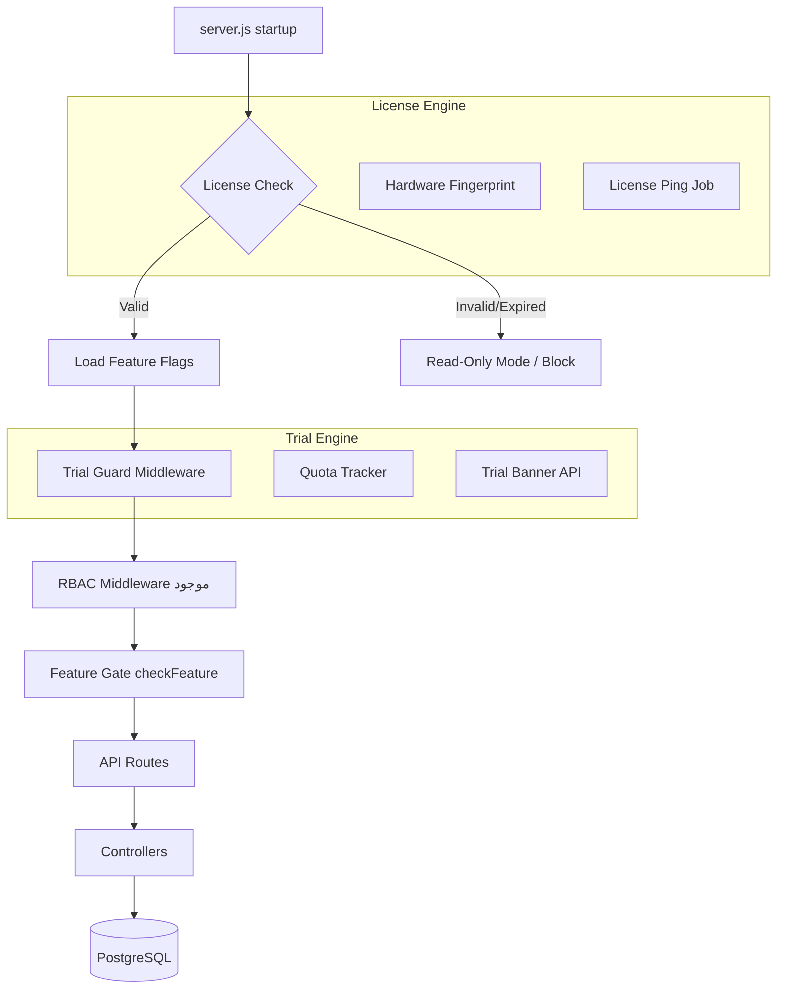

# 🛡️ خطة حماية نظام VIARA RCMS وإصدار النسخة التجريبية

> **🚨 تحديث حرج — 29 سبتمبر 2026:** كان هناك عطل يمنع استخدام النسخة التجريبية بالكامل عند التشغيل الفعلي. تم إصلاحه. راجع [العطل الحرج](#🚨-عطل-حرج-في-حجب-المميزات-تم-إصلاحه-critical-feature-gate-bug).

---

## الجزء الأول: حماية النظام

### 🔐 الطبقة 1 — محرك الترخيص (License Engine)

أهم طبقة في المنظومة كلها. الفكرة هي ألّا يعمل النظام بدون مفتاح ترخيص صالح.

**الآلية المقترحة:**

```
VIARA License Key = base64( encrypt( {
    customerId,
    edition,        // "trial" | "standard" | "enterprise"
    expiryDate,
    maxUsers,
    allowedModules, // ["appointments","pacs","hr","finance",...]
    hardwareFingerprint  // (اختياري للترخيص المرتبط بالجهاز)
} ) )
```

**التطبيق:**
- ملف جديد: `backend/src/services/licenseService.js`
- يُشغَّل عند بدء السيرفر (في `server.js`) ويحقق من:
  - صلاحية المفتاح (التشفير + التوقيع)
  - تاريخ الانتهاء
  - عدد المستخدمين النشطين مقارنةً بالحد المسموح
- إذا فشل التحقق → السيرفر يعمل في **وضع قراءة فقط** أو يرفض تماماً

---

### 🖥️ الطبقة 2 — بصمة الجهاز (Hardware Fingerprinting)

لمنع نقل الترخيص أو تشغيله على خوادم غير مرخصة.

```javascript
// backend/src/utils/hardwareFingerprint.js
const os = require('os');
const crypto = require('crypto');

function getFingerprint() {
    const networkInterfaces = os.networkInterfaces();
    const macs = Object.values(networkInterfaces)
        .flat()
        .filter(i => !i.internal && i.mac !== '00:00:00:00:00:00')
        .map(i => i.mac)
        .sort()
        .join('|');

    const cpus = os.cpus().map(c => c.model).join('|');
    const hostname = os.hostname();

    return crypto
        .createHash('sha256')
        .update(`${macs}::${cpus}::${hostname}`)
        .digest('hex');
}
```

الترخيص يُقيَّد بهذه البصمة عند أول تفعيل (Activation).

---

### 🚦 الطبقة 3 — Feature Gating (تحكم بالميزات)

بدلاً من تعطيل النظام كلياً، تُحدَّد الميزات المتاحة لكل إصدار.

**جدول المقارنة:**

| الميزة | Trial | Standard | Enterprise |
|--------|-------|----------|------------|
| المواعيد | ✅ (100/شهر) | ✅ (غير محدود) | ✅ |
| PACS / DICOM | ⛔ | ✅ | ✅ |
| التمويل والفواتير | ⛔ | ✅ | ✅ |
| الموارد البشرية | ⛔ | ✅ | ✅ |
| تقارير الذكاء الاصطناعي | ⛔ | محدود | ✅ |
| بوابة المريض | ⛔ | ✅ | ✅ |
| SSO / LDAP | ⛔ | ⛔ | ✅ |
| دعم متعدد الفروع | ⛔ | ⛔ | ✅ |

**التطبيق عبر Middleware موجود:**

```javascript
// إضافة checkFeature() في rbacMiddleware.js
const checkFeature = (featureName) => (req, res, next) => {
    const license = req.app.locals.license;
    if (!license.allowedModules.includes(featureName)) {
        return res.status(403).json({
            error: 'feature_not_licensed',
            message: `هذه الميزة غير متاحة في إصدارك الحالي. يرجى الترقية.`,
            upgradeUrl: process.env.UPGRADE_URL
        });
    }
    next();
};
```

---

### 📡 الطبقة 4 — Rate Limiting المعزَّز

لديك بالفعل `rateLimiters.js`. يمكن ربطه بالترخيص:

```javascript
// قيود Trial أكثر صرامة
const trialLimits = {
    api:     rateLimit({ windowMs: 15*60*1000, max: 200 }),
    login:   rateLimit({ windowMs: 60*60*1000, max: 5  }),
    uploads: rateLimit({ windowMs: 60*60*1000, max: 10 }),
};
```

---

### 🔒 الطبقة 5 — تشفير البيانات (موجود جزئياً)

لديك `ENCRYPTION_KEY` و `BLIND_INDEX_KEY` في `.env`. تأكد من:

- ✅ تشفير البيانات الحساسة للمرضى (PII) قبل الحفظ في DB
- ✅ تشفير ملف الترخيص المحلي بمفتاح منفصل (`LICENSE_SECRET`)
- ✅ استخدام TLS/HTTPS في الإنتاج لجميع الاتصالات
- ✅ تشفير النسخ الاحتياطية (`BACKUP_ENCRYPTION_KEY` موجود)

---

### 📋 الطبقة 6 — Audit Trail الشامل (موجود)

لديك `auditService.js` و `auditLogger.js`. وسّعه ليشمل:

- محاولات تجاوز الترخيص
- الوصول إلى ميزات غير مرخصة
- تصدير البيانات الضخمة
- تغيير الإعدادات الحساسة

---

### 🌐 الطبقة 7 — License Ping (الفحص الدوري)

للتراخيص السحابية أو المُحدَّدة بمدة، أضف Job دوري:

```javascript
// backend/src/jobs/licensePingJob.js
// يُرسل PING كل 24 ساعة إلى خادم الترخيص
// إذا فشل 3 مرات متتالية → تنبيه للمستخدم
// إذا فشل 7 مرات → وضع قراءة فقط
```

---

---

## الجزء الثاني: النسخة التجريبية (Trial Edition)

### 🎯 استراتيجية Trial المقترحة

#### الخيار أ: **Trial ذاتي الخدمة (Self-Service)**
> الأفضل للوصول الأوسع

1. العميل يطلب من موقعك
2. يتلقى بريداً إلكترونياً بمفتاح Trial صالح 30 يوماً
3. يُثبِّت النظام بنفسه (أو يستخدم Docker Compose الموجود)
4. المفتاح يلتصق بـ MAC Address عند أول تشغيل

#### الخيار ب: **Demo Cloud Instance**
> الأسرع للعميل

- نسخة مشتركة على السحابة تخدم عدة عملاء
- كل عميل يحصل على tenant معزول
- لا يحتاج تثبيتاً، رابط فوري

> ⚠️ **تحديث معماري 2026-09-29 — لا يُنصح بالتنفيذ كما هو**
>
> **نظام VIARA لا يحتوي على عزل tenant.** لا يوجد `tenant_id` ولا `org_id` في أي من الـ 182 migration أو في `schema.sql`. حقل `branch_id` موجود على الجداول المالية فقط (فواتير، مدفوعات، مصروفات) ولا يوجد على البيانات الطبية: `patients`، `appointments`، `examinations`، `users`.
>
> عملياً، عميلان على نفس القاعدة سيرى كل منهما بيانات الآخر — المرضى والأشعة — وهي بيانات تشخيصية وحساسية، في نظام يُسوِّق على HIPAA و GDPR. **إضافة multi-tenancy حقيقية تعني ترحيل قاعدة البيانات على قلب النظام الطبي**، وهو خطر غير مقبول في منتج موقَّع عليه.
>
> **الحل المعتمد بدلاً من ذلك: عزل على مستوى قاعدة البيانات، لا في الكود.**
> كل Demo يحصل على PostgreSQL مستقلة و volume مستقل لـ Orthanc. لا يمكن الوصول لبيانات عميل من stack عميل آخر لأنه لا توجد عملية واحدة تحمل الاثنين معاً. **هذا لا يتطلب أي تغيير في الـ schema.**
>
> **ما عجزت أفحصه:** `docker-compose.yml` يثبّت 7 أسماء حاويات (`container_name: VIARA_db` وغيرها)، وهذا يُلغي فائدة `-p` في Compose ويجعل تشغيل أكثر من stack على نفس المضيف مستحيلاً. المنافذ نفسها **ليست** عقبة — كلها مُعاملَمة (variables) عدا منفذ Orthanc الثابت `8042`.
>
> التفاصيل الكاملة والقرار موثّق في `docs/adr-001-demo-isolation.md`.

#### الخيار ج: **Hybrid** (الأنسب لـ VIARA)
- Demo سحابي فوري للعرض الأول
- ثم Trial مثبَّت على بيئة العميل لمدة 30 يوماً

---

### ⏳ آلية انتهاء صلاحية Trial

```javascript
// backend/src/middleware/trialGuard.js

const trialGuard = async (req, res, next) => {
    const license = req.app.locals.license;
    
    if (license.edition !== 'trial') return next();
    
    const daysLeft = Math.ceil(
        (new Date(license.expiryDate) - new Date()) / (1000 * 60 * 60 * 24)
    );
    
    // أضف header تحذيري في كل response
    res.setHeader('X-Trial-Days-Remaining', daysLeft);
    
    if (daysLeft <= 0) {
        return res.status(402).json({
            error: 'trial_expired',
            message: 'انتهت صلاحية النسخة التجريبية. يرجى التواصل معنا لتفعيل الترخيص الكامل.',
            contactUrl: process.env.SALES_CONTACT_URL
        });
    }
    
    // تحذير في آخر 7 أيام
    if (daysLeft <= 7) {
        res.setHeader('X-Trial-Warning', `${daysLeft} days remaining`);
    }
    
    next();
};
```

---

### 📊 حدود Trial الذكية

| المورد | الحد في Trial |
|--------|--------------|
| إجمالي المرضى | 50 مريض |
| المواعيد/الشهر | 100 موعد |
| المستخدمين | 3 مستخدمين |
| التقارير/اليوم | 10 تقارير |
| رفع الصور الطبية | ⛔ |
| التصدير إلى Excel/PDF | ⛔ |

---

### 🎨 علامات مائية Trial في الواجهة

**في الـ Frontend (React):**

```jsx
// frontend/src/components/TrialBanner.jsx
const TrialBanner = ({ daysLeft }) => {
    if (!daysLeft) return null;
    
    return (
        <div className="trial-banner">
            <span>🕒 نسخة تجريبية — {daysLeft} يوم متبقٍ</span>
            <a href={UPGRADE_URL} className="upgrade-btn">ترقية الآن</a>
        </div>
    );
};
```

**في التقارير والمطبوعات:**
- طابع مائي "TRIAL / تجريبي" على كل PDF مطبوع

---

### 🚀 معالج الإعداد الأولي (Onboarding Wizard)

مساعدة العميل على الاستفادة من Trial بسرعة عبر 5 خطوات. الملف: `frontend/src/pages/Onboarding.jsx` (مسجّل على `/onboarding`، ويظهر تلقائياً عند أول دخول من `App.jsx`).

الوثيقة الأصلية وصفته كـ"مستقبلاً" — لكن عند المراجعة تبيّن أنه **موجود ومعطّل فعلياً بثلاث عيوب حقيقية**، أُصلحت جميعها:

| العيب | الأثر | الإصلاح |
|-------|-------|---------|
| يرسل الحفظ إلى `PUT /settings/center-info` — **نقطة غير موجودة** (`settingsRoutes.js:36` هي `/center`) | كل عملية حفظ تفشل بصمت | تصحيح المسار |
| `fetch` خام بلا رمز Bearer | الخادم يرفض بـ 401 | `authenticatedFetch` (يحمل الرمز + CSRF) |
| **لا يفحص حالة HTTP** | `fetch` لا يرمي على 4xx/5xx — فيُبلَّغ عن نجاح على كتابة مرفوضة | فحص `res.ok` صريح |
| نص Trial مُثبَّت ("30 يوماً"، "100 موعد") | عميل مدفوع يُقال له إنه في تجربة | `useLicense()` مع عرض مُعلَّق حتى يُحل الترخيص || لا مُشغِّل تلقائي رغم أن الوثيقة تعد به | المعالج لا يظهر إطلاقاً | `RoleAwareDashboard` يحوّل عند أول دخول |

**قرار سلوكي مهم — الفشل لا يتقدّم صامتاً:** عند رفض الحفظ يبقى المعالج على الخطوة الحالية مع تحذير مرئي وزر **"متابعة على أي حال"**. التقدّم التلقائي مع التحذير كان سيُبطل نفسه فوراً (الفكاهة تُركّب المكوّن) فلا يقرأه المستخدم أبداً. بديله: البقاء + إعادة محاولة + تجاوز صريح — فلا يُحتجز المُثبِّت ولا يُفقد الإعداد.

**ملاحظة معمارية:** منطق العلامة نُقل إلى `frontend/src/utils/onboardingState.js` المستقل، لأن `App.jsx` يقرأه — واستيراده من صفحة `lazy` كان سيُسقط التقسيم الكودي ويسحب المعالج كله إلى الحزمة الرئيسية. العلامة متصفحية لا لكل مستخدم: الإعداد يخصّ المنشأة، فمشغّل ثانٍ على نفس الجهاز يصل للوحة التحكم لا للمعالج.

**التحقق:** 15 اختباراً — `src/pages/__tests__/Onboarding.test.jsx` (11، تغطي العيوب الثلاث ومسار إعادة المحاولة) و `src/utils/__tests__/onboardingState.test.js` (4، تشمل سلوك تعذّر التخزين الذي لا يحتجز المستخدم في حلقة).

---

### 📈 تتبع استخدام Trial (Analytics)

```javascript
// backend/src/services/trialAnalyticsService.js
// يُسجِّل:
// - الميزات التي استخدمها العميل
// - الميزات التي حاول الوصول إليها ومُنع منها
// - معدل النشاط اليومي
// - المستخدمين الفعليين
// → Weekly Sales Digest (trialReportJob) يحوّل ذلك لبريد أسبوعي للمبيعات
```

#### Weekly Sales Digest — `backend/src/jobs/trialReportJob.js`

يغلق حلقة `trialAnalyticsService` التي كانت تجمع البيانات بلا مستهلِك. كل نافذة أسبوعية يرسل بريداً واحداً للمبيعات يتضمن:

- **شريحة التفاعل (engagement band):** `hot` / `warm` / `cold`
  - `hot`: `engagementScore ≥ 60`، **أو** `≥ 20` مع `≥ 3` ميزات محجوبة
  - الحجب المتكرر مؤشر أقوى من مجرد النقرات — العميل الذي اصطدم بجدار الدفع هو عميل جاد
- الميزات المستخدمة فعلياً (أعلى 5)
- **الميزات المحجوبة بالترخيص** — أقوى إشارة تحويل
- ضغط الحصة (quota blocks)
- الأيام المتبقية، مع نص صريح عند انتهاء التجربة

**حواجز الأمان:**

| الحاجز | السلوك |
|--------|--------|
| إصدار مدفوع | لا يعمل — لا يوجد ما يُبلَّغ عنه |
| `TRIAL_REPORT_TO` فارغ | لا يبدأ (يمنع إرسال بريد من نسخة تجريبية بلا مقصود) |
| إرسال ضمن النافذة | يُتخطّى — العلامة عبر `INSERT` شرطي يمنع التكرار والتسابق |
| فشل SMTP | **يُحرَّر العلامة** فلا يُضيع خطأ مؤقت النافذة كاملة |
| جدول التحليلات غير موجود | يُتخطّى بهدوء |
| أي خطأ | fail-soft — لا يُسقط الـ API الطبي |

**الإعداد:** `TRIAL_REPORT_TO` (مفصولة بفواصل)، `TRIAL_REPORT_INTERVAL_MS`، `TRIAL_REPORT_ENABLED`.

**التحقق:** 20 اختباراً في `backend/tests/trial-report-job.test.js` تغطي التصنيف والتنسيق وتحليل المستلمين وكل الحواجز الستة.

---

---

## خريطة التنفيذ التقنية



---

## أولويات التنفيذ

| الأولوية | المهمة | الوقت التقديري | الحالة |
|----------|--------|---------------|--------|
| 🔴 عالية | `licenseService.js` + التحقق عند البدء | 2 أيام | ✅ منجزة |
| 🔴 عالية | `trialGuard.js` middleware | 1 يوم | ✅ منجزة |
| 🔴 عالية | Trial Watermark على كل المخرجات المطبوعة | 1 يوم | ✅ منجزة |
| 🔴 عالية | Feature Gate على مسارات التصدير | 0.5 يوم | ✅ منجزة |
| 🟡 متوسطة | Feature Gating في الـ Routes | 2 أيام | ✅ منجزة |
| 🟡 متوسطة | Trial Banner في الـ Frontend | 1 يوم | ✅ منجزة |
| 🟡 متوسطة | Quota Tracker (مرضى/مواعيد/مستخدمين) | 1 يوم | ✅ منجزة |
| 🟡 متوسطة | License Ping Job | 1 يوم | ✅ منجزة |
| 🟢 منخفضة | Hardware Fingerprinting | 1 يوم | ✅ منجزة |
| 🟢 منخفضة | Trial Analytics Service | 2 أيام | ✅ منجزة |
| 🟢 منخفضة | Weekly Sales Digest Job | 1 يوم | ✅ منجزة |
| 🟢 منخفضة | Onboarding Wizard (إصلاح 3 عيوب) | 1 يوم | ✅ منجزة |
| 🟢 منخفضة | Demo Cloud Instance | 5 أيام | ⬜ لم تُنفَّذ |

---

### 8.7 طبقة المخرجات (الطبقة 8)

حماية البيانات لا تكتمل بحماية الـ API فقط — يجب حماية **المخرجات المطبوعة والمُصدَّرة**:

| المخرج | الحماية | الحالة |
|--------|---------|--------|
| تقرير PDF (native) | طابع مائي `TRIAL` مائل على **كل صفحة** | ✅ `services/reportPdfRenderer.js` |
| تقرير HTML/الطباعة | overlay ثابت `position: fixed` يتكرر على كل صفحة | ✅ `services/pdfService.js` |
| مُصيّر التقارير البديل | نفس الـ overlay | ✅ `services/reportHtmlBuilder.js` |
| تصدير التحليلات (Excel/PDF) | `checkFeature('export')` → 403 في Trial | ✅ `routes/analyticsRoutes.js` |
| تصدير سجلات التدقيق | `checkFeature('export')` → 403 في Trial | ✅ `routes/auditRoutes.js` |

**مفتاح الميزة `export`:** ممنوع في `trial`، مسموح في `standard` و`enterprise` (انظر `config/featureFlags.js`).

الطابع المائي **لا يتبع** مفتاح `showWatermark` الخاص بالعميل — يُحقن من `isTrialEdition()` في `licenseService` مباشرة، فلا يستطيع العميل إزالته من لوحة التخصيص.

**التحقق (Verification):** 5 اختبارات جديدة تغطي الطبقة — `tests/pdf-service.test.js` (present/absent حسب الإصدار) و `tests/services/licenseService.test.js` (gate على `export` لـ trial/standard/enterprise).

---

## ملاحظات أمنية مهمة

> [!CAUTION]
> لا تضع منطق التحقق من الترخيص في الـ Frontend فقط — يجب أن يكون في الـ Backend دائماً.

> [!WARNING]
> مفتاح تشفير الترخيص `LICENSE_SECRET` يجب أن يُحفَظ في بيئتك المطورة فقط وألّا يُشحن مع الكود.

> [!TIP]
> استخدم `asymmetric cryptography` (RSA/ECDSA) لتوقيع مفاتيح الترخيص — المفتاح العام يُوزَّع مع النظام، المفتاح الخاص يبقى عندك فقط.

---

## 🚨 عطل حرج في حجب المميزات (تم إصلاحه) — Critical Feature Gate Bug

**اكتُشف في:** 29 سبتمبر 2026 · **الأثر:** النسخة التجريبية كانت **غير قابلة للاستخدام فعلياً**

### ما كان يحدث

في `server.js` كانت بعض الراوترات تُركَّب على المسار العام `/api` مع بوابة الترخيص:

```js
app.use('/api', trialGuard, checkFeature('finance'), financeRoutes(pool, auditService));
```

`checkFeature` يقرّر القرار من قائمة وحدات الترخيص فقط، **ولا يفحص مسار الطلب إطلاقاً**. وبما أن `app.use('/api', ...)` يطابق كل مسارات `/api/*`، تكون البوابة تُنفَّذ على **كل** مسار مسجَّل بعدها في `server.js`.

### النتيجة

لمستخدم النسخة التجريبية، كانت هذه المسارات تُرفض بـ `403 feature_not_licensed` باسم-feature **خاطئ تماماً**:

| المسار | النتيجة الخاطئة |
|---|---|
| `/api/settings/*` (إعداد المركز) | 403 — feature: finance |
| `/api/dashboard/stats` | 403 — feature: finance |
| `/api/patients` | 403 — feature: finance |
| `/api/profile` | 403 — feature: finance |
| `/api/reception/*`, `/api/display/*`, `/api/notifications`, `/api/chat` | 403 — feature: finance |
| `/api/license/info` | 403 — لا يستطيع Trial قراءة حالة ترخيصه |

أي أن **العميل المحتمل لم يكن يستطيع إدخال بيانات مركزه ولا رؤية لوحة المعلومات ولا حتى قراءة حالة ترخيصه** — رغم أن هذه بالضبط الميزات المُدرجة في `licensing.md` للنسخة التجريبية.

### لماذا لم تكتشفها الاختبارات

كل الاختبارات الحالية تستدعي الراوترات مباشرة، ولا يوجد أي اختبار يشغّل `server.js` فعلياً. لذلك كان العطل غير مرئي.

### الإصلاح

نُقلت البوابة إلى داخل كل راوتر، وصارت مقيّدة بمسارات ذلك الراوتر فقط:

```js
const FINANCE_PATHS = ['/reports', '/invoices', '/invoice-summary', '/cashier',
                       '/refunds', '/partial-payment-exceptions', '/finance'];
router.use(FINANCE_PATHS, checkFeature('finance'));
```

**ملاحظة مهمة:** نقل البوابة إلى `router.use(checkFeature('finance'))` بدون مسارات **لا يحل المشكلة**، لأن الراوتر نفسه مُركَّب على `/api` فيرى كل مساراته.

### الحماية من التكرار

أُضيف `tests/feature-gate-mounting.test.js` (5 اختبارات) يفشل إذا:
- رُكِّبت أي بوابة على المسار العام `/api`، أو
- أُضيف مسار جديد داخل راوتر محجوب خارج قائمة مساراته (فيسرب بلاحظار).

### التحقق

تم تشغيل الخادم فعلياً بترخيص تجريبي حقيقي، والنتيجة بعد الإصلاح:

```
/api/license/info          200   (daysRemaining, maxUsers, isTrial — كاملة)
/api/reports/revenue       403   finance      ✅ محجوب كما يجب
/api/insurance/providers   403   insurance    ✅
/api/suppliers             403   inventory    ✅
/api/analytics/export      403   export       ✅
/api/audit-logs/export     403   export       ✅
/api/settings/center       200                 ✅ متاح في Trial
/api/dashboard/stats       200                 ✅
/api/patients              200                 ✅
/api/profile               200                 ✅
```

> **درس مستفاد:** أي فحص صلاحيات يعتمد على "المسار" يجب أن يُختبر بتشغيل الخادم فعلياً، لا باستدعاء الراوتر في العزل.
